*This is the second of the two part guide to running [Who's On First](https://whosonfirst.mapzen.com) tools on your own hardware. You may want to read [part 1](https://mapzen.com/blog/wof-in-a-box/) first.*

Before we jump into installing the Who's On First [REST API](https://github.com/whosonfirst/whosonfirst-www-api) and [editor](https://github.com/whosonfirst/whosonfirst-www-boundaryissues), let's briefly take stock of what we have running from the [first part](https://mapzen.com/blog/wof-in-a-box/) of this guide.

* We have a git repo of [WOF administrative data](https://github.com/whosonfirst-data/whosonfirst-data)
* Incoming web requests get proxied by [nginx](https://www.nginx.com/)
* We can explore the data with our own installation of the [WOF Spelunker](https://github.com/whosonfirst/whosonfirst-www-spelunker/)

Some of the stuff we set up in part one, like Elasticsearch and nginx, are dependencies for this second part of the stack too.

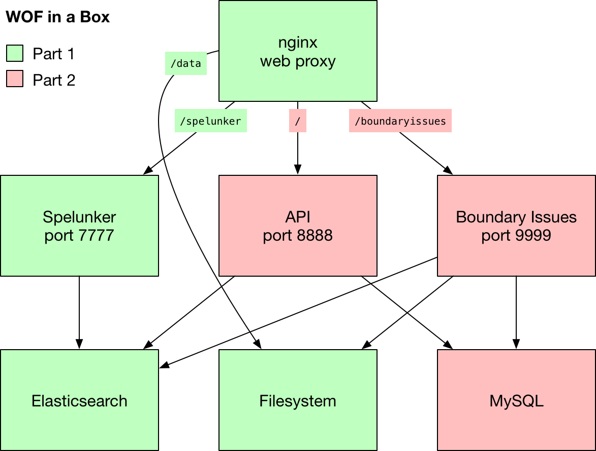

These next parts we're setting up run on a [LAMP stack](https://en.wikipedia.org/wiki/LAMP_(software_bundle)), each built with [Flamework, a set of libraries and conventions](https://github.com/exflickr/flamework/blob/master/docs/philosophy.md) originally created for the Flickr back-end. It still works just fine, although you can find some crufty bits if you poke around.

The two remaining web apps exist separately for now, but could very well be combined into a single codebase at some point in the future. The diagram shown above is rather simplified, and reflects a slight adjustment from the plan in the first part of this guide. Instead of API requests getting routed through `/api`, we will use the top-level `/` path.

The Who's On First documentation we used to have at the top-level `/` path is still [available online](https://whosonfirst.mapzen.com/), if not on your NUC.

## Getting the time right

Before we start, there is one minor change from how we set up the server in [part one](https://mapzen.com/blog/wof-in-a-box/) of the guide. During the Ubuntu server setup I mentioned that I just accept the defaults except for a handful important changes. One important change that I left out was to set the server's timezone to [UTC (Coordinated Universal Time)](https://en.wikipedia.org/wiki/Coordinated_Universal_Time).

We can easily revisit that step in the setup menu.

```
sudo dpkg-reconfigure tzdata
```

Then choose __None of the above__, then __UTC__. Then select __Ok__.

Let's err on the side of caution and install some software to ensure the server has the most up-to-date time set.

```
sudo apt-get update
sudo apt-get install -y ntpdate
```

Now we can update the time from the [National Institute of Standards and Technology](https://www.nist.gov/).

```
sudo ntpdate time.nist.gov
```

With that settled, let's continue.

[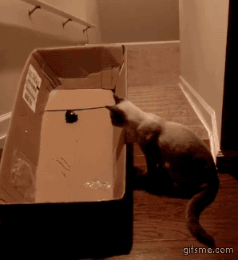](https://giphy.com/gifs/trolling-wtCFBQ0lNjxaU)

## Setting up the API

Okay, let's begin setting up the API. I'm going to assume you're already SSH'd into the NUC machine.

```
cd /usr/local/mapzen
git clone https://github.com/whosonfirst/whosonfirst-www-api.git
```

Much of the API's setup process is automated, but if you look inside the [Makefile](https://github.com/whosonfirst/whosonfirst-www-api/blob/master/Makefile) you can inspect each step in detail.

Since we are proxying requests with nginx, we will set things up without SSL support (for now).

```
cd /usr/local/mapzen/whosonfirst-www-api
make setup-nossl
```

You may be prompted for your password for `sudo`. You will also be asked to confirm that you want to install unattended upgrades (Yes) and which updates to install (the default is fine). Finally, you will choose a MySQL root password (and confirm it), then enter it once more to set up the database schema.

When all of this finishes your API setup will _almost_ be in working order. Some things you should know about how the stack is set up:

* The API's Apache configuration is symlinked from `whosonfirst-www-api/config/whosonfirst-www-api-apache.conf`
* The database is called `wof_api` and is accessed by user `wof_api`
* All passwords and tokens are stored in `www/include/secrets.php`
* You will learn a lot by reading [`www/.htaccess`](https://github.com/whosonfirst/whosonfirst-www-api/blob/master/www/.htaccess)
* There's also a great number of configuration tweaks contained in [`www/include/config.php`](https://github.com/whosonfirst/whosonfirst-www-api/blob/master/www/include/config.php) (the convention is to set overrides in a separate file, we'll get to that down below)

## Configuring Apache

We still need to adjust a couple configurations in Apache, to make the API run on port 8888.

```
cd /usr/local/mapzen/whosonfirst-www-api
nano config/whosonfirst-www-api-apache.conf
```

Edit the first line to use port 8888:

```
<VirtualHost *:8888>
```

Next, edit Apache's `ports.conf`.

```
sudo nano /etc/apache2/ports.conf
```

We're instructing Apache to listen on 8888 and also 9999 (for Boundary Issues). We can get rid of the existing configurations for port 80 and 443. Those ports are handled by nginx.

```
Listen 0.0.0.0:8888    # API
Listen 0.0.0.0:9999    # Boundary Issues
```

Let's restart Apache and check to make sure we can reach port 8888.

```
sudo service apache2 restart
curl -I http://localhost:8888/
```

If you see `HTTP/1.1 200 OK` then you are in good shape.

## GitHub OAuth application

We use GitHub's OAuth mechanism to authenticate users. We will need to set some things up at GitHub in order for that to work.

* Go to GitHub's [Developer settings](https://github.com/settings/developers) and navigate to OAuth Apps
* Click the [New OAuth App](https://github.com/settings/applications/new) button
* Enter an Application Name (`WOF in a Box` is a good choice)
* For the Homepage URL, enter your server's IP address, for example `http://192.168.0.47/`
* The Authorization callback URL is similar to the Homepage URL, but with an `/auth` path suffix, e.g., `http://192.168.0.47/auth`
* Click the Register Application button

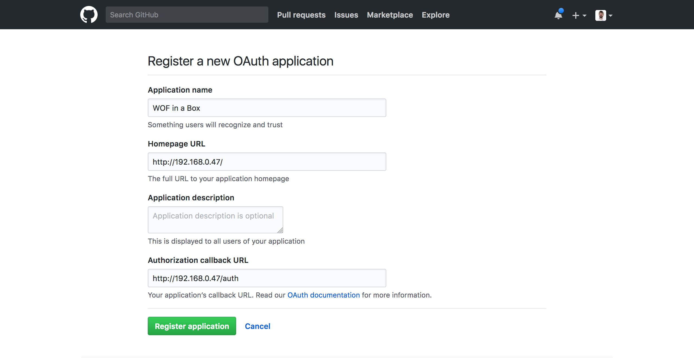

Edit `/usr/local/mapzen/whosonfirst-www-api/www/include/secrets.php` and copy/paste the GitHub OAuth tokens using the following configurations. You'll want to add this just before `# the end`.

```
$GLOBALS['cfg']['github_oauth_key'] = '(your client ID)';
$GLOBALS['cfg']['github_oauth_secret'] = '(your client secret)';
```

## Secret hashes

While we're looking at this file, check to see if the first three configurations are set. If they have values like `You must set cfg.crypto_password_secret` that means we need to set them still. These are used for things like cookie sessions, passwords, and [CSRF](https://en.wikipedia.org/wiki/Cross-site_request_forgery)-deterrent crumbs.

Generate a new secret hash for each of the three configurations, using the following script:

```
cd /usr/local/mapzen/whosonfirst-www-api
php bin/generate_secret.php
php bin/generate_secret.php
php bin/generate_secret.php
```

Those hashes get copied into `secrets.php` like this (your hashes will be different):

```
$GLOBALS['cfg']['crypto_cookie_secret'] = 'lfMi9sHoC2gnFKmMBgG8wUWqvqWO80eq';
$GLOBALS['cfg']['crypto_password_secret'] = 'afEp7fVgVe7TeO07jhud1y9opqgmhsmy';
$GLOBALS['cfg']['crypto_crumb_secret'] = 'u73GlqrDxqBOriFK921H8a0OsT8YZExz';
```

## Configuring nginx

Before we can test everything, we will need to make one last adjustment to the nginx config. Instead of routing traffic from `/api` to port 8888, we will send everything from the top level `/` path.

```
sudo nano /etc/nginx/sites-enabled/whosonfirst
```

First, delete this block:

```
location / {
	try_files $uri $uri/ =404;
}
```

Then modify the API block to use `/` instead of `/api`. Notice there are two places that need editing, the `location /` part and the `proxy_set_header X-Proxy-Path /` part.

```
location / {
	proxy_pass http://localhost:8888;
	proxy_set_header Host $http_host;
	proxy_set_header X-Forwarded-For $proxy_add_x_forwarded_for;
	proxy_set_header X-Scheme $scheme;
	proxy_set_header X-Proxy-Path /;
}
```

Let's restart nginx to make those configurations take effect.

```
sudo service nginx restart
```

## Logging in with GitHub

There is one last configuration we need to make for all of this to run on plain vanilla HTTP. It's not so much that we wouldn't want to run on HTTPS, just that we would need a public hostname, or a self-signed certificate.

If file `config_local.php` exists, it gets loaded in to override the default values defined in `config.php`.

```
cd /usr/local/mapzen/whosonfirst-www-api
nano www/include/config_local.php
```

Add the following to disable HTTPS and, while we're in here, use the right Elasticsearch index:

```
<?php

	$GLOBALS['cfg']['server_force_https'] = 0;
	$GLOBALS['cfg']['api_require_ssl'] = 0;
	$GLOBALS['cfg']['elasticsearch_spelunker_index'] = 'spelunker';
```

We don't need a trailing `?>` since it is optional, and can lead to [unexpected side-effects](https://stackoverflow.com/questions/4410704/why-would-one-omit-the-close-tag).

Save your `config_local.php` configuration, and then load up your WOF in a Box's IP address (something like http://192.168.0.47/) in a browser.

In the top-right corner, choose __Sign In__ from the drop-down menu labeled __You__.

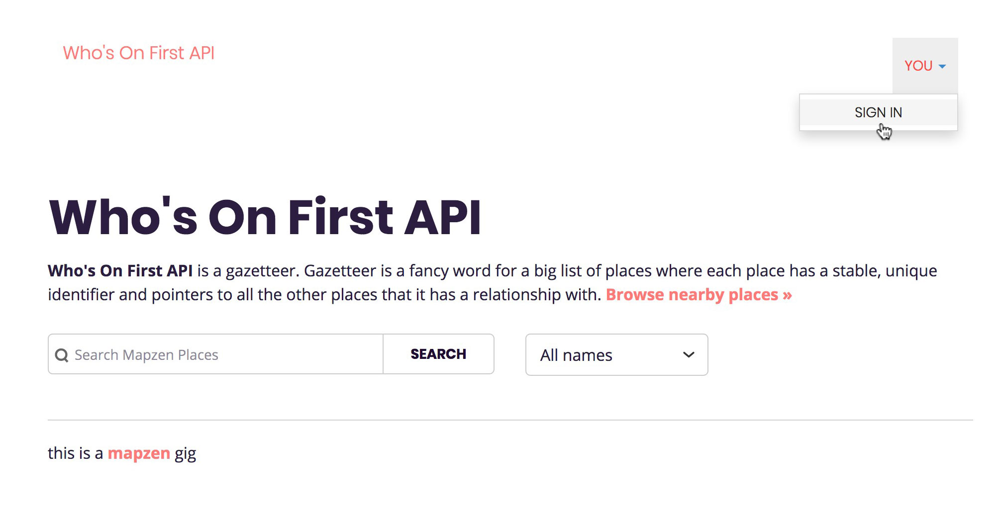

GitHub will ask for permission to authenticate you with the OAuth application you just set up. Click the green button to login.

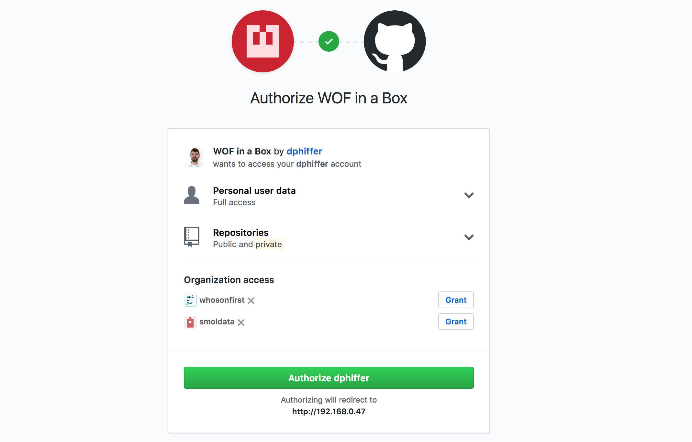

You should get redirected back to the WOF in a Box homepage. If all goes well you should see your name appear in the top-right drop-down menu. You have been OAuth'd by GitHub.

## Create an access token

Go to the to-right drop-down menu and choose __Developer__. From here you can explore some of the API methods available, and configure OAuth access.

Click on __Your Access Tokens__, then __Create a new access token for yourself__.

Give your token a name ("WOF in a Box" is a safe choice), permissions ("Read" is good), and expiration ("until I revoke it").

Then you have to click one more __I agree!__ checkbox and you should be set.

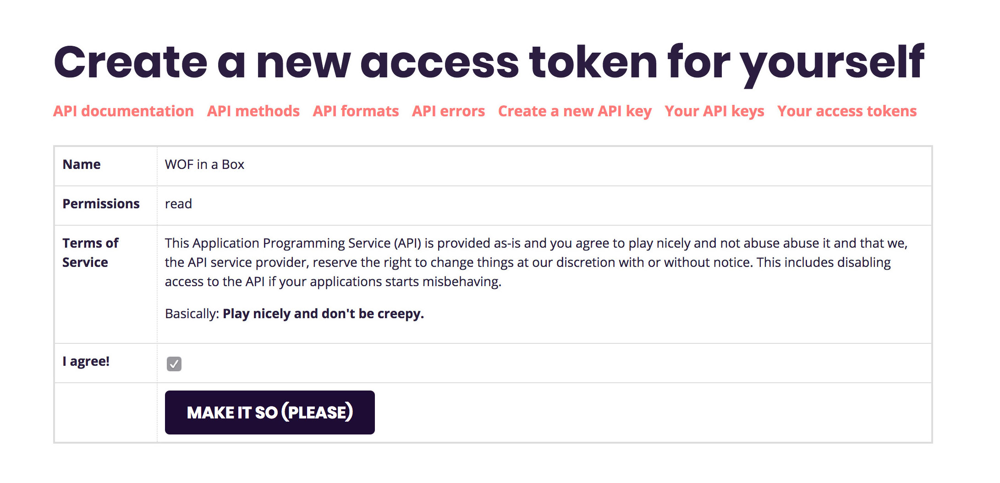

You should see a green "hooray" message, with a hexidecimal token for you to copy/paste.

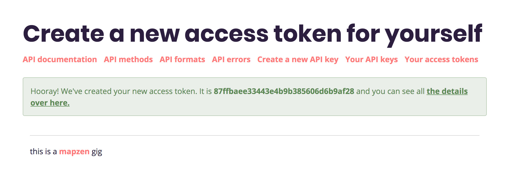

For the sake of having a realistic looking example token, we'll go with `87ffbaee33443e4b9b385606d6b9af28`, but yours will be different.

## Accessing the API

If you navigate to the __API methods__ section of the Developer pages, you can try out some of the methods using the web-based API explorer.

Let's try calling some API methods using `curl`.

```
curl -s "http://192.168.0.47/api/rest/?method=api.test.echo&access_token=87ffbaee33443e4b9b385606d6b9af28" | jq
```

You should see the following result:

```
{
  "method": "api.test.echo",
  "access_token": "87ffbaee33443e4b9b385606d6b9af28",
  "stat": "ok"
}
```

We can use a shell variable to store the IP address and access token, which should make the examples easier to copy/paste. Note, again, that your own IP and token will be different.

```
wof_api="http://192.168.0.47"
wof_token="87ffbaee33443e4b9b385606d6b9af28"
```

Now we should be able to test out the REST API. Let's get a list of all the API method names.

```
curl -s "$wof_api/api/rest/?method=api.spec.methods&access_token=$wof_token" | jq "[ .methods[].name ]"
```

Let's load up some info about a specific WOF record.

```
curl -s "$wof_api/api/rest/?method=whosonfirst.places.getInfo&id=102030609&access_token=$wof_token" | jq
```

You should see a record for [Mumbai](https://whosonfirst.mapzen.com/spelunker/id/102030609/).

One last example, all the [microhoods](https://whosonfirst.mapzen.com/docs/placetypes/#microhood) in [San Francisco](https://whosonfirst.mapzen.com/spelunker/id/85922583/):

```
curl -s "$wof_api/api/rest/?method=whosonfirst.places.getDescendants&id=85922583&placetype=microhood&access_token=$wof_token" | jq '[ .places[]["wof:name"] ]'
```

You should take some time to explore the API documentation, and try out the [standalone API Explorer desktop app](https://mapzen.com/blog/whosonfirst-api-explorer/). It has a settings pane that lets you change the API endpoint, so you can test out requests against your own WOF in a Box rig.

Important note: not all of the API methods will work for you at this point. We need some additional software for spatial queries and an additional Elasticsearch index for brands to work. Those can be subjects of some future WOF guide.

[](https://giphy.com/gifs/cat-box-j1BQPAjNzKh9K)

## Setting up Boundary Issues

We are in the home stretch. The final part of the stack is [our bespoke web-based WOF editor](https://mapzen.com/tag/boundaryissues/), called [Boundary Issues](https://github.com/whosonfirst/whosonfirst-www-boundaryissues/). It has a similar setup process as the API.

```
cd /usr/local/mapzen
git clone https://github.com/whosonfirst/whosonfirst-www-boundaryissues.git
```

Like the API, much of the setup has been automated with a Makefile to run a sequence of shell scripts. And as with the API, we will set things up without HTTPS, since we're proxying requests through nginx.

```
cd /usr/local/mapzen/whosonfirst-www-boundaryissues
make setup-nossl
```

You will be prompted for your `sudo` password, and then for the MySQL root password.

There is a second set of installation scripts that install everything required for offline tasks. The offline task functionality was designed to be an optional add-on to Boundary Issues, so it gets installed with a separate Makefile target.

```
make setup-offline
```

Most of the offline task dependencies are pulled in from modular single-purpose Flamework repos that take care of setting up each of:

* [redis](https://github.com/whosonfirst/flamework-redis)
* [gearman](https://github.com/whosonfirst/flamework-gearman)
* [logstash](https://github.com/whosonfirst/flamework-logstash)

You may notice the process of setting up `gearman` has an exceptionally large set of dependencies. This is the unfortunate consequence of `apt-get install gearman` not working in Ubuntu 16.04. Instead we install a few low-level dependencies and then build it [from source](https://github.com/gearman/gearmand/). The process is automated by a shell script, so you shouldn't have to type anything extra, but you will notice a whole lot more scrolling by.

Also, for some reason `logstash` doesn't get validated during its installation, so you will need to manually confirm that you're okay with that.

Once all that finishes, things will be set up similarly to the API:

* The API's Apache configuration is symlinked from `whosonfirst-www-boundaryissues/config/whosonfirst-www-boundaryissues-apache.conf`
* The database is called `boundaryissues` and is accessed by user `boundaryissues`
* All passwords and tokens are stored in `www/include/secrets.php`
* Reading the bottom part of [`www/.htaccess`](https://github.com/whosonfirst/whosonfirst-www-boundaryissues/blob/master/www/.htaccess) will show you all the URL path routing logic
* There's also an awful lot of configuration tweaks contained in [`www/include/config.php`](https://github.com/whosonfirst/whosonfirst-www-boundaryissues/blob/master/www/include/config.php) (we'll set some overrides in a `config_local.php` down below)

## Configuring Apache (again)

Like with the API, we need to adjust a couple configurations to make Boundary Issues run on port 9999.

```
cd /usr/local/mapzen/whosonfirst-www-boundaryissues
nano config/whosonfirst-www-boundaryissues-apache.conf
```

Edit the first line to use port 9999:

```
<VirtualHost *:9999>
```

Also, add this additional config after the `DocumentRoot` part, to get the `/boundaryissues` path to work properly:

```
Alias /boundaryissues /usr/local/mapzen/whosonfirst-www-boundaryissues/www
```

We already took care of `/etc/apache2/ports.conf` earlier, so we can just restart Apache and check to make sure we can reach port 9999.

```
sudo service apache2 restart
curl -I http://localhost:9999/
```

If you see `HTTP/1.1 200 OK` then take a moment to celebrate quietly before we move on.

## Indexing Elasticsearch (again)

One of the quirks about the Who's On First ecosystem is that Boundary Issues and the Spelunker run on separate Elasticsearch indexes. This was intended to reduce the likelihood of accidentally screwing up live data in the Spelunker. We may combine them at some point, but for now it means we have some more schemas and indexing to take care of.

Let's start with the schemas, yes plural. Boundary Issues uses three of them! I'm assuming we already did all the other Elasticsearch setup from [part one](https://mapzen.com/blog/wof-in-a-box/) of the guide.

```
cd /usr/local/mapzen/es-whosonfirst-schema
cat schema/2.4/mappings.boundaryissues.json | curl -X PUT http://localhost:9200/boundaryissues_20171229 -d @-
curl -X POST http://localhost:9200/_aliases -d '{ "actions": [ { "add": { "alias": "boundaryissues", "index": "boundaryissues_20171229" } } ] }'
cat schema/2.4/mappings.offline_tasks.json | curl -X PUT http://localhost:9200/offline_tasks_20171229 -d @-
curl -X POST http://localhost:9200/_aliases -d '{ "actions": [ { "add": { "alias": "offline_tasks", "index": "offline_tasks_20171229" } } ] }'
cat schema/2.4/mappings.audit_trail.json | curl -X PUT http://localhost:9200/audit_trail_20171229 -d @-
curl -X POST http://localhost:9200/_aliases -d '{ "actions": [ { "add": { "alias": "audit_trail", "index": "audit_trail_20171229" } } ] }'
```

That's a whole lot of schemas and aliases. Basically what we did was set up three new indexes, aliased to make future upgrades easier:

* `boundaryissues` aliased to `boundaryissues_20171229`
* `offline_tasks` aliased to `offline_tasks_20171229`
* `audit_trail` aliased to `audit_trail_20171229`

Now we can start the process of indexing the WOF records into the `boundaryissues` index. As with the Spelunker's Elasticsearch index, this will take some time to finish, so you may want to use `screen` for it.

```
cd /usr/local/data/whosonfirst-data
wof-es-index -s . --index=boundaryissues -b
```

Let that run in the background while we finish up the rest of the Boundary Issues setup.

## Secret hashes and GitHub OAuth (again again)

Okay, so a lot of what's below may seem familiar after setting up the API. And I know you are eager to start editing WOF records. We are getting there!

[](https://www.tumblr.com/search/cat%20in%20a%20box%20gif)

Unfortunately, because the API and Boundary Issues are separate apps, we need to set up a second GitHub OAuth application to handle redirects properly.

* Go to GitHub's [Developer settings](https://github.com/settings/developers) and click the [New OAuth App](https://github.com/settings/applications/new) button
* Enter another Application Name (`Boundary Issues in a Box` is a good choice)
* For the Homepage URL, enter your server's IP address, for example `http://192.168.0.47/boundaryissues`
* The Authorization callback URL is similar to the Homepage URL, but with an `/auth` path suffix, e.g., `http://192.168.0.47/boundaryissues/auth`
* Click the Register Application button

Now let's open up `secrets.php` and insert those GitHub OAuth credentials.

```
$GLOBALS['cfg']['github_oauth_key'] = '(your client ID)';
$GLOBALS['cfg']['github_oauth_secret'] = '(your client secret)';
```

Next we'll generate three new secret hashes, for the crypto hash configs:

```
cd /usr/local/mapzen/whosonfirst-www-boundaryissues
php bin/generate_secret.php
php bin/generate_secret.php
php bin/generate_secret.php
```

Those hashes get copied into `secrets.php` like this (your hashes will be different):

```
$GLOBALS['cfg']['crypto_cookie_secret'] = '9NBEy7d484AN3muSObRPsicoQIpjrhxQ';
$GLOBALS['cfg']['crypto_password_secret'] = 'HRoQz6jcuCB6lHhSmOhlWmfH3X7Nw9xa';
$GLOBALS['cfg']['crypto_crumb_secret'] = 'AxM2yCFsTwY9lVgyDUpJphrv4Qxf3gwI';
```

## The pending folder

To accommodate the process of saving WOF records, we need to set up a www-writeable directory for incoming edits. It works kind of similarly to a Git index, with subfolders to keep the present edited state and a snapshot record of each edit.

The convention is to put the pending folder into the same structure as the other data repos.

```
sudo mkdir /usr/local/data/whosonfirst-pending
sudo chown www-data:www-data /usr/local/data/whosonfirst-pending
```

... and then symlink *that* into the Boundary Issues folder.

```
sudo ln -s /usr/local/data/whosonfirst-pending /usr/local/mapzen/whosonfirst-www-boundaryissues/pending
```

## Let's test things out

Now that we've set a whole bunch of Boundary Issues stuff... let's maybe try it?

Go to `http://192.168.0.47/boundaryissues/` in a browser (again, with your IP subbed in), and see if it loads up. You should see something similar, but not quite the same as, the API's homepage.

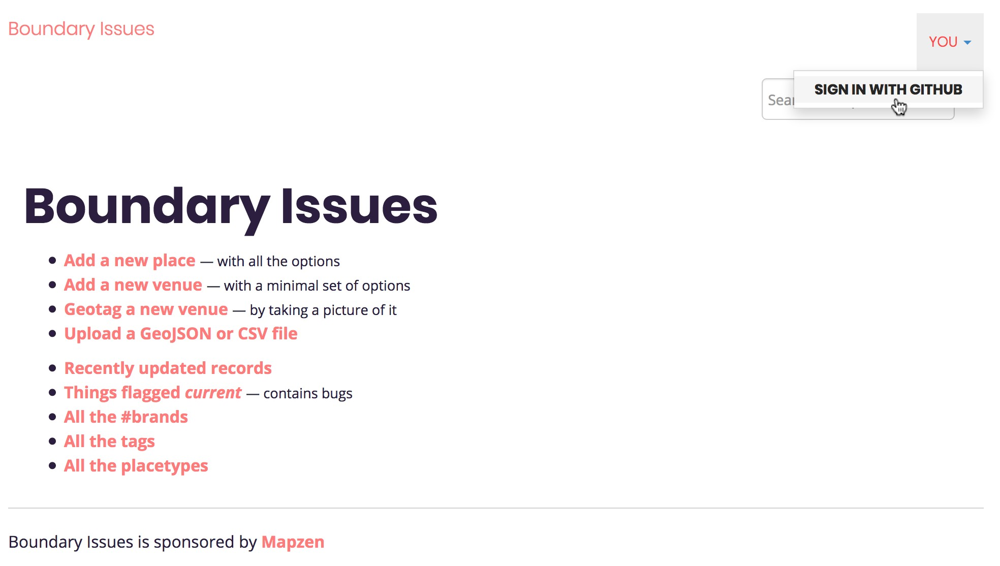

Click on the same __You__ menu and then __Sign in with GitHub__. You should see a similar OAuth confirmation page on GitHub, and then redirect back to the Boundary Issues homepage.

Once you get redirected back, you will have to accept some terms before you can continue.

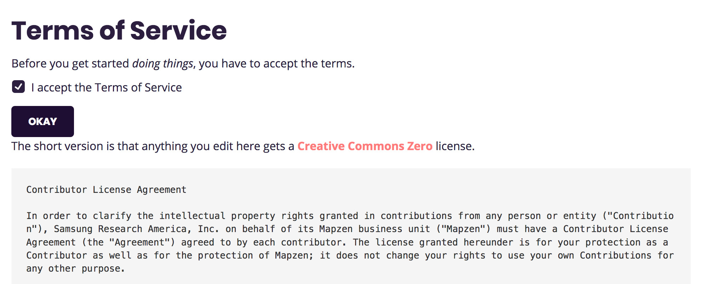

Let's search for a record, for example [Brooklyn](https://whosonfirst.mapzen.com/spelunker/id/421205765/).

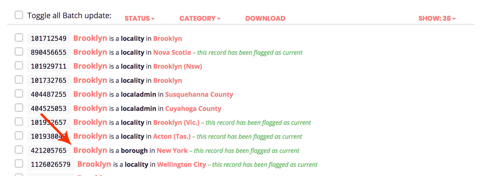

You want to click on the one that's a [Borough placetype](https://whosonfirst.mapzen.com/docs/placetypes/#borough).

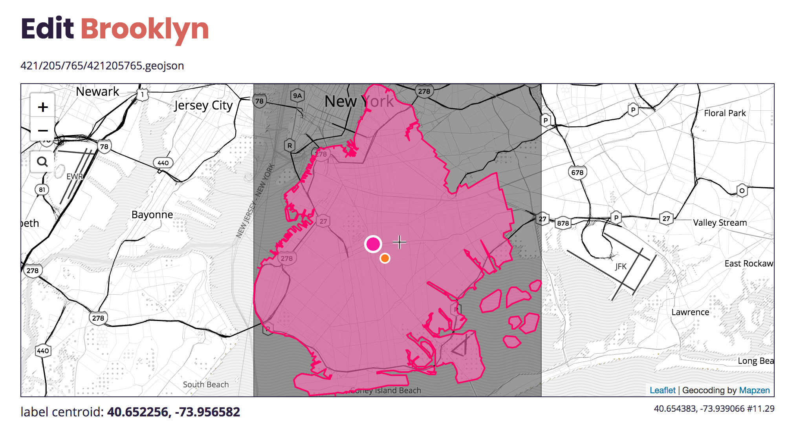

Okay now we are getting somewhere, although...


... by default, new users don't have permissions to edit records.

## Add a user role

One last setup task: we just need to add the role `admin` to your user account and you should be all set.

Here's how that works (again, swap in the email address you used to sign up for your GitHub account):

```
cd /usr/local/mapzen/whosonfirst-www-boundaryissues
php bin/add_user_role.php your.email@example.com admin
```

You should be prompted with a confirmation (press `Y` or just press enter).

There is actually _another configuration_ we should set, inside a new `config_local.php` file.

```
cd /usr/local/mapzen/whosonfirst-www-boundaryissues/www/include
nano config_local.php
```

This will make Boundary Issues update the Spelunker's Elasticsearch index, upon saving.

```
<?php

	$GLOBALS['cfg']['enable_feature_index_spelunker'] = 1;

```

And _one more thing_ (I know, this is complicated), we need to make sure we have the offline tasks running, since they take care of saving stuff after you hit the __Save__ button.

```
sudo /etc/init.d/gearmand start
sudo supervisorctl start all
```

Okay, now we should really be ready.

## Edit a WOF record

Go back to the __Edit Brooklyn__ page in Boundary Issues and reload it. You should be able to edit things now, yay!

Scroll down to the __name__ section, and expand it open. Add the colonial name "Breuckelen" to the list of variant names (technically this should be under the Dutch language, not English, but one thing at a time).

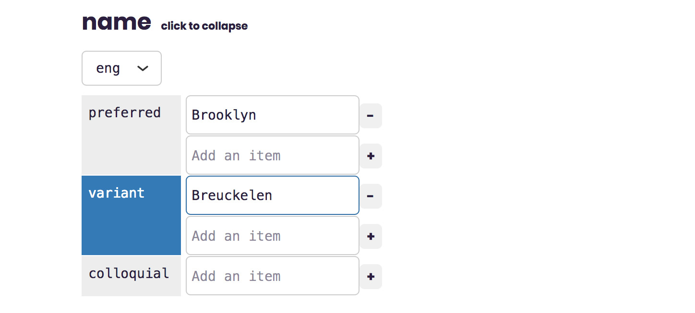

Notice how the interface added a blue indicator next to the field? That helps you keep track of which things you've edited.


When you hit the save button, if all goes well, it should replace the list of changed properties with __Saved__. If it gets stuck on __Saving...__ you may want to try again and keep an eye on the JavaScript console looking for error messages.

Finally, let's try searching for updated name using the Spelunker.

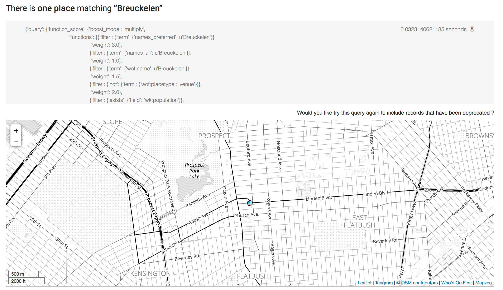

Hooray, you made an edit and it showed up in the Spelunker. There is more to all of this that I won't go into in this blog post. Right now all the changes you make end up in `/usr/local/data/whosonfirst-pending`, without modifying the actual WOF Git repos. If we wanted to actually upstream the changes to GitHub, we would need to set up a new user on the server (we tend to go with `botsonfirst`) with credentials to push up to GitHub. And that user would execute the script `bin/save_pending.php` on a cron job.

There is also the whole subject of pipeline tasks vs. offline tasks, but maybe you can ask me about that over a beer some day.

[](http://i68.tinypic.com/2j3qvm1.gif)

## Bundler config

Okay one final set of config changes before we call it a day. The Spelunker has a very handy tool called the [Bundler](https://mapzen.com/blog/bundler/) and we should get it working with our new *WOF in a Box* stack.

SSH into the NUC server and edit the flask config.

```
cd /usr/local/mapzen/whosonfirst-www-spelunker/config/
nano whosonfirst-www-spelunker-flask.cfg
```

We'll make two edits here, the first enables the bundler feature:

```
enable_feature_bundler=1
```

The second will swap where the Spelunker looks for its WOF records from (once again, with your own IP swapped in):

```
data_root=https://192.168.0.47/data
```

There are a couple more edits to another config file: `mapzen.whosonfirst.config.js`

```
cd /usr/local/mapzen/whosonfirst-www-spelunker/www/static/javascript/
nano mapzen.whosonfirst.config.js
```

We are going to scroll down to the bottom and edit this part:

```
if (mapzen.whosonfirst.api) {
        mapzen.whosonfirst.api.set_endpoint('https://' + api_host + api_path);
        mapzen.whosonfirst.api.set_key(api_key);
}
```

Change it so that it looks like this (remember the access token we generated for the API?):

```
if (mapzen.whosonfirst.api) {
		mapzen.whosonfirst.api.set_endpoint('http://192.168.0.47/api/rest/');
		mapzen.whosonfirst.api.set_token('87ffbaee33443e4b9b385606d6b9af28');
}
```

Note that we changed the `set_key` function call to `set_token`. This is an important difference.

Okay, now we can try it all out!

First, restart the Spelunker for the config changes to take effect.

```
sudo /etc/init.d/whosonfirst-www-spelunker.sh restart
```

Next, load up the Spelunker page for Brooklyn (or Breuckelen). The URL should be something like `http://192.168.0.47/spelunker/id/421205765/`.

Now, scroll down until you get to the "Other" links, below the Hierarchy.


You should see a new link for __Download descendants of Brooklyn__. Click on that.

If everything is working, you should now be able to bundle and download all the descendants records of Brooklyn, using the NUC's API and data. Let's try getting all the Brooklyn neighbourhoods.

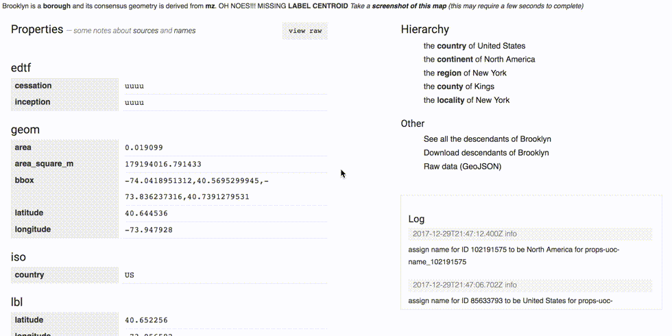

## That's all, folks

That was a whole lotta WOF in a Box, thanks for reading this far!

[](https://giphy.com/gifs/vtT53Z1YmKCxW)
