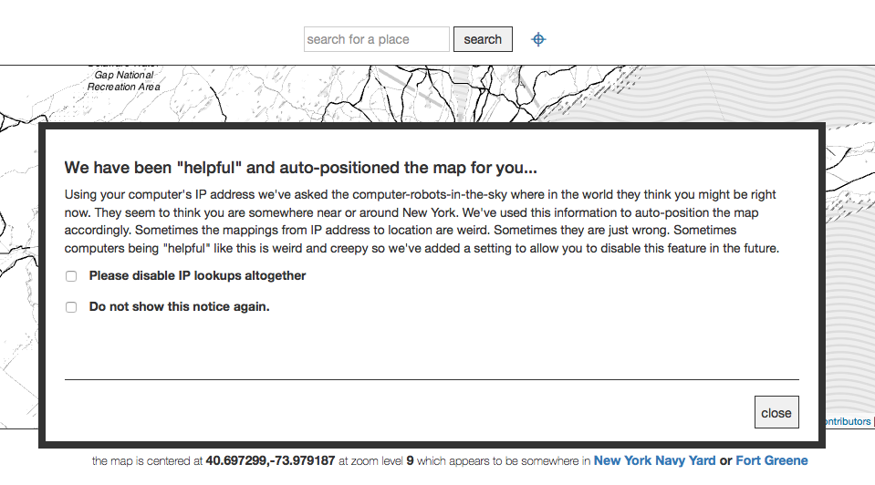

<iframe class="demo-wrapper" height="512px" width="90%" src="//tangrams.github.io/tangram-sandbox/tangram.html?styles/radar#4/38/-97"></iframe>

You Are Here (± 10,000 km)

There are few things more dangerous than an overconfident point when it's placed on a map. These sorts of points are intended to represent a place, like a house, a town, a city, or a country. But what happens when the thing not underneath that place is not that place (or is a fundamental misunderstanding of what that place is supposed to be)?

This past weekend, [Kashmir Hill](https://twitter.com/kashhill) of [Fusion](https://fusion.net) reported a [terrifying story](https://fusion.net/story/287592/internet-mapping-glitch-kansas-farm/) that reflects the dark side of what happens when map data is misinterpreted and people are overconfident in what lies beneath that dot.

The story revolves around a small farm in Kansas that has been the victim of mistaken identity many times over. As Kashmir writes:
> They’ve been accused of being identity thieves, spammers, scammers and fraudsters. They’ve gotten visited by FBI agents, federal marshals, IRS collectors, ambulances searching for suicidal veterans, and police officers searching for runaway children. They’ve found people scrounging around in their barn. The renters have been doxxed, their names and addresses posted on the internet by vigilantes. Once, someone left a broken toilet in the driveway as a strange, indefinite threat.

And to get to the underlying cause of this horrible case of mistaken identity is rather common technology called GeoIP. GeoIP providers attempt to connect clusters of IP addresses to a geographic region. Sometimes, that can be fairly specific, down to the city, other times it can only link to a state or country. If Facebook has asked you if you have tried to log in from another country you haven't visited, or a map that centers on your town by default, this is likely the technology that makes that possible. Sometimes, though, it centers on the wrong place, like when dial-up AOL had all their IP addresses coming from northern Virginia.

MaxMind, the most prominent GeoIP provider, only intended to give back the "general area" the IP address is in; not to indicate that the precise location lay beneath the pin. But that's exactly what many of the users of MaxMind's users have assumed that the data indicated. Which meant that any IP address that's known to be "Somewhere in America" (but can't be pinpointed to a specific city or state), MaxMind pointed right at this family farm. In some cases, these GeoIP leads can be useful, but when it all gets boiled down to _that point_, the nuance is often lost. And that can have drastic repercussions.

Part of the reason we're writing this is to point out that we have [our own project to augment the MaxMind GeoIP database](https://whosonfirst.mapzen.com/mmdb) with data from [Who's On First](https://whosonfirst.mapzen.com/) to interpret the results coming back from an IP lookup as a geographic area, and not a single point. Rather than sending back a point and some words saying where an IP address is location our modified version of the MaxMind database returns both a Who's on First ID and a bounding box (as well as its complete hierarchy) for that location. It means the United States is the container for the United States and that small town in Kansas is just that small town in Kansas. This is still an experimental project and we are working through the mechanics of what we store in the databases (we could include complete polygons but that might makes things a bit... heavy) and how often things get updated. As of this writing we haven't yet updated our databases to [reflect the changes that MaxMind has made to their own data](http://fusion.net/story/290772/ip-mapping-maxmind-new-us-default-location/) yet.

One of the other things this story has prompted us to do it finish up the work to enable IP lookups in [the I Am Here project](https://mapzen.com/blog/iamhere/). When enabled the code on [the I Am Here website](https://whosonfirst.mapzen.com/iamhere) will try to use your computer's IP address and its corresponding location (using a [Who's On First enabled MaxMind database](https://whosonfirst.mapzen.com/mmdb/)) to automatically position the map. Previously the map would always load centered on San Francisco's majestic [Space Claw](https://www.flickr.com/people/spaceclaw/photosof/)... I mean Sutro Tower, which is great but a bit tiresome if don't live in San Francisco and always need to start using the website by zooming out to a different location.

The reason that we haven't enabled the IP lookup functionality sooner is because we noticed that sometimes when you load the website from a computer in San Francisco the map would automatically position itself in... you got it, Kansas. Now when you load [I Am Here](https://whosonfirst.mapzen.com/iamhere/) for the first time you will see a modal dialog explaining that there are computers trying to be helpful, that sometimes their suggestions aren't very helpful and finally the option to tell the computers to stop helping you. Hopefully the computers will get it right more often than not and, because IP lookup is pretty cool when it works, there will be a way for people to use I Am Here without having to always start in San Francisco.

But this story, and [others](http://fusion.net/story/214995/find-my-phone-apps-lead-to-wrong-home/) [like it](https://gimletmedia.com/episode/53-in-the-desert/) should be a wake-up call to folks who design geospatial systems. When conveying ambiguity, it's hard to think how your users' users will necessarily interpret the thing. And while longitude and latitude are ubiquitous, they're not always right to send along the context involved.

MaxMind has [already taken some corrective steps](http://fusion.net/story/290772/ip-mapping-maxmind-new-us-default-location/) by changing the point that represents America from the farm at [38,-97] to the center of a nearby lake, but it still doesn't address the necessary issue of conveying how big a place match may be.

But to them, and to you, please: Consider the polygon.
