[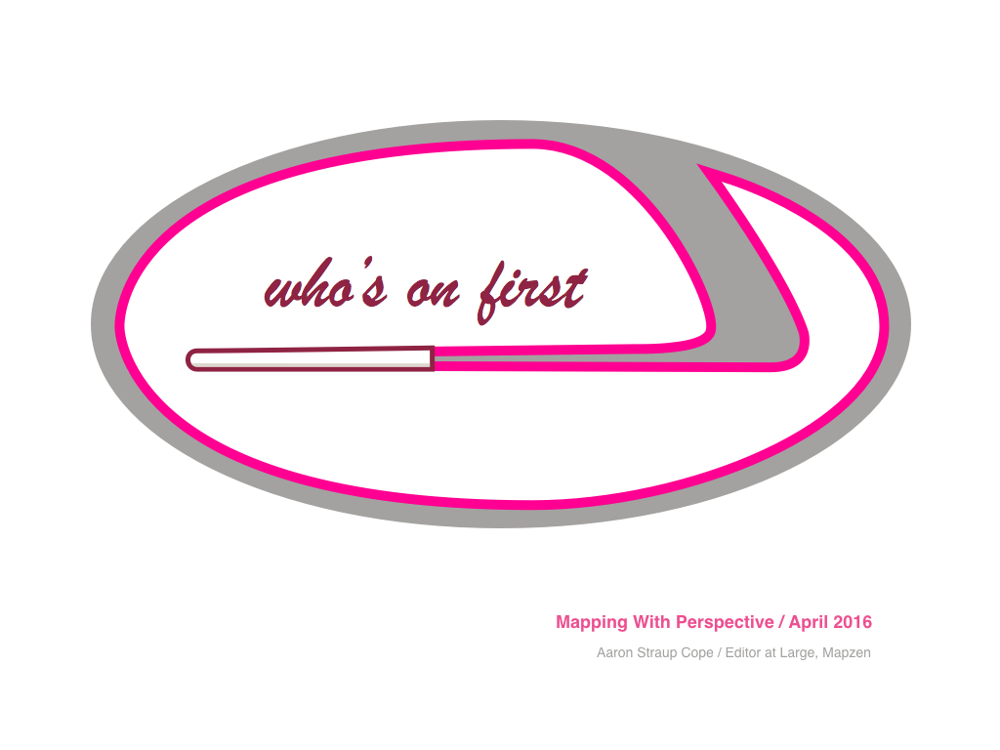](#intro)
	
_The following are the slides and notes for a talk I presented at the [Mapping With Perspective](https://mapzen.com/blog/mapzen-sf-event-april-26/) event held at the [Mapzen West](https://whosonfirst.mapzen.com/spelunker/id/907212541/) offices, in April 2016._

_If you've read the first [introductory blog post](https://mapzen.com/blog/who-s-on-first/) about Who's On First or [the talk I did at FOSS4G](https://mapzen.com/blog/spelunker-jumping-into-who-s-on-first) introducing the Spelunker much of what follows will be familiar. It was a short talk so rather than get lost in the [technical details](https://www.github.com/whosonfirst/whosonfirst-docs/) I tried instead to focus on some of the principles, and statements of bias, that influence the project. Why we're doing this, rather than how, particularly for people who might not have read those first two blog posts._

_My talk was titled "Mapping with Bias" and this is what I said._

* * *

I had stickers made for the [Who’s On First](https://whosonfirst.mapzen.com/) project recently. They look [like this.](images/stickers.jpg)

No one has any idea what they depict and that’s led to some hilarious speculation about what they "are" ranging from a hockey stick (I am from Canada) to the Lexus car logo to [an e-cigarette](https://twitter.com/alloftheplaces/status/720359919749169152).

It’s actually a [pitot tube](https://www.grc.nasa.gov/WWW/k-12/VirtualAero/BottleRocket/airplane/pitot.html). Wikipedia [describes a pitot tube](https://en.wikipedia.org/wiki/Pitot_tube) as:

> …a pressure measurement instrument used to measure fluid flow velocity.

It goes on the describe "flow velocity" as:

> …a vector field which is used to mathematically describe the motion of a continuum.

[Who’s On First](https://whosonfirst.mapzen.com) is _not really_ a pitot tube but I like that idea that there might be an instrument to measure the motion – the velocity – of people’s understanding of place.

[Also, I like shiny things](images/stickers.jpg).

[Who's On First](https://whosonfirst.mapzen.com) is a gazetteer. A gazetteer is a "big bag of places" in which every place has a stable and permanent identifier, supporting metadata and pointers to other IDs in the gazetteer for places with which it has a relationship.

Over [15, 000 words have written about Who's On First](https://whosonfirst.mapzen.com/#theory) so far because it turns out that gazetteers are a pretty complicated subject.

Rather than trying to squeeze [all the details](https://mapzen.com/tag/whosonfirst/) in to a 20-minute talk I am going to focus instead on some of the first principles motivating the project and governing our day-to-day work.

The toxic trinity of "geo" has always been the unholy union of: _licensing and coverage and quality_.

The aim of [Who's On First](https://whosonfirst.mapzen.com) is to tackle all three at the same time.

If and when we are forced to ["pick two"](https://en.wikipedia.org/wiki/Project_management_triangle#.22Pick_any_two.22) we will choose licensing and coverage, so that in the end there is always something left over that people can improve as time and circumstances permit.

These decisions make [Who's On First](https://whosonfirst.mapzen.com) both ambitious and daunting so I have always felt that it is important for us to have a governing bias with which to negotiate the complexities and the quicksand that the project will inevitably yield.

In many ways, these are principles to help us understand what the project is _not_ and to help us understand how things _should be_ even if the technology doesn't always work as well as we imagine it should, yet.

A gazetteer is a pretty brainy project. Gazetteers are one of those things that don't seem important at all until they are, at which point they suddenly take on an outsized importance. This means we need to design things in such a way that our work can outlast people's reluctance.

We need to build something with the patience and the stamina, conceptually and financially, to sit quietly in the corner and be ready to be of service when you are and not before.

What follows are six "umbrella" ideas that we keep in mind as we work towards that goal.

[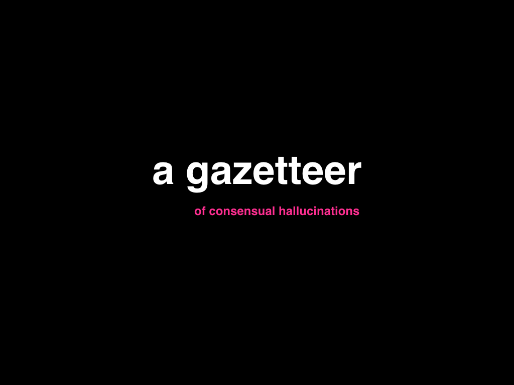](#consensual)

The first is the idea that [Who’s On First](https://whosonfirst.mapzen.com/) is **a gazetteer of consensual hallucinations**.

The history of geospatial technologies has for most part been one of [force projection](http://www.aaronland.info/weblog/2012/03/13/godhelpus/#sxaesthetic) and [tax collection](http://www.aaronland.info/weblog/2015/02/24/effort/#holodeck). Some people argue they are the same thing.

But there is a good reason that, for example, California alone [has seven state planes](http://www.conservation.ca.gov/cgs/information/geologic_mapping/state_plane): There are actual tax dollars, and services like emergency responders, that depend on being able to precisely and accurately locate a thing in a world where latitude [can not be neatly subdivided in to equal units](https://en.wikipedia.org/wiki/Geographic_coordinate_system#Complexity_of_the_problem) across the surface of the globe.

It is worth remembering that coordinate space is one of the truly great abstractions. Being able to reduce the problem, in so many cases, to fit a Cartesian grid has made some pretty amazing things possible.

On the other hand, I cut my teeth working on geo at Flickr where we learned over and over and over again that [no one thinks of place as coordinate data](http://code.flickr.net/category/geo) at least not when it comes to [their photos](https://www.flickr.com/places/).

It’s not just Flickr. There is a long and growing list of companies – really, _all_ companies – whose services are implicitly built around social rather than administrative notions of place. And social notions of place are messy and an inexact and complicated. This is the space where [Who's On First](https://whosonfirst.mapzen.com) sits.

[Who's On First](https://whosonfirst.mapzen.com) is, by design, not a gazetteer of unitary perspective.

[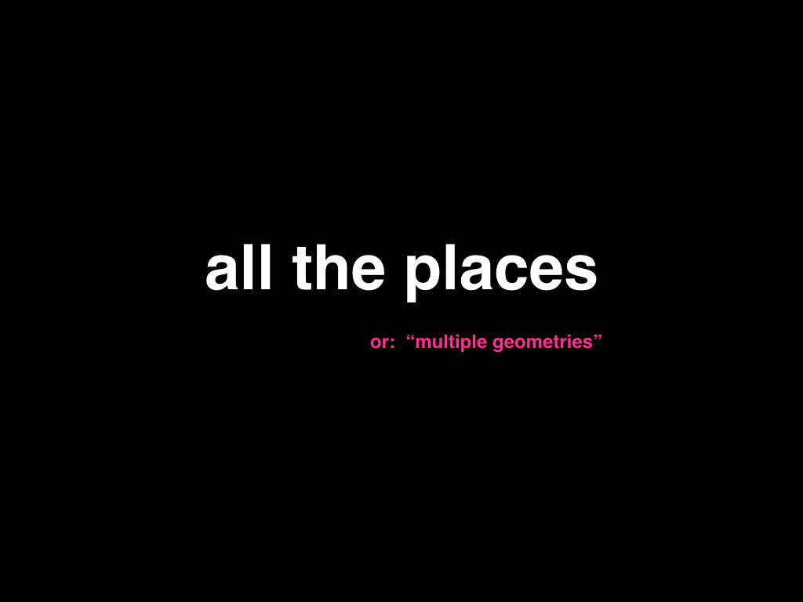](#geometries)

Or put another way, [Who’s On First](https://whosonfirst.mapzen.com/) is **not a gazetteer of geometries**.

[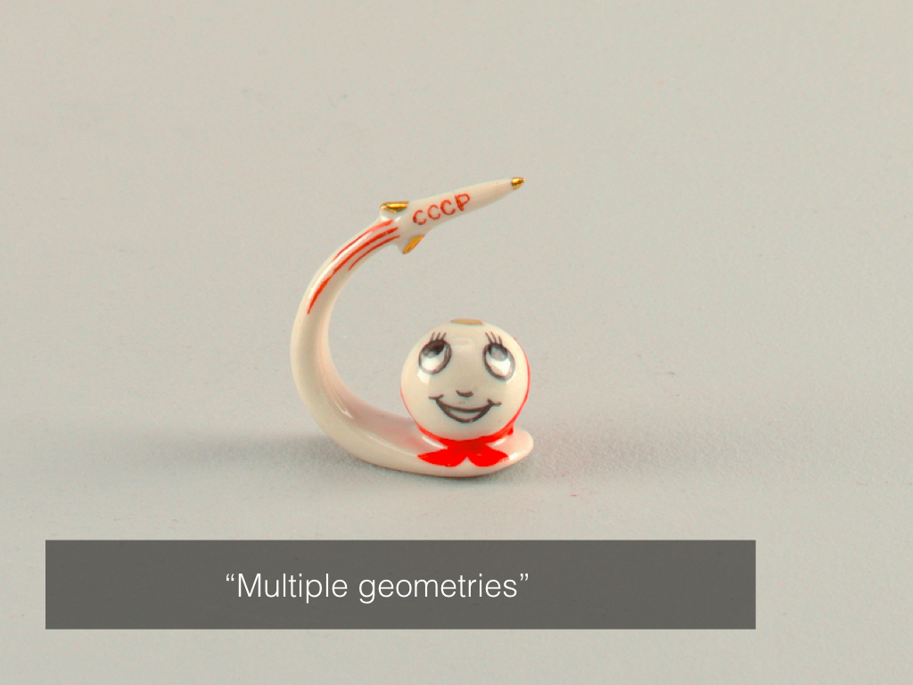](https://collection.cooperhewitt.org/objects/18643589/)

One of our earliest decisions was on that each record in [Who’s On First](https://whosonfirst.mapzen.com) would contain multiple geometries.

As a rule every place in [Who's On First](https://whosonfirst.mapzen.com) should contain a so-called "ground truth" geometry. A ground truth geometry is like Benoit Mandelbrot’s [map of England](https://en.wikipedia.org/wiki/How_Long_Is_the_Coast_of_Britain%3F_Statistical_Self-Similarity_and_Fractional_Dimension) which, by definition, means it will always grow in size and detail.

Some places might even have _two_ ground truth geometries, one clipped to the coastline and another than includes territorial waters. These geometries are especially good [for reverse geocoding](https://github.com/whosonfirst-data/whosonfirst-data/issues/367) but the salient point in all of this is that the geometries themselves, as often as not, enforce the biases of their use.

There might also be "folk" geometries which encode [a common (or folk) understanding of a place](https://github.com/whosonfirst-data/whosonfirst-data/blob/master/data/859/225/83/85922583-alt-mapzen.geojson) rather than an official designation. Think of Eric Fischer's [Locals and Tourists maps](http://www.moma.org/interactives/exhibitions/2011/talktome/objects/146200/).

There will inevitably be disputed geometries. These are different from places that have been classified as [disputed](https://whosonfirst.mapzen.com/spelunker/placetypes/disputed/), places like Kashmir or the Golan Heights. These are places where the stakes are not so high. Places where even though their may be officially recognized boundaries people still bicker over the details. Effectively [all neighbourhoods](http://www.gowanusheights.info), everywhere.

We may disagree on where [The Tenderloin](https://whosonfirst.mapzen.com/spelunker/id/85865903/descendants/?exclude=nullisland&placetype=microhood) starts and stops, for example, but we all agree that The Tenderloin _exists_.

The purpose and the value of [Who's On First](https://whosonfirst.mapzen.com) is in giving those [notions of place](https://whosonfirst.mapzen.com/spelunker/id/102112179/) a collective proof. In giving them a mass and weight and a gravity in the universe that other people and products can orbit.

[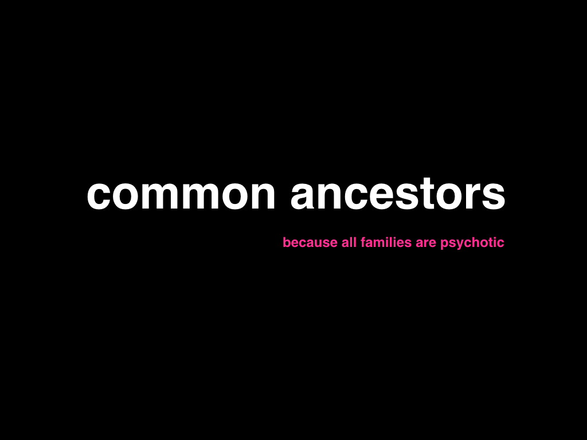](#ancestors)

Another core principle of [Who's On First](https://whosonfirst.mapzen.com) that is every record shares **a common set of ancestors**.

[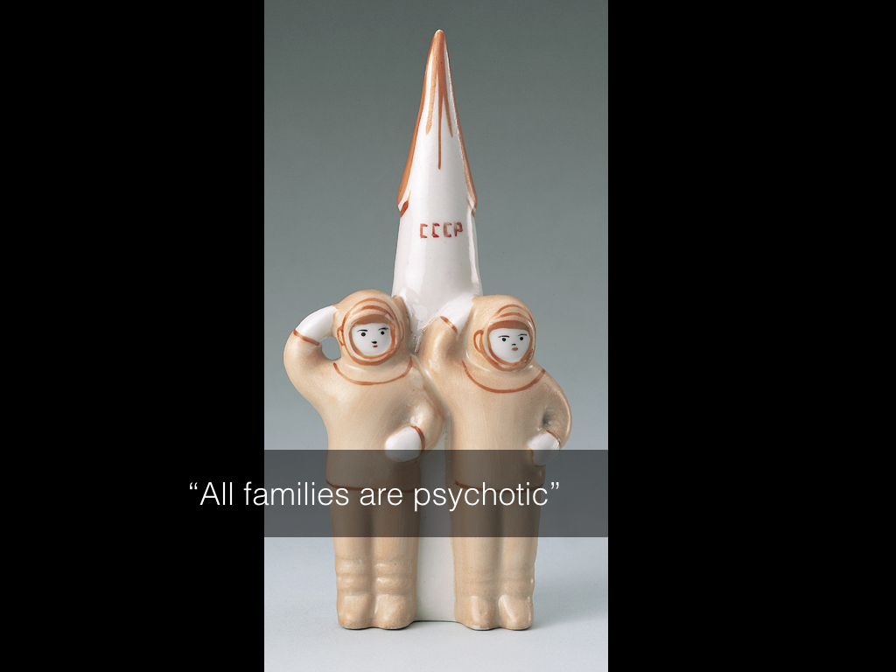](https://collection.cooperhewitt.org/objects/18643587/)

Hierarchies, in particular administrative hierarchies, vary wildly from country to country. We used to say that all locations in [Who's On First](https://whosonfirst.mapzen.com) share a common hierarchy but I think that was often more confusing than not.

It is an articulation that lends itself to the idea, incorrectly, that there is a single comprehesive hierarchy which encodes all the relationships between places.  That is not what [Who's On First](https://whosonfirst.mapzen.com) tries to do.

Instead we have said that there are [five common placetypes](https://github.com/whosonfirst/whosonfirst-placetypes#here-is-a-pretty-picture) – _continent, country, region, locality and neighbourhood_ – and that every record in [Who's On First](https://whosonfirst.mapzen.com), regardless of its [specific placetype](https://whosonfirst.mapzen.com/spelunker/placetypes/) has at least one of the common placetypes as an _ancestor_.

This acts as a baseline for a global dataset, both on a conceptual and a practical level. It is important to us that, within reason, we not impose any single architectural approach or set of technical requirements in order to be able to use [Who's On First](https://whosonfirst.mapzen.com).

Five "database" columns for encoding a global hierarchy seems like a reasonable trade-off in 2016. If you need to include [Brooklyn, NY](https://whosonfirst.mapzen.com/spelunker/id/421205765/) (which is technically a [borough](https://whosonfirst.mapzen.com/spelunker/placetypes/borough)) in your dataset then you'll need to add a sixth column but that's your business. Otherwise you can hopefully make do with [New York City](https://whosonfirst.mapzen.com/spelunker/id/85977539/).

Importantly, unknown place types are not a fatal error. They are left to the needs and discretions of people using [Who's On First](https://whosonfirst.mapzen.com) for whatever they need to use it for, without sacrificing a common ground where all of these projects can still comfortably hold hands.
 
There is also a related discussion about places having _multiple_ hierarchies but we don't have time for that tonight. Suffice it to say that places [can and do have multiple hierarchies](https://github.com/whosonfirst/whosonfirst-placetypes#hierarchies) for much the same reasons that a place might have multiple geometries.

[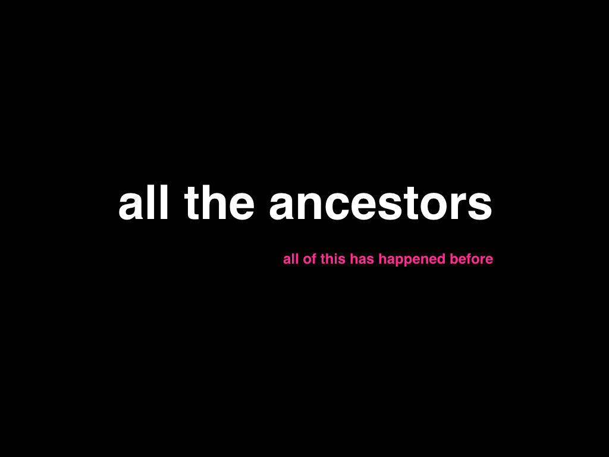](#supersedes)

[Who’s On First](https://whosonfirst.mapzen.com) is **not a linear scorched-earth view of the world**.

[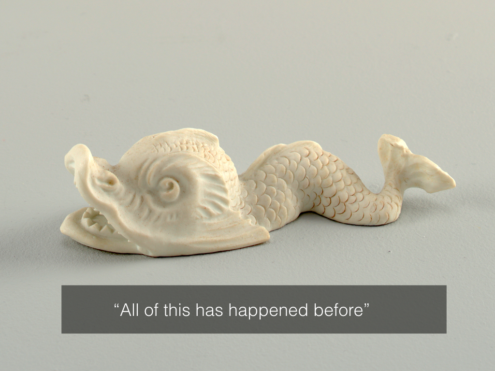](https://collection.cooperhewitt.org/objects/18334353/)

Places change. The physical boundaries of the USA [changed 141 times](https://github.com/whosonfirst-data/whosonfirst-data/issues/176) between the years 1789 and 1959. The entire notion of what Yugoslavia _meant_ changed three times in the 20th century before finally atomizing in to [seven countries](https://en.wikipedia.org/wiki/Yugoslavia#/media/File:Former_Yugoslavia_2008.PNG), by 2008.

Ultimately there is a much larger question about how an individual, or worse a community, decides whether an event constitutes a simple update versus a fundamental change. This is the realm of hard philosophical questions and those are things we are not going to try to answer.

We can provide breadcrumbs, though. Every record in [Who's On First](https://whosonfirst.mapzen.com) has both a `superseded_by` and `supersedes` property that are used to signal that a change has occurred but _not necessarily why_. That part is left up to you.

These properties act as a kind of [linked-list for places](https://en.wikipedia.org/wiki/Linked_list) indicating, for example, that the Kingdom of Yugloslavia was superseded by the Federal People's Republic of Yugoslavia in 1946, and so on.

This decision means two things:

1. That there might be [multiple entries](https://whosonfirst.mapzen.com/spelunker/search/?name=stamen design) for the "same" place in [Who's On First](https://whosonfirst.mapzen.com) and consumers of the data need to account for this fact.
2. That if you have been using the [the first iteration](https://whosonfirst.mapzen.com/spelunker/id/571704337/) of a place in [Who's On First](https://whosonfirst.mapzen.com) its _meaning and semantics_ won't suddenly change when there is [a legimate reason](https://whosonfirst.mapzen.com/spelunker/search/?name=stamen design) to create [a second iteration](https://whosonfirst.mapzen.com/spelunker/id/907212647/).

We do this as a way to foster confidence in the robustness and durability of [Who's On First](https://whosonfirst.mapzen.com) identifiers. The past is complicated territory and though it is not the focus of our daily work we want to try and make sure that it is always welcome.

[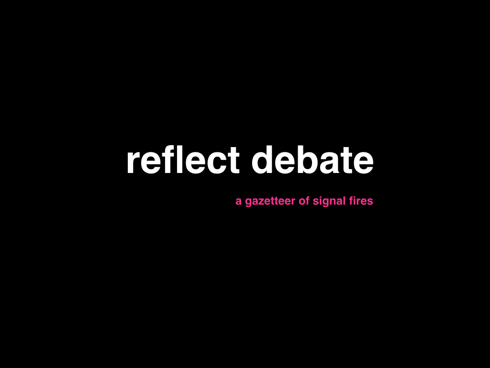](#signal)

[Who’s On First](https://whosonfirst.mapzen.com) is **a gazetteer of signal fires**.

[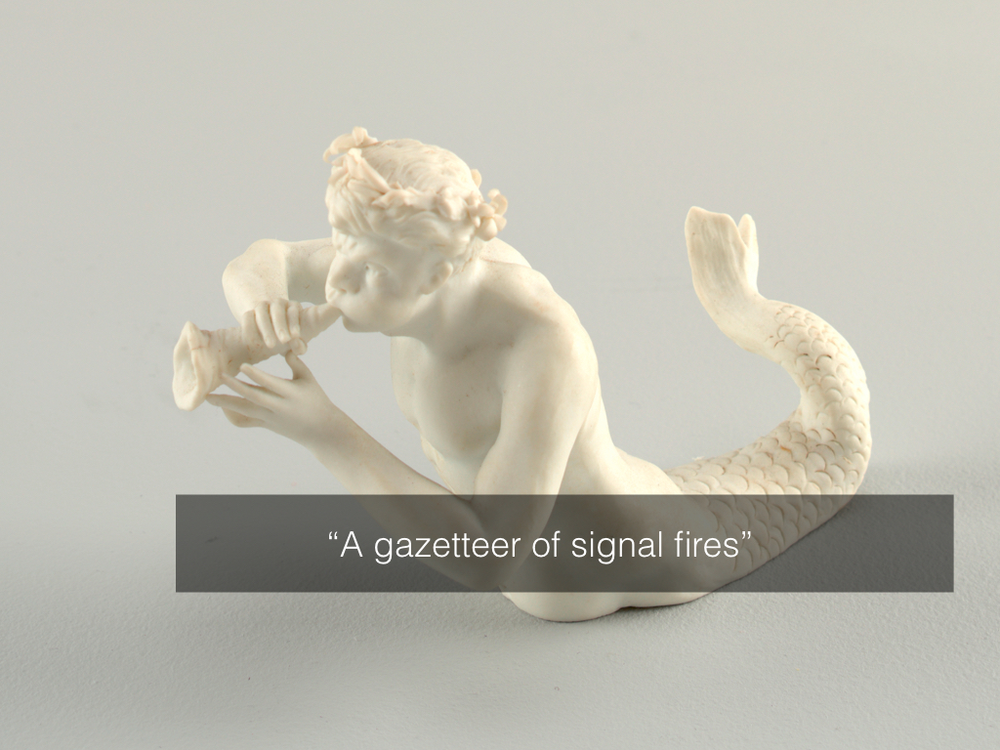](https://collection.cooperhewitt.org/objects/18334351/)

It's probably obviously by now but it bears repeating: The world is full of complex and contradictory opinions. We do not want to try and settle those debates. We can not settle those debates.

For almost as long as we've had the notion of place itself people have had the benefit of complete sentences and entire paragraphs and even book-length arguments to make sense of the nature and meaning and value of place.

_And still we don't agree_ so I don't know why anyone can imagine that a bag of key/value pairs will do better at answering any of these questions.

Obviously there are a few instances where [Who's On First](https://whosonfirst.mapzen.com) needs to assert some degree of editorial opinion about but as a rule we try to do this as infrequently and as transparently as possible.

When there is genuine debate about something we leave it to the consumers of the data to interpret. We want to signal that _there is debate_ about something rather than try to gloss over the awkward bits.

[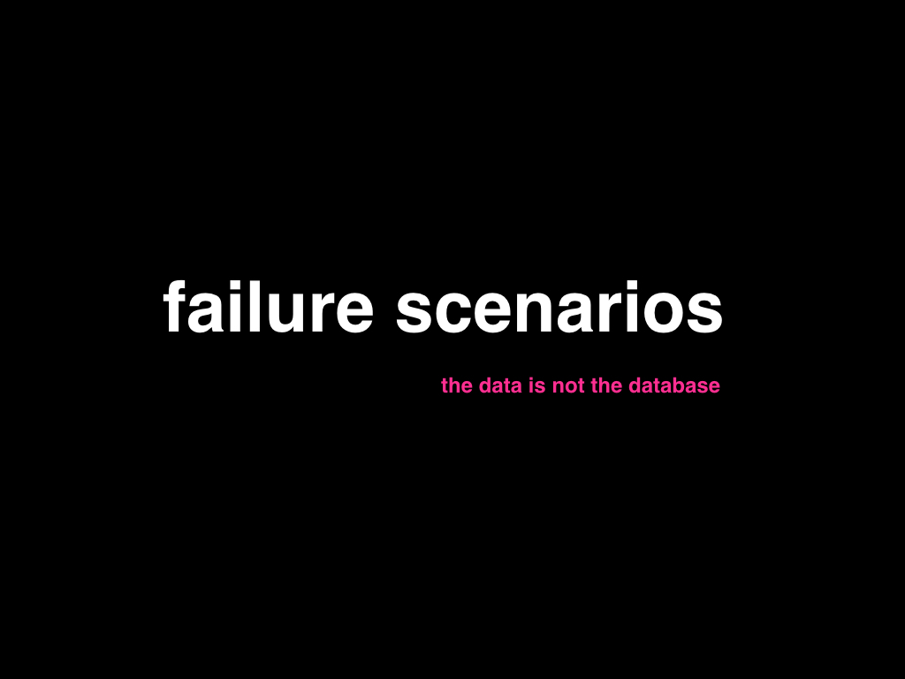](#database)

Finally, **the data is not the database.**

[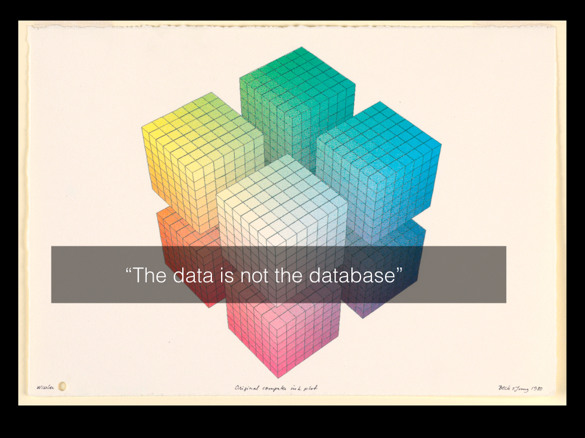](https://collection.cooperhewitt.org/objects/18616235/)

I mentioned at the beginning that [Who's On First](https://whosonfirst.mapzen.com) was designed to "outlast people's reluctance".

What this means is that [Who's On First](https://whosonfirst.mapzen.com) is not optimized for any one application including [Mapzen](https://www.mapzen.com/), which makes for some awkward conversations around the office from time to time.

What this means, in concrete terms, is that at its core [Who's On First](https://whosonfirst.mapzen.com) is [a gigantic bag of plain-text files](https://whosonfirst.mapzen.com/data/). The failure scenario for updating a [Who's On First](https://whosonfirst.mapzen.com) record should always be the ability to edit it using nothing more than a text editor. You shouldn't _have_ to do that but when everything else breaks you still _can_ do that.

The point is not that [Who's On First](https://whosonfirst.mapzen.com) doesn't play with databases but that it should be able to play nicely with _all_ the databases. The point is that the demands [Who's On First](https://whosonfirst.mapzen.com) places on its users should be as universal as possible across platforms and concerns.

Sometimes this makes getting things set up a little harder than we'd like but it's 2016 and we've all gotten pretty good at [processing text files at scale](https://dl.acm.org/citation.cfm?id=512948) and feeding them in to databases.

Despite all the advances we've made over the years it turns out that the simplest, most universal and accessible thing is still plain-old, plain-vanilla, plain-text files on disk.

They have the added benefit of being (still) the most reliable way to archive things [as the technological landscape shifts](http://www.cooperhewitt.org/2013/08/26/planetary-collecting-and-preserving-code-as-a-living-object/), year over year. We can [print them out](http://booktwo.org/notebook/wikipedia-historiography/), if necessary.

This focus – of demanding a high degree of portability and durability in our work - is very much influenced by [the early systems designs](https://www.princeton.edu/~hos/frs122/unixhist/finalhis.htm) for the Unix, and Multics before it, operating system and more recently the [Unicode](http://unicode.org/) project.

These are [subjects](https://www.bell-labs.com/usr/dmr/www/hist.html) that could occupy many, many more nights of presentations [all on their own](http://www.unicodeconference.org/) and it remains to be seen whether we can accomplish our work as well as they did theirs.

But that is the work.

Thank you. If you'd like a sticker [send up a flare](https://www.twitter.com/alloftheplaces).

* * *

All of the images in this presentation are part of the collection of the <a href="https://collection.cooperhewitt.org/">Cooper Hewitt Smithsonian Design Museum</a>. They are:

<ul style="margin-top:1em;">
<li><a href="https://collection.cooperhewitt.org/objects/18297119">Bound Print (France); Purchased for the Museum by the Advisory Council; 1921-6-559-19</a></li>
<li><a href="https://collection.cooperhewitt.org/objects/68775917">Paper Construction, Buck Rogers, 25th Century Featuring Buddy and Allura in "Strange adventures in the Spider Ship"; Attacked by the Giant Reptile, ca. 1935; Collection of Smithsonian Institution Libraries</a></li>
<li><a href="https://collection.cooperhewitt.org/objects/18643589/">Figure, ca. 1960; porcelain, enamel; Gift of Ludmilla Shapiro; 1993-13-2</a></li>
<li><a href="https://collection.cooperhewitt.org/objects/18643587/">cosmonauts and rocket Figure, 1960–70; Made by Gzhel Porcelain Factory ; porcelain, enamel.; Gift of Ludmilla Shapiro; 1993-13-1</a></li>
<a href="https://collection.cooperhewitt.org/objects/18334353">Figure; biscuit; Gift of Eleanor and Sarah Hewitt; 1931-88-89-a/d</a></li>
<a href="https://collection.cooperhewitt.org/objects/18334351/">Triton Figure, 19th century; Manufactured by Sèvres Porcelain Manufactory (France); France; biscuit porcelain; Gift of Eleanor and Sarah Hewitt; 1931-88-88-a/d</a></li>
<a href="https://collection.cooperhewitt.org/objects/18616235/">Ink Plot; computer ink plot; 1981-19-1</a></li>
</ul>

