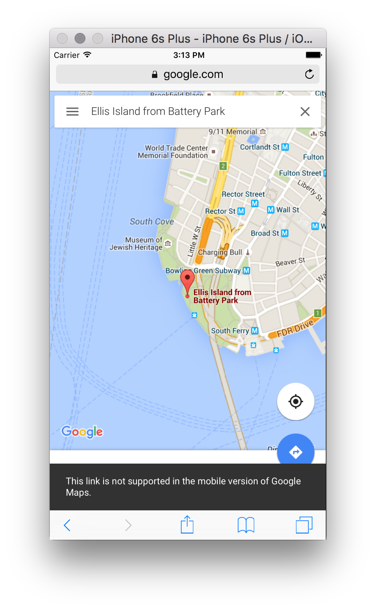
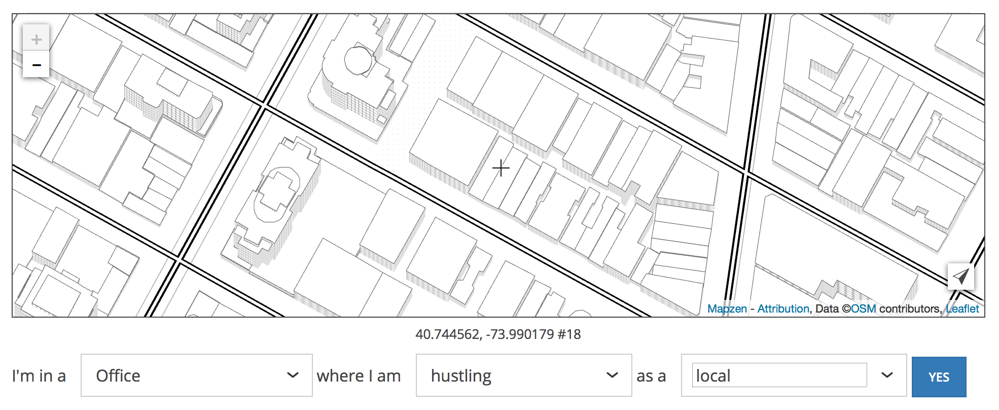
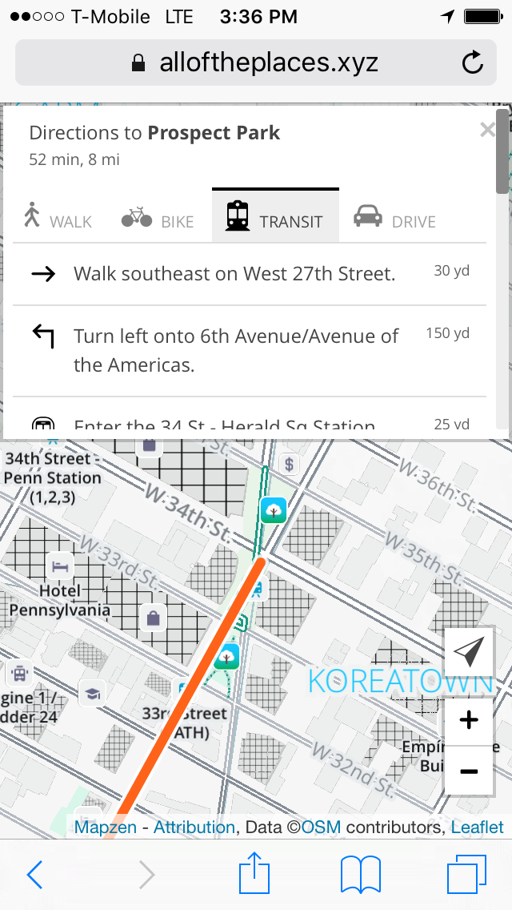
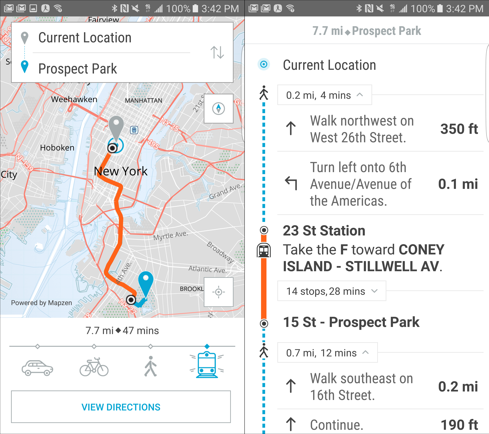
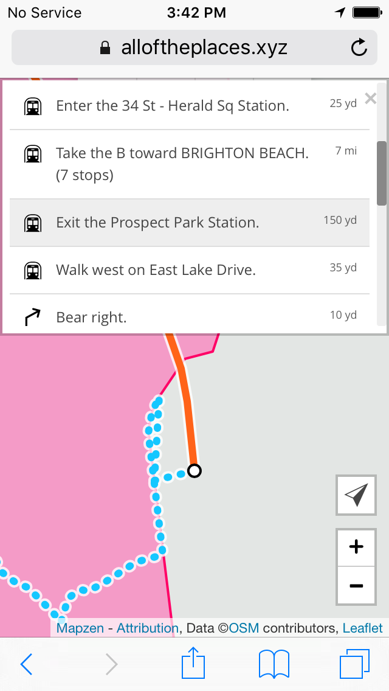
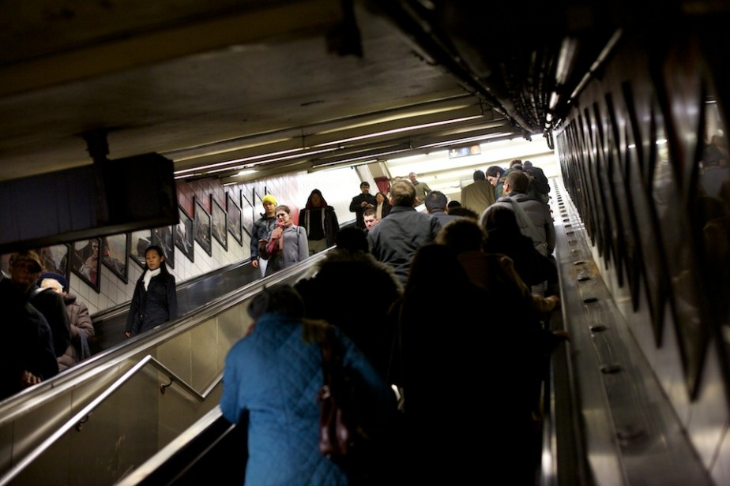

*TL;DR I got lost with my friend, and then found [alloftheplaces.xyz](https://alloftheplaces.xyz/) using all of the Mapzen APIs.*

I was meeting my friend [Caroline](https://twitter.com/carolinesinders) on the July 4th holiday to discuss [a project we’re working on](https://smalldata.coop/). She said “we must find something holiday themed,” and so we planned a field trip to Ellis Island. I suggested a time and sent her [a link](https://www.google.com/maps/place/Ellis+Island+from+Battery+Park) (now defunct) to where we should meet up. On Monday morning I waited for a while next to the line of tourists, and some time passed. It was a holiday, so there was no particular rush, but I started to suspect she was lost. And then, after some confused texting, we discovered we’d each ended up in different states!

The ferry to the Statue of Liberty and Ellis Island leaves from two different docks. One departs from Battery Park, at the tip of Manhattan. The other leaves from across the Hudson, in New Jersey. I had sent her a URL that yielded ambiguous results. Testing the link afterward suggested that depending on what kind of device you used, where you made your request from, (perhaps various other personalization factors?) it was unpredictable where the map might lead you.

In this case my phone showed [New York](https://whosonfirst.mapzen.com/spelunker/id/907288683/), hers showed [New Jersey](https://whosonfirst.mapzen.com/spelunker/id/907289587/). We sorted out the confusion and met in the middle, on Ellis Island. All was good.

The experience stuck with me. How is it that one URL could yield a single, *but different* result for each person? Further inspection made me realize I’d linked to a photo icon on the map, and that linking to photos isn’t well supported on the iOS version of Google Maps.

I’d also complicated the situation by modifying the URL before I shared it. Part of what I removed, the latitude and longitude coordinates, turn out to be an important fallback for settling search result ambiguities. But the link worked for me at the time, so I figured it was safe to share. Nobody is better at intuiting meaning from fuzzy text than Google’s search engine. But sometimes it’s better for an interactive map to fail rather than offer up a guess. And this appears to be the new behavior, so kudos to the Google Maps team for improving that.

I got to thinking about how our own [Who’s On First](https://mapzen.com/blog/who-s-on-first/) gazetteer might help in this type of situation. We already have the [Spelunker](https://whosonfirst.mapzen.com/spelunker/id/874411113/) to find and inspect records, but I decided to build something with far less detail. I just want to *link to a place on the map*, and get directions there. And decorate it with links to other relevant websites—to our own [Spelunker](https://whosonfirst.mapzen.com/spelunker), to the official web presence for the place (if one exists), to social media, Wikipedia, etc.

My place-permalinking website is called [alloftheplaces.xyz](https://alloftheplaces.xyz/) and it’s still very much an early prototype. As such, it still doesn’t quite do what it says on the tin. We are far from including “all of the places,” if that is even possible. It’s an aspirational name, and is consistent with the Who’s On First [Twitter account](https://twitter.com/alloftheplaces).

<iframe scrolling="no" src="https://alloftheplaces.xyz/874411113">
    Your browser doesn't support iframe, please go to 'https://alloftheplaces.xyz/874411113' to see demo.
</iframe>

I wired up [Mapzen.js](https://github.com/mapzen/mapzen.js) using the new [Walkabout](https://mapzen.com/blog/walkabout/) map style, and set it up to pull in data from [Who’s On First](https://whosonfirst.mapzen.com/). On top of that: [Turn-By-Turn navigation](https://mapzen.com/products/turn-by-turn/) and [Mapzen Search](https://mapzen.com/products/search/). This little website could just as well be called “All of the Mapzen Services.”

Last week [Aaron](http://aaronland.info/) asked me to take the directions feature out for a spin and to keep track of my experience. So I did that, and it helped clarify some ideas and feelings about using mobile devices to navigate meatspace.

A lot of this may be specific to an NYC-style of routing: transit-focused, with sensitivity to offline use. On the other hand, a lot of general-purpose mapping apps have an everyone-drives-everywhere bias. I’m still undecided about whether a mobile web slippy map is up to this task, but I do think it’s a good way to quickly try out UI ideas.

First issue: Who’s On First had no record of the place I was trying to navigate to (Grand Army Plaza). There was also no record of the art space I was traveling to afterward (Pioneer Works, now [added](https://alloftheplaces.xyz/907130503)). The data will get better, and I’d like to experiment with capturing new places directly from  alloftheplaces.xyz, perhaps by collecting them via *another* tiny Mapzen service that Aaron is working on called Maplibs.

Second issue: As a New Yorker, I have opinions about things like local vs. express trains. When I asked for a route, it only offered me a single choice, though the Mapzen Mobility team has alternate routes on their radar.

At this point in my test I still haven’t left yet, but I’m using the routing service as a probe to figure out how soon I need to leave. The initial view should emphasize the travel time more. A feature that might be useful here is a built-in reminder: “hey, time to start leaving.” Apple does this with Calendar.app events with locations, but it seems to assume that everyone drives everywhere.

I leave, and I’m transitioning from my desktop to my phone. I have to look up the trip again on my phone, and I’m probably doing it in the elevator where bandwidth is iffy. A thing that Google Maps does well here is it uses my Google account to sync up recently searched things, which means I don’t have to thumb-type my search again. This is a nice feature that feels like an invasive lock-in, but it’s still a nice feature.

I’m thinking about how to offer a similar experience but with less of Google’s “let us organize *all of your data.*” For starters I could save each search query in the web browser cache, so that found things stay found. But the real challenge in a feature like this is syncing these searches between devices and doing it in a way that keeps the user in control of her or his own data. Building out all the plumbing required for that type of use case makes me think of [Carl Sagan’s apple pie recipe](https://www.youtube.com/watch?v=7s664NsLeFM).

In any case, here’s what I’m seeing on my phone as I leave the office:

Using this interface on such a tiny screen is still kind of a hot mess. To a large extent this is because I made a compromise to split up the vertical screen space between map and directions. Scrolling through that list of walking directions inside such a tiny box is painful, and offers too much detail.

Maybe what I want is a summarized version that says:
[+](#) Walk to 34th St - Herald Sq Station
[+](#) Take the B train to 7th Ave
[+](#) Walk to Prospect Park

And then I could tap on the [+](#) for each of the high-level steps to get more details. Maybe I can use the raw turn-by-turn data and group each of the steps by mode to create each top-level step. Worth a try anyway.

[Sarah Lensing](https://twitter.com/sarahlensing), who works on the mobile team here, is testing a version of the directions view in Erasermap that takes a similar approach, structuring the various modes of a multimodal trip (available soon!)

Now I’m on the train, and I’ve lost my bandwidth, but I’m using my phone to figure out which stop to get off at. This is another place where that overview view could be helpful—I really care about “where do I get off the train?” and to a lesser degree “where am I going to walk once I get there?" Bonus points if I could pre-cache a high zoom level neighborhood map of my destination to look at while I’m en route. To the extent that it’s possible, anything I download on my phone should be cached for offline use, probably with something like [localForage](https://github.com/localForage/localForage).

Here’s how things look now on the train:

I make it to my destination and I’m done, but my map is still trying to geolocate me. Was it trying to do this the whole time I was underground? I need some way to tell the map “I’m done” and for the map to notice “we’re offline, stop trying to geolocate.” I wonder if most browsers/phones are smart enough to detect when you’ve lost connectivity and stop trying to geolocate you? Uncertain, but I can always just listen for an [`offline` event](https://developer.mozilla.org/en-US/docs/Online_and_offline_events) so the map responds correctly when I go underground.

Another pain point I’ve experienced nearing the end of the trip is when I emerge from the train, blinking in the bright sunlight, and the map hasn’t really accounted for my new situation. Which way should I walk? If I have a CitiBike membership (I do), where are the racks with available bikes? [Citymapper](https://citymapper.com/) has a great bike sharing interface for this type of scenario), and the Mapzen Mobility team is thinking about [how to implement this](https://github.com/transitland/transitland-datastore/issues/310).

I made it to Grand Army Plaza. The test was a partial success, with lots of pointers toward things that should change. I don’t think my experimental web map is going to become anyone’s new default, but there’s a whole lot you can spin up quickly with various Mapzen APIs. The capacity to add new records to the Who’s On First dataset, and then *link to them*, means I’ll be far less likely to accidentally send my friends to New Jersey.
