_TL;DR: we've added a CSV import feature to [Boundary Issues](https://mapzen.com/blog/boundary-issues-properties/)! Our web-based GeoJSON editor for Who’s On First is not available for public use (yet), but we’re still publicly documenting our progress out in the open. The more technical stuff with screengrabs comes after a bit of introductory context._

## The territory is itself weird

Like many New Yorkers who grew up on the west coast, the subway system is endlessly fascinating to me. Our sprawling 24-hour transit is a source of pride, the subject of gripes and strongly held opinions, and maybe the most interesting venue for [contemporary dance](http://gothamist.com/2015/06/29/two_showtime_dancers_give_us_the_lo.php) in a city well known for its performing arts.

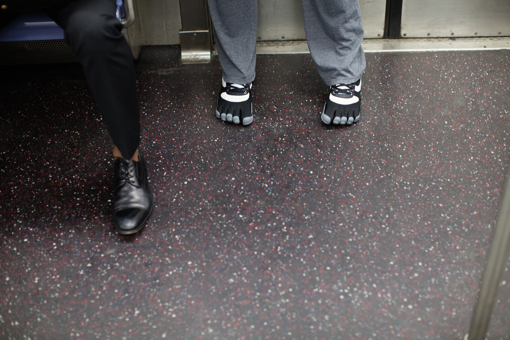

Naturally, we love to map the subway here in NYC. There’s the familiar and practical [MTA official map](http://web.mta.info/maps/submap.html) (whose [evolution](http://gizmodo.com/18-subway-maps-that-trace-nycs-transit-history-1242514280) is also a subject of obsession) and its many [opinionated variations](http://www.citylab.com/design/2014/07/a-vignelli-inspired-map-designed-to-make-the-least-amount-of-people-mad/374680/). Two of my favorites are the [prewalker](http://www.urbandictionary.com/define.php?term=prewalking)’s essential tool, [ExitStrategy](http://gizmodo.com/5310818/nyc-exit-strategy-the-other-nyc-subway-app-you-need), and [BulletMap](https://medium.com/@anthonydenaro/mapping-nyc-transit-all-of-it-e16e76a95a0e), a map optimized for transfers between the subway and bus networks.

All of this is to say, the “subway map” means different things to different people. And that is because the subway itself means different things, depending on whether or not you’re [able-bodied](https://www.dnainfo.com/new-york/20150608/bushwick/map-subway-map-showing-only-wheelchair-accessible-stations), just looking to [catch a show](http://nypost.com/2014/04/17/nyc-buskers-too-many-zooz-become-latest-internet-sensation/), or stocking up on [fashionionable collectables](http://www.theverge.com/2017/2/20/14674604/mta-supreme-metro-cards-nyc-subway-resale).

## Zooming in

Let’s isolate ourselves to just one subway station, let’s say the [36th Street D/N/R/W stop](https://en.wikipedia.org/wiki/36th_Street_(BMT_Fourth_Avenue_Line)) in the historically working class neighborhood of Sunset Park. You can find this useful metadata embedded within the station itself.

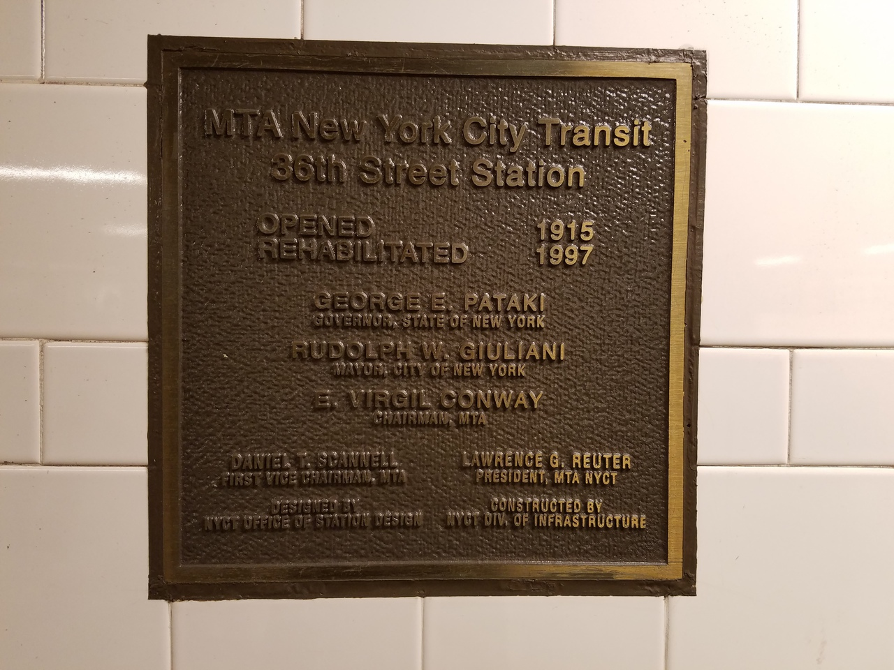

Let’s just stand back a little bit. Behold, there are restrooms here! (For those not familiar with NYC subway facilities, this is uncommon.)

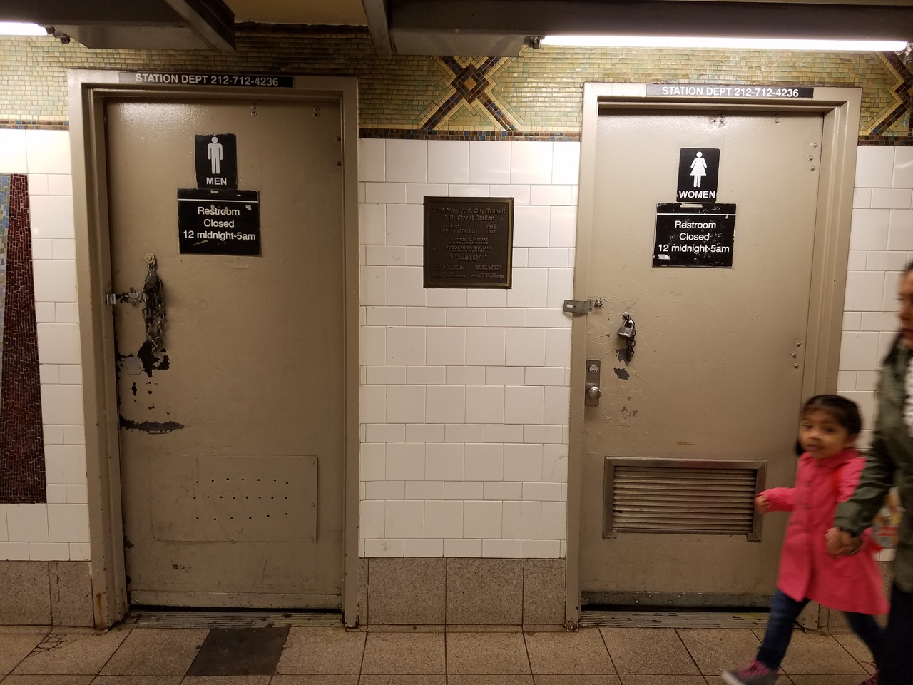

Also included are more valuable hours-of-operation metadata, especially useful if you find yourself returning home from a late night out, looking for relief. (Either rush home _before midnight_ or take your time and wait until _after 5am_.)

Let’s keep looking around this station. Oh man, check out these tile murals!

<div id="mural-designers"></div>
<script>

var div_id = 'mural-designers';
var img_hover_src = 'images/mural2-hover.jpg';

var div = document.getElementById(div_id);
var img = div.querySelector('img');
var img_hover = new Image();
var img_normal = new Image();
img_normal.src = img.src;
img_hover.src = img_hover_src;

div.addEventListener('mouseover', function() {
	img.src = img_hover.src;
});

div.addEventListener('mouseout', function() {
	img.src = img_normal.src;
});

div.addEventListener('touchstart', function() {
	img.src = img_hover.src;
});

div.addEventListener('touchend', function() {
	img.src = img_normal.src;
});

</script>

<p class="caption">The designers. (Hover or tap on this if you want to <em>blow your mind</em>.)</p>

<div></div>

<p class="caption">The builders.</p>

<div></div>

<p class="caption">The riders.</p>

Like all of the public art in NYC subway stations, we’ve got more good metadata here. (Shout out to Peter Columbo, whose name is misspelled on the plaque, but whose mosaic handiwork is [also at 110th St and Lexington](http://www.metmuseum.org/exhibitions/listings/2012/byzantium-and-islam/blog/cultural-connections/posts/byzantium-and-hip-hop).)

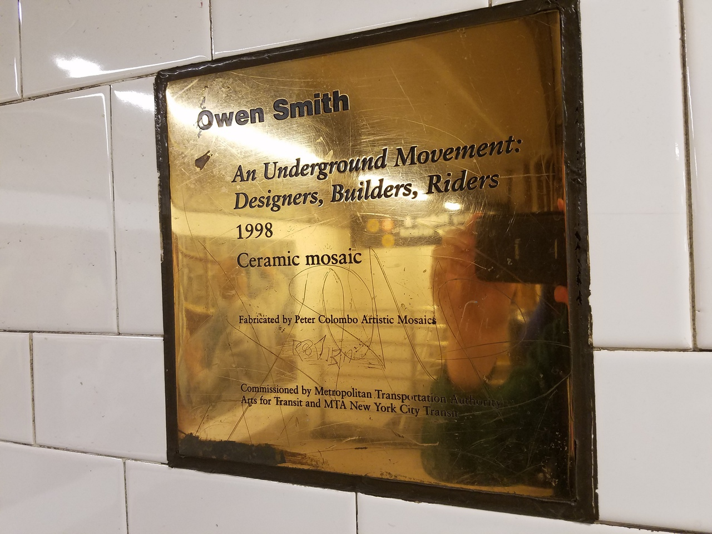

Checking out the [Wikipedia article](https://en.wikipedia.org/wiki/36th_Street_(BMT_Fourth_Avenue_Line)) for the station gives us an even denser picture of the station’s attributes. I am as fascinated by the train enthusiasts who obsessively compile this info, as I am by the train systems themselves. (n.b. I very much [count myself](https://www.youtube.com/playlist?list=PL_WssN5hKWUY9exh9UonSJBO9ntpL137Y) as one of those weirdo train enthusiasts.)

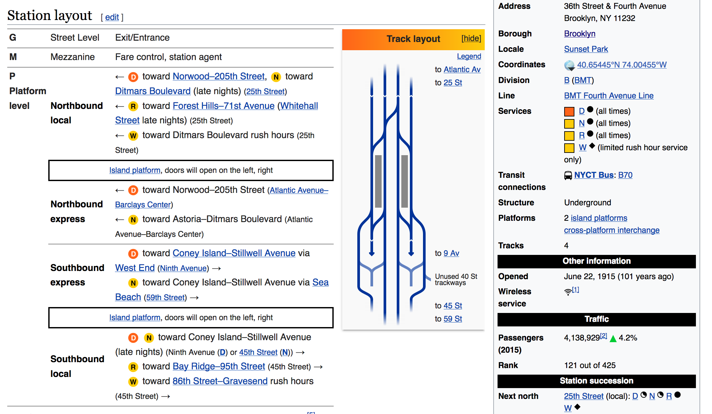

Despite the impressive diagram illustrating how the station’s unused tracks are positioned, Wikipedia does not mention restrooms or public art. That there are restrooms, that the mural here is a great example of Social Realism, are facts that are _just as valid_ and frankly _more interesting_ than the latitude and longitude for this place. Lots of the nuance that captures why we should even care about places tends to get ignored by datasets that are considered comprehensive.

(There was once [an app for finding NYC subway art](http://www.wnyc.org/story/286899-an-app-for-finding-nyc-subway-art/), but it appears to have been discontinued.)

## Zooming out

Taking our previous example at 36th Street, we could imagine systematically capturing the kinds and locations of public art in transit centers (we could also do the same for restrooms and other amenities).

This being a post on the Mapzen blog, I’m interested in how that information can make its way into our open gazetteer, [Who’s On First](https://whosonfirst.mapzen.com/). It’s important to caveat that this type of transit information has _not yet_ been gathered and associated with our place records, but it could be. We have all the tools in place, and an extensible structure that can capture new forms of place nuance.

The trick is in how we encode the properties for each place record, and in particular how we keep those property names from conflicting with each other. As I wrote in my last blog post about [Boundary Issues and property editing](https://mapzen.com/blog/boundary-issues-properties/):

> Instead of specifying a `tags` property, we use `wof:tags`, meaning it’s a part of the Who’s On First namespace. This lets us keep things that are common to _all WOF records_, like `wof:name`, separate from from Mapzen _opinionated things_ like `mz:categories`

The namespaces for WOF properties act as a cue about the nature of each property: is it “general purpose” or is it an “opinionated assertion?” It also serves another purpose: _where did this opinion originate from?_ If you see a property with `sg:tags`, that `sg:` prefix lets you know that the data came from [SimpleGeo](https://archive.org/details/2011-08-SimpleGeo-CC0-Public-Spaces).

This system allows us to keep a property like `wof:name` (the name of the place, “36th Street”) distinct from `public_art:name` (the mural’s title, “An Underground Movement: Designers, Builders, Riders”). The namespaces assigns a kind of credit/blame for where a given detail originated from. We maintain a GitHub repository, [whosonfirst-sources](https://github.com/whosonfirst/whosonfirst-sources/), that describes who is responsible for which properties.

(Quick side note: just to be especially clear, `public_art:name` is a fictional property name chosen for the purpose of illustrating the logic of prefixes and sources. Who’s On First has [an existing convention](https://whosonfirst.mapzen.com/spelunker/concordances/sfac/#10/37.8166/-122.5057) of treating public art as a _first-class place_, rather than a set of properties that decorate wherever an artwork physically manifests itself. A helpful test for answering the question “is it a place?” is: _can I ask someone to meet me there?_ As in, “let’s meet over by [Fearless Girl](https://gregfallis.com/2017/04/14/seriously-the-guy-has-a-point/).”)

```json
{
	"id": 404734187,
	"fullname": "Yahoo! GeoPlanet (formerly Where On Earth)",
	"name": "whereonearth",
	"prefix": "woe",
	"key":"id",
	"url": "http://developer.yahoo.com/geo/geoplanet/",
	"license": "http://developer.yahoo.com/geo/geoplanet/data/"
}
```

A Who’s On First _source_ is composed of a short list of attributes like `name`, `fullname`, `prefix`, `url` encoded into a publicly accessible JSON file.  We maintain a single [list of all the sources](https://github.com/whosonfirst/whosonfirst-sources/blob/master/sources/README.md#simplegeo), including [The New York Times](https://github.com/whosonfirst/whosonfirst-sources/blob/master/sources/nytimes.json) (prefix `nyt`), [United States Census Bureau](https://github.com/whosonfirst/whosonfirst-sources/blob/master/sources/nytimes.json) (prefix `uscensus`), and our own [Burrito Justice](https://github.com/whosonfirst/whosonfirst-sources/blob/master/sources/burritojustice.json), whose microhood, [La Lengua](https://burritojustice.com/la-lengua/), has gone on to become [standardized](https://bernalwood.com/2015/02/05/extremely-graphic-infographic-visualizes-2014-bernal-heights-microhood-real-estate-trends/) in other mapping taxonomies.

The range of ways we might describe a place will differ vastly depending on interests and needs. Using property prefixes gives us a useful way to group those needs, avoid naming conflicts, and let them all cohabitate within a single WOF record.

## Who’s On First: it’s not just data

One of our self-imposed design constraints is that we don’t get to choose your dev stack. This is why we publish everything as GeoJSON flat files instead of, say, a PostgreSQL dump file. If you use PostgreSQL/PostGIS, you’ll find a way to get the data into your tables.

For my work on [Boundary Issues](https://github.com/whosonfirst/whosonfirst-www-boundaryissues), our bespoke web-based content management system for WOF records, my Mapzen colleagues are the primary customer. However, they are not the only customer, and we are just starting to pull in outside contributors. (If you want to be a guinea pig, please [get in touch](boundaryissues@mapzen.com)!). A lot of my recent focus working on Boundary Issues  has been about lowering the bar for contributing data.

## WOF ❤️ CSV

While [GeoJSON](http://geojson.org/) offers an amazing level of flexibility and compatibility for describing places, it turns out CSV is an _even better_ format for expressing many places at once. First of all it’s just been around longer; [FORTRAN 77 supported it in 1978](https://en.wikipedia.org/wiki/Comma-separated_values#History). That longevity means it has support in a wide range of spreadsheet editors, from VisiCalc to Google Sheets.

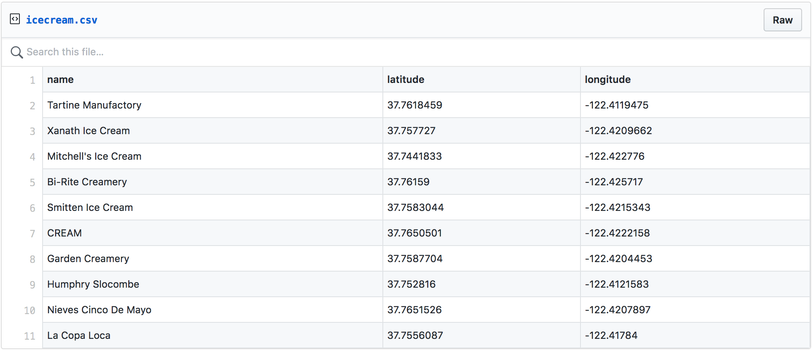

Unlike JSON (or XML), data encoded into CSV format doesn’t require that you read the entire file before you can start parsing it. That means CSV files can get _really really big_, and your software will still be able to read a single row efficiently. There are drawbacks to CSV as well, chiefly among them is it’s harder to express nested information inside its columnar structure. It’s all a trade-off, and choosing the right data format to encode stuff in has everything to do with the circumstances at hand.

## _Six sections into the post and…_

That brings us to the lede, buried under quite a bit of context and exposition: _Boundary Issues now supports importing CSV files_ 🎉. This is important and not just for the convenience of editing WOF data outside of specialized geo-software ([QGIS](http://www.qgis.org/en/site/forusers/download.html) I love you, but your user interface is bringing me down). CSV support means Boundary Issues can now import more data into Who’s On First, from a wider range of sources. And more importantly, we can invite more people to edit within spreadsheet software they already have at hand, increasing the number of perspectives describing WOF places.

## The world is wonderfully multifaceted

The territory means [different things to different people](https://twitter.com/Walldo/status/852040146446831616). Depending on your perspective, the kinds of data that are captured about places may be missing, insufficient, or downright hostile. Who’s On First is _opinionated_—like all datasets, no collection is truly unbiased—but we hope to be aware of when we’re asserting our own opinions about places and create a framework where a polyglot of _place-feels_ will be welcome.

The multifaceted maps we make simply reflect the weird and wonderful territory they represent.

Like [the Internet](https://peoplecentered.net/the-internet-is-made-of-people/), Who’s On First data is _made of people_. Those who have the capability to edit our raw data necessarily reflect themselves in those edits. They are present in the data through choices about which places get edited, and the types of nuanced assertions they make about places.

Throughout the development of the CSV import feature, I had the pleasure of working with Jeff Ferzoco’s dataset for his excellent historic mapping project, [OUTgoing](http://outgoingnyc.com/).

> OUTgoing: The Hidden History of New York's Gay Nightlife—is an effort to map documented historic locations of gay nightlife in New York City as far back and comprehensively as possible. We now have all 50 states with legalized gay marriage, and the LGBT experience is in the midst of a 21st century upshift. It's time to look back and get some perspective and data—in order to look forward. From historic records, we’ve gathered 969 nighttime spots—bars, clubs, bathhouses, coffee houses, cruising areas, late-night diners, etc.—from the 1800s to 2015. It is nowhere near complete.

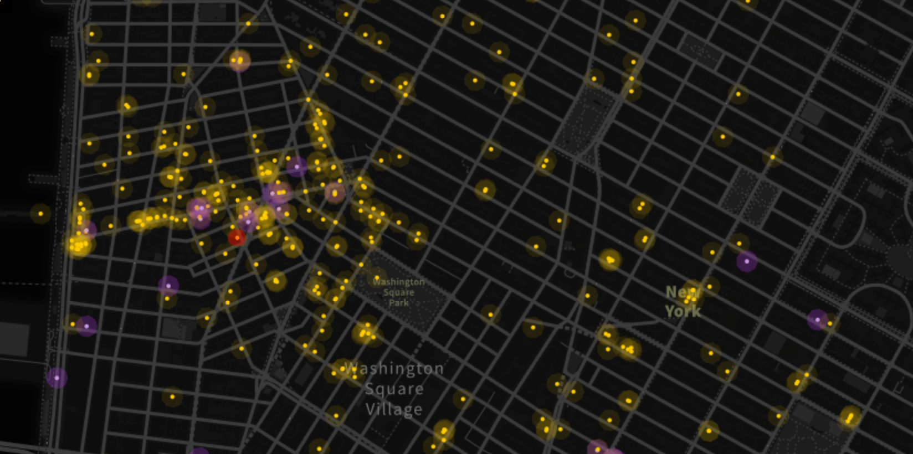

Jeff was kind enough to share a CSV file of all his collected places, which is dense with excellent metadata like `year_opened`, `year_closed`, and `mafia_owned`.

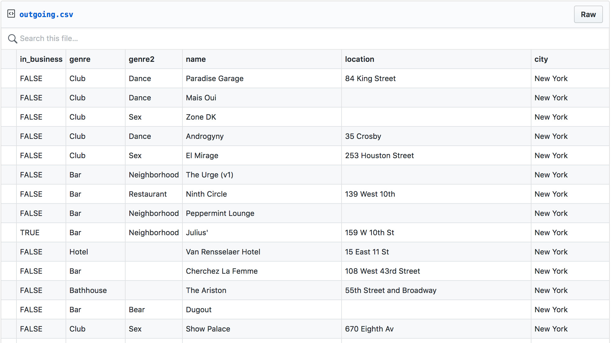

Here’s how we can start importing that data into Who’s On First: select the CSV file we want to upload.

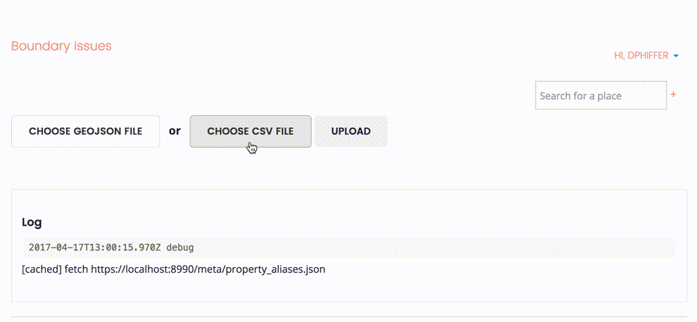

The upload interface reveals some general options, allowing us to specify whether the CSV file has a column header row,  identify a _source_ for the data (in this case, [`outgoing`](https://github.com/whosonfirst/whosonfirst-sources/tree/master/sources#outgoing)), and choose a _prefix_ for the properties we are merging into Who’s On First.

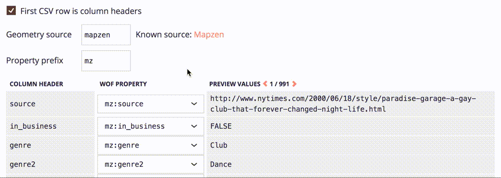

Next we will map _which columns_ should be saved to _which properties_. Some columns map onto generic, well-known WOF properties like `wof:name`, `geom:latitude`, and `geom:longitude`, while others get saved as new properties with the `out:` prefix. The code detects predictable column headings like `latitude` and `longitude` and maps them automatically.

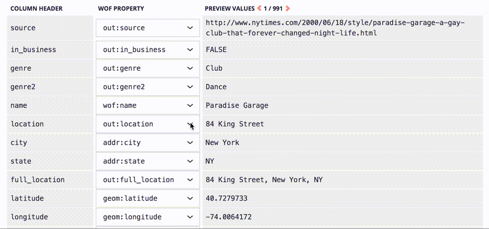

Once that property mapping is ready, we can click the “upload” button and begin stepping through each of the rows in the CSV file.

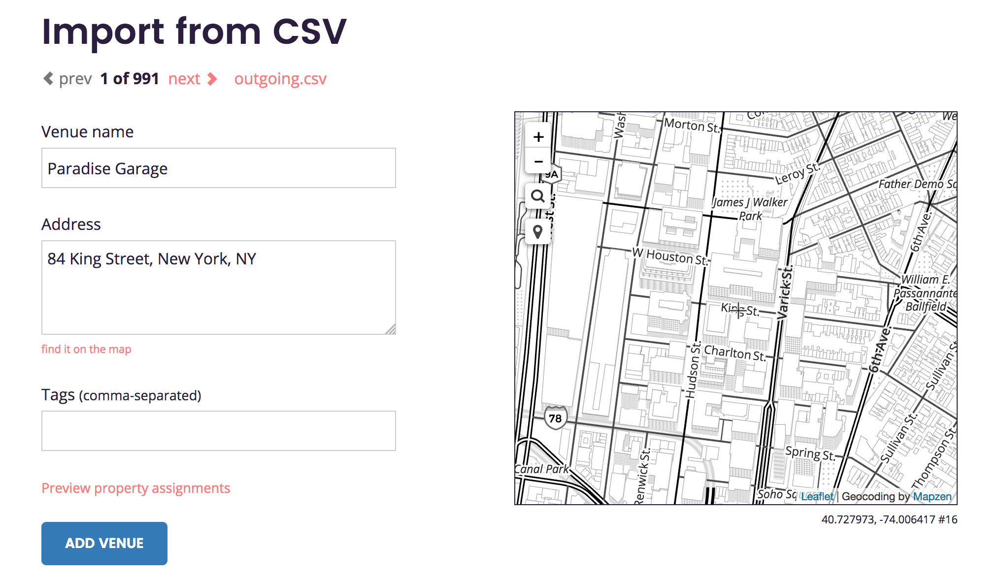

This row-by-row process allows us to make any necessary adjustments to the record before we import it into the Who’s On First dataset. In some cases, we may need to choose which address is the correct one.

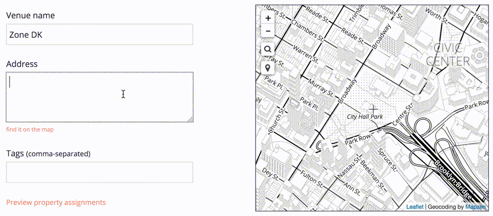

We also want to avoid duplicating existing records, if possible.

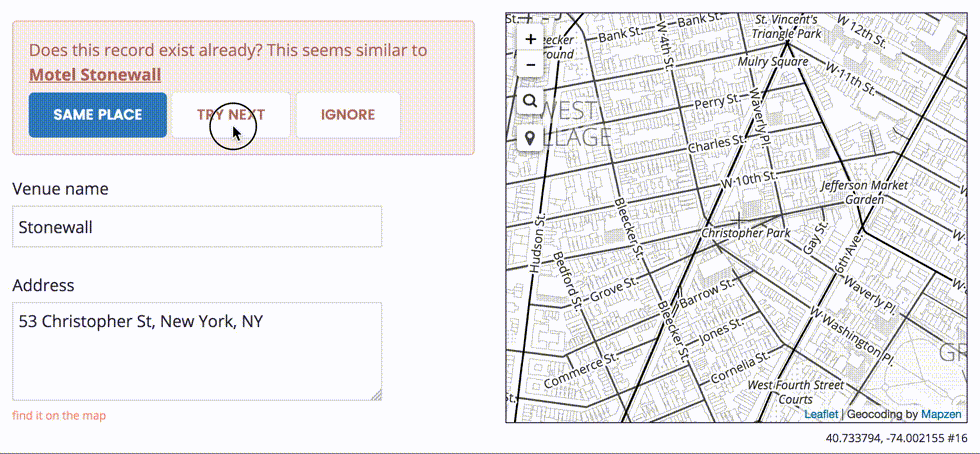

Once we complete the step-through import process, we can download a new CSV file modified to include a new `wof_id` column. This additional column allows us to round-trip our edits back into Who’s On First, effectively turning your spreadsheet editor into a new external interface to change properties en masse.

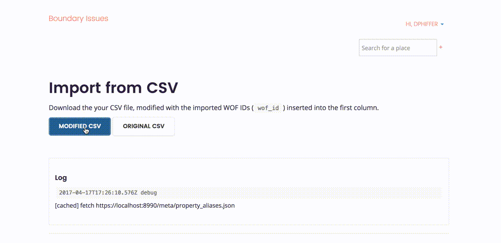

Working with real data has been extremely helpful for shaping the CSV step-through feature. Huge thanks to [Jeff](https://twitter.com/zingbot) for sharing his research and for being so generous with the underlying dataset. The OUTgoing data is quirky and opinionated, and was instrumental in identifying unexpected edge cases as I was writing the code.

We [look forward to meeting](mailto:boundaryissues@mapzen.com?subject=CSV%20FTW) your weird and wonderful CSVs!

## Excuse me while I promote some things here

Plug #1: _This blog post was adapted into a talk at [csv,conf](https://csvconf.com/) on May 3 in Portland, OR. Thanks for coming by! [Here are the slides](https://phiffer.org/etc/csvconf.pdf), and the [slides + video](https://phiffer.org/etc/csvconf.zip) if you missed it._

Plug #2: _We are extending the deadline for our [call for  internship applications](https://whosonfirst.mapzen.com/interns/#2017). Please apply if you found this discussion interesting, and want to help us improve how we we present Who’s On First to the world._
