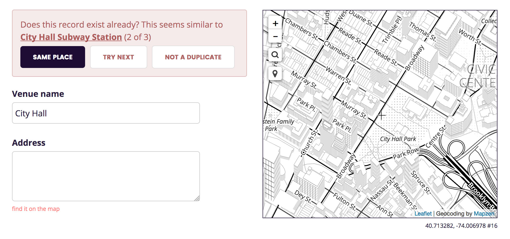
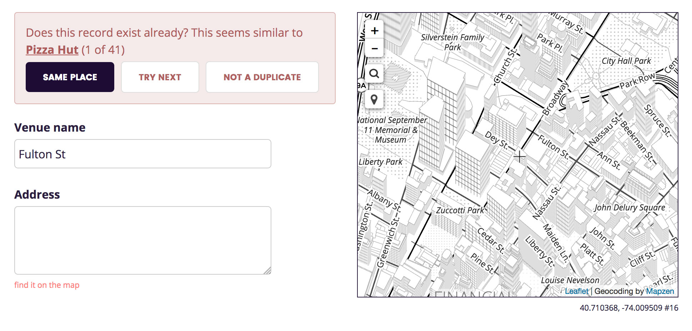
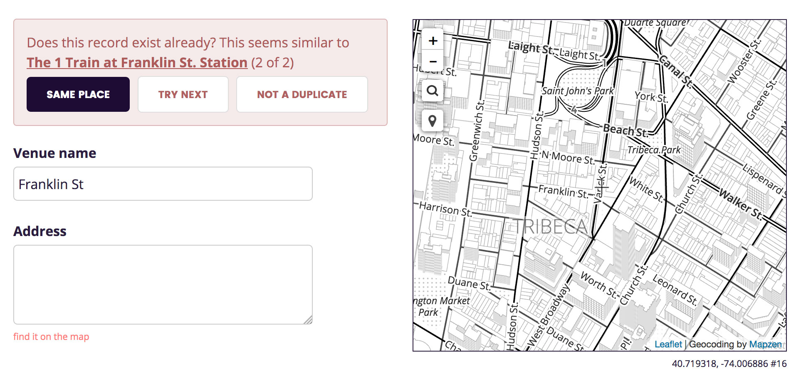
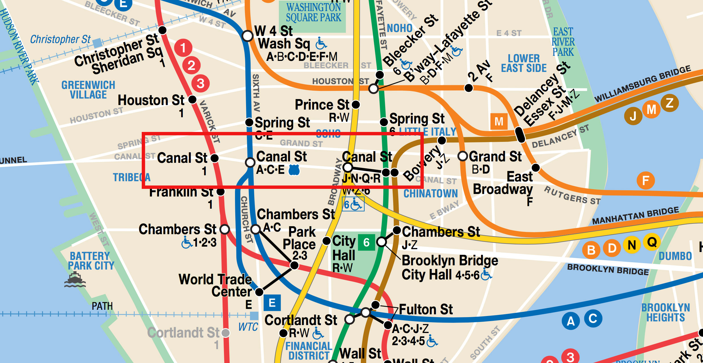
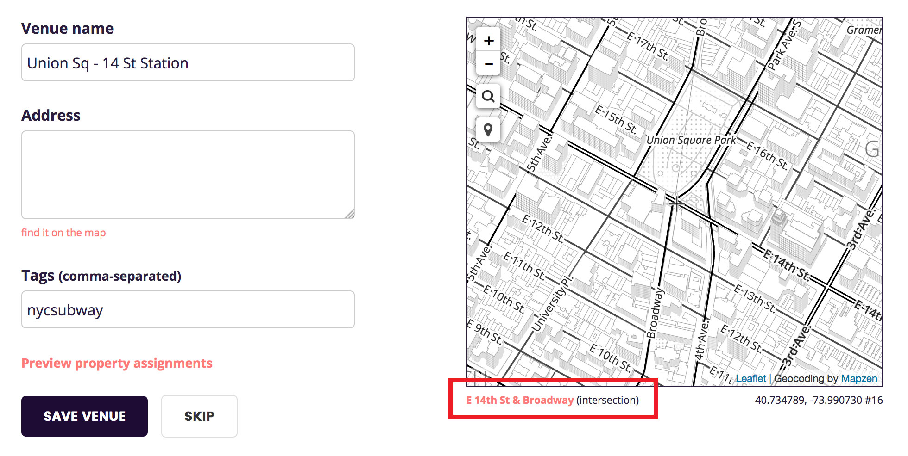
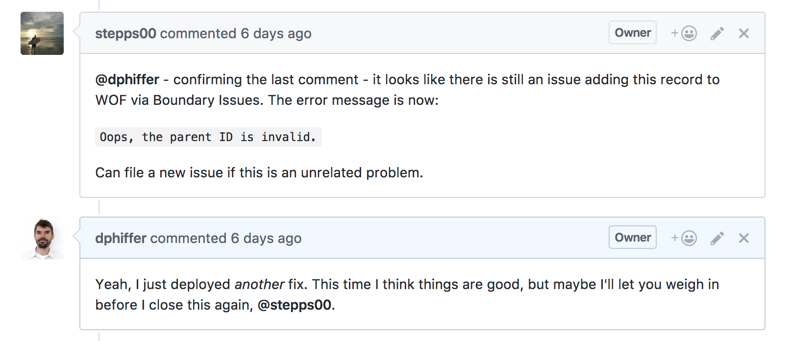
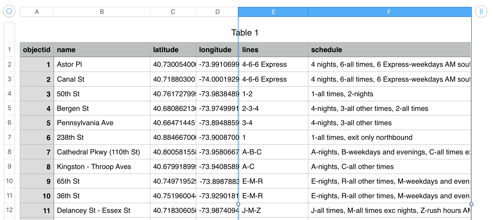
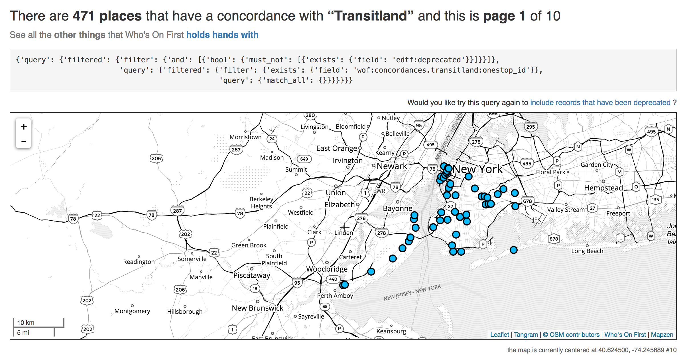

Last Wednesday I gave a talk at [csv,conf](https://csvconf.com/) in Portland, OR. The conference gathered a variety of people who care about open data, technical and non-technical alike. I adapted the talk from my last blog post [The world is weird and wonderful!](https://mapzen.com/blog/weird-and-wonderful/) I’ve been told the conference organizers will post videos talks, so [stay tuned](https://twitter.com/csvconference).

Like the blog post, my talk was split into two parts. I started by introducing [Who’s On First](https://mapzen.com/tag/whosonfirst/) and [Boundary Issues](https://mapzen.com/tag/boundaryissues/) to an audience not necessarily familiar with open geo, and then showed a hands-on demo of the [Boundary Issues CSV import feature](https://mapzen.com/blog/weird-and-wonderful/).

## Hello, Transitland!

Both my blog post and talk focus on New York City’s subway. As I was thinking about the system, and the 36th St station I used for my example, I realized that we did not actually _have_ records for subway stations in Who’s On First.

That seemed like as good excuse as any to _import the subway stations_. After all, I just made this fancy new CSV importer, why not put it to use?

So I brought in the records using the [Transitland Datastore API](https://transit.land/documentation/datastore/api-endpoints.html). I wrote [a shell script](https://gist.github.com/dphiffer/00aa7b646cd206e067feee1bf7c5b04c) that generated [a CSV file](https://gist.github.com/dphiffer/00aa7b646cd206e067feee1bf7c5b04c#file-2_transitland_nyc_subway-csv), encoding each station as a row. The columns include a station name, a [Onestop ID](https://transit.land/documentation/onestop-id-scheme/), and latitude/longitude coordinates.

Here is a screen capture I took while I was testing to give you a sense for the process.

<video src="images/transitland_import.mp4" controls="controls"></video>

It worked! I imported all of the subway stations, using a home team geometry source. There is one remaining mystery regarding the number of stations; of the 502 CSV rows I discovered a handful of duplicates on the way in, ultimately resulting in [471 records](https://whosonfirst.mapzen.com/spelunker/concordances/transitland/). However, according to [Wikipedia](https://en.wikipedia.org/wiki/New_York_City_Subway_stations) we should actually have 472 stations. In due time we will untangle the station count discrepancy. Better than yesterday!

## Don’t get duped by dupes

For each new venue you import during the step-through process there’s a possibility that we already have a WOF record in the dataset. We don’t want two records for the same place, so it’s incumbent upon the user interface to alert you when something with the same name and location exists.

De-duping places is a _hard problem (a.k.a. tricky business)_ (*[Deduplicating a Places Database](https://research.fb.com/publications/deduplicating-a-places-database/)* is a paper from Facebook Research that has been recommended to me, although I haven't read it yet) and I did not set out to solve in a complete or even correct way. What I did set out to do is make a de-duping interface we could live with today and that we could improve on tomorrow. I created the _simplest dumbest thing_, a stepping stone to a _marginally less dumb, more nuanced thing_.

Here’s what it looks like:

Sometimes it found _obviously wrong_ dupe candidates:

And sometimes it surfaced incorrect (or at least *incomplete*) WOF records:

Despite the mixed quality of the dupe candidates, it worked! I was able to discover and merge the new data with existing WOF records.

One caveat to add is that my dupe-detection UI has both false positives (suggestions for places that aren't the same) and false negatives (it fails to suggest some existing places). I am more concerned with fixing the latter, but in the interim I have added a method for manually specifying a duplicate place by WOF ID.

## The Canal St Station problem

I came to learn quickly that NYC’s subway stations are full of challenging edge cases. Lots of stations have the same name! Canal Street has five different subway stations, from which you can take the 1, A, C, E, J, N, Q, R, J, or Z trains.

As the data was coming in, I had to determine if the incoming record actually represented a _new Canal St_ or another dimension of an existing record. To make matters more confusing, Transitland accounts for each platform within a subway station complex.

I decided on a rule that I could follow: if there’s a _dot on the official MTA map_ that dot represents a distinct station. Even if you can walk between two of the dots on the map via a connecting tunnel—DOT EQUALS STATION. Anything more complicated elevates the likelihood of forming the wrong mental model for the next person to try to understand.

As I was writing this blog post, I heard about some new Transitland updates that are in the works. [Ian Rees](https://github.com/irees) along with [Greg](https://twitter.com/heyknisely) and [Duane](https://twitter.com/DuaneGearhart) have been working on Transitland's station hierarchies, which capture station/platform/entrance relationships. More is coming soon!

## Place hierarchies are hard

For each record we add to Who’s On First, we wire in its hierarchy of parent places. For example, [14 St - Union Square Station](https://whosonfirst.mapzen.com/spelunker/id/1108958717/) is in Union Square neighbourhood, in Manhattan, which is in New York City, etc. Additionally, each place has a direct `wof:parent_id` assigned to it.

For some reason during my import process the hierarchies came out all funky. Some, but not all, records were parented by `borough` records (skipping `intersection`, `microhood`, `neighbourhoud`, etc.). Other records had no hierarchy or parent. Unfortunately my _very pared down, very simple_ user interface didn’t provide any indication of the hierarchy (or lack thereof).

I have since added a small indicator that shows what the direct parent of the place is, which should help clue in the person importing data when something goes wrong.

For a more in-depth description of the Who’s On First placetype hierarchy, see the [whosonfirst-placetype repo](https://github.com/whosonfirst/whosonfirst-placetypes).

## Shipping good bug fixes is hard

Once I discovered the importer was generating bad hierarchies and assigning the wrong parent IDs, I decided to add a check that would do some validation before the record gets saved.

I deployed the validation check, Aaron helped me clean up the incorrectly-encoded subway records, and then I went back to enjoying the csv,conf presentations.

Almost immediately I heard from three people, more or less in unison, that something was wrong. They could not save WOF records using the importer! Something about an `Incorrect parent ID`.

So I went back to the drawing board. There turned out to be a flaw in how we were requesting [point-in-polygon](https://en.wikipedia.org/wiki/Point_in_polygon) results. However, the larger problem was that overzealous validation was blocking the save process. A person adding a venue just wants the _save button_ to _save the thing_. They don’t know what a parent ID error is, especially when they have no means of fixing it.

I'm not sure whether I’ve nailed down all the root causes for bad `wof:hierarchy` and `wof:parent_id` properties, but I have come up with a better way to mitigate that situation if it crops up again. Now when you press the save button, the code does a slightly looser validation check, and if the hierarchy/parent stuff looks wrong—it will tell you two things:

1. Hey, the hierarchy/parent stuff looks bad
2. But don’t worry I’m fixing it (try saving again!)

And then it goes and fixes it. For now you still have to press the save button one more time, which is a temporary compromise. On the one hand, I am curious to know how often people encounter this particular problem. On the other hand, you just want to _save the thing_, and _why can't it just fix-and-then-save automatically?_ Today it is _somewhat_ annoying, but not to the degree that it stops you from doing what you're trying to do.

## Still to come

All this time I was fixing issues with the CSV importer, I was testing out another subway data set I got from the official [NYC Open Data website](https://data.cityofnewyork.us/Transportation/Subway-Stations/arq3-7z49).

It’s the same list of subway stations, but it includes some interesting summarized descriptions of what you can find at each station in terms of train lines and service frequency.

More importantly, it means we will have records with both the official object ID assigned from the NYC Open Data website _and also_ the concordance from Transitland. If any other application uses the “official” data source, they can now use a WOF record to correlate _their stuff_ with _Transitland’s stuff_.

Until then, here are the [Transitland concordances](https://whosonfirst.mapzen.com/spelunker/concordances/transitland/) we do have.

## It just _looks_ simple

A big motivation for creating a CSV importer has been to reduce the complexity involved in getting data into Who’s On First. I created a venue editor with just three text inputs: _name_, _address_, and _tags_, instead of the myriad property editing controls of the fully featured edit page. Without having studied the full corpus of [WOF theory](https://whosonfirst.mapzen.com/theory/), someone with a CSV file to share should be able to contribute to the dataset.

Enter a name, pick a location, hit the save button. You put the data in, and _boing_, your place is on the map. (Shout out to my mom, Kathleen Phiffer, whose one sentence-summary of my talk I borrowed here.)

My simpler add-a-venue page _still produces fully-functional GeoJSON_. There’s a whole lot going on behind the scenes that’s easy to miss.

Do you have good open data you want to try? [Drop us a line](mailto:boundaryissues@mapzen.com) if you want to test.

## Excuse me while I promote one more thing

Plug: *I’m going to be giving a shorter version of my csv,conf talk at month’s GeoNYC. It is happening on Monday May 15, so if you don’t have plans already come on out to [Mapzen](https://whosonfirst.mapzen.com/spelunker/id/420573371/) to hear all about how [POIs are just interesting points](https://www.meetup.com/geonyc/events/239820070/).*
