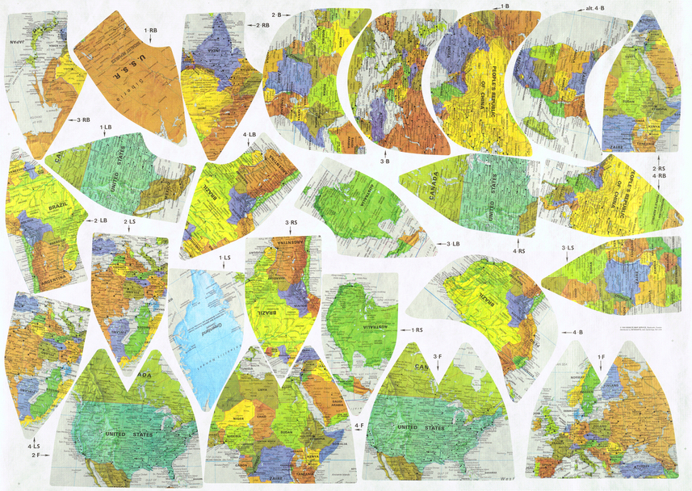

[Mapzen Places](https://mapzen.com/data/places/) is here! Find out more about a location, its geometry, its relationships, and return useful metadata, all through a [convenient and well-documented API](https://mapzen.com/documentation/places/). Mapzen Places is all based on open data, with licensing suitable for commercial projects. Start using it via [Mapzen Flex](https://mapzen.com/pricing/) today!

If you like plain-text GeoJSON records with stable numeric IDs, a finite set of placetypes, and a common set of ancestors for all records, then Mapzen Places is for you. Perform spatial queries without having to set up and run a spatial database! Get worldwide admin hierarchies from continent to neighbourhood! Records may be updated, superseded or deprecated, but never removed. Mapzen Places also “holds hands” with Wikipedia, Wikidata and other datasets.

The Mapzen Places API gets its data from [Who's On First](https://whosonfirst.mapzen.com/), and supersedes the Who's On First API which we have been beta testing for the past year. Note that `whosonfirst-api.mapzen.com/?` is deprecated but requests will get redirected to `mapzen.places.com/v1/?`. The old `whosonfirst.*` methods will continue to work but are deprecated — `mapzen.*` is the new method.

There are [many useful methods in the Mapzen Places API](https://mapzen.com/documentation/places/methods/), including

###mapzen.places.getDescendants

[Get descendants of a place](https://mapzen.com/documentation/places/methods/#mapzen.places.getDescendants): counties in a country, postal codes in a city, regions in a continent, venues in a neighbourhood. 

Here's the API request for neighbourhoods in London:  

```
https://places.mapzen.com/v1/?
method=mapzen.places.getDescendants&
id=101750367&
placetype=neighbourhood&
extras=name
&api_key=INSERT-YOUR-API-KEY
```

_(We've broken out the arguments in the URL to make it easier to read -- [here's a link](https://places.mapzen.com/v1/?method=mapzen.places.getDescendants&id=101750367&placetype=neighbourhood&extras=name&api_key=INSERT-YOUR-API-KEY), just add your API key.)_

Here's the response:

```
places: [
    {
        "wof:id": "85785187",
        "wof:parent_id": "101750367",
        "wof:name": "Abbey Wood",
        "wof:placetype": "neighbourhood",
        "wof:country": "GB",
        "wof:repo": "whosonfirst-data",
        "name": ""
    },
    {
        "wof:id": "85785221",
        "wof:parent_id": "101750367",
        "wof:name": "Acton",
        "wof:placetype": "neighbourhood",
        "wof:country": "GB",
        "wof:repo": "whosonfirst-data",
        "name": ""
    }...
```

Adding `format=geojson` does what you'd expect:

```
{
type: "FeatureCollection",
features: [
    {
        type: "Feature",
        geometry: {
            type: "Point",
            coordinates: [
                0.12401,
                51.495463
            ]
        },
        properties: {
            wof:id: 85785187,
            wof:parent_id: "101750367",
            wof:name: "Abbey Wood",
            wof:placetype: "neighbourhood",
            wof:country: "GB",
            wof:repo: "whosonfirst-data",
            name: "",
            geom:latitude: 51.495463,
            geom:longitude: 0.12401,
            lbl:latitude: 51.488981,
            lbl:longitude: 0.11348
     }
 }...
```

...as does `format=csv`:


```
name,wof_country,wof_id,wof_name,wof_parent_id,wof_placetype,wof_repo
,GB,85785187,"Abbey Wood",101750367,neighbourhood,whosonfirst-data
,GB,85785221,Acton,101750367,neighbourhood,whosonfirst-data
,GB,85785229,Addiscombe,101750367,neighbourhood,whosonfirst-data
,GB,85785259,Aldersbook,101750367,neighbourhood,whosonfirst-data
...
```


###mapzen.places.getHierarchiesByLatLon

Get the [hierarchy of a place](https://mapzen.com/documentation/places/methods/#mapzenplacesgethierarchiesbylatlon), from `neighbourhood` or `microhood` up to `country` and `continent`. Here is the hierarchy for a microhood in Bernal Heights, San Francisco:

```
https://places.mapzen.com/v1/?
method=mapzen.places.getHierarchiesByLatLon&
latitude=37.74
&longitude=-122.42&
api_key=INSERT-YOUR-API-KEY
```

```
{
hierarchies: [
        {
            microhood_id: "420780693",
            neighbourhood_id: 85865945,
            continent_id: 102191575,
            country_id: 85633793,
            locality_id: 85922583,
            county_id: 102087579,
            region_id: 85688637
        }
    ],
stat: "ok"
}
```

Adding `spr=1&extras=name&` will give you a more detailed response -- here's a snippet of the `neighbourhood` details:

```
    neighbourhood: {
        "wof:id": 85865945,
        "wof:parent_id": "85922583",
        "wof:name": "Bernal Heights",
        "wof:placetype": "neighbourhood",
        "wof:country": "US",
        "wof:repo": "whosonfirst-data"
    }...
```

###mapzen.places.getIntersects

Discover [placetypes that intersect a bounding box](https://mapzen.com/documentation/places/methods/#mapzen.places.getIntersects) -- here is the request for counties in `-6.6482,38.2448,-4.8118,39.9779`:

```
https://places.mapzen.com/v1/?
method=mapzen.places.getIntersects&
min_latitude=-6.6482&
min_longitude=38.2448&
max_latitude=-4.8118&
max_longitude=39.9779&
placetype=county&
api_key=INSERT-YOUR-API-KEY
```

a.k.a. coastal Tanzania:


```
{
  "places": [
    {
      "wof:id": 421188197,
      "wof:parent_id": 85679651,
      "wof:name": "Kusini",
      "wof:placetype": "county",
      "wof:country": "TZ",
      "wof:repo": "whosonfirst-data"
    },
    {
      "wof:id": 421191173,
      "wof:parent_id": 85679651,
      "wof:name": "Kati",
      "wof:placetype": "county",
      "wof:country": "TZ",
      "wof:repo": "whosonfirst-data"
    }...
```

These methods have [lots of arguments](https://mapzen.com/documentation/places/methods/#arguments_8), and as noted earlier, can return data in exciting formats such as json, geojson, and csv.

If you choose GeoJSON, you can add the API response directly onto a map! In Tangram, here's how you can use `mapzen.places.getDescendants` to display airports in Africa:

```
    venues:
        type: GeoJSON
        # url: https://whosonfirst-api.mapzen.com/?method=whosonfirst.places.getNearby
        url: https://places.mapzen.com/v1/?
        url_params:
            method: mapzen.places.getDescendants
            id: 102191573 #africa
            api_key: global.sdk_mapzen_api_key
            placetype: campus
            tags: airport
            format: geojson
            per_page: 500
            extras: wof:tags,wof:concordances,mz:is_current,name:eng_x_variant,oa:type,oa:elevation_ft,wof:name

```

Note the `extras` — this lets you pull in metadata (in this case, airport codes and airport size that we've concorded with OurAirports and ICAO and IATA) that you can use for labels and display.

<div class="demo-wrapper">
<iframe src="https://mapzen.com/tangram/view/?api=22/1036#2.84/3.73/14.86"></iframe>
</div>

[Open full screen](https://mapzen.com/tangram/view/?api=22/1036#5.605/5.148/3.729), and [check out the scene file](https://mapzen.com/tangram/play/?api=22/1036#5.605/5.148/3.729) in Tangram Play!

You can learn much more on the [Mapzen Places page](https://mapzen.com/data/places/) and [the documentation](https://mapzen.com/documentation/places/). Mapzen Places is part of [Mapzen Flex](https://mapzen.com/pricing/), with clear, predictable pricing and a generous free tier. Sign up for [an API key](https://mapzen.com/developers) to get started!

_Preview image: Sheet printed with parts of map of the world in sections as would be made up into baseball hats. The parts of 4 hats are printed on each sheet. It was designed by Esselte Map Service and company: Interarts and made by Graphic Jackets,  via [Cooper Hewitt](https://collection.cooperhewitt.org/objects/18635637/)._
