

[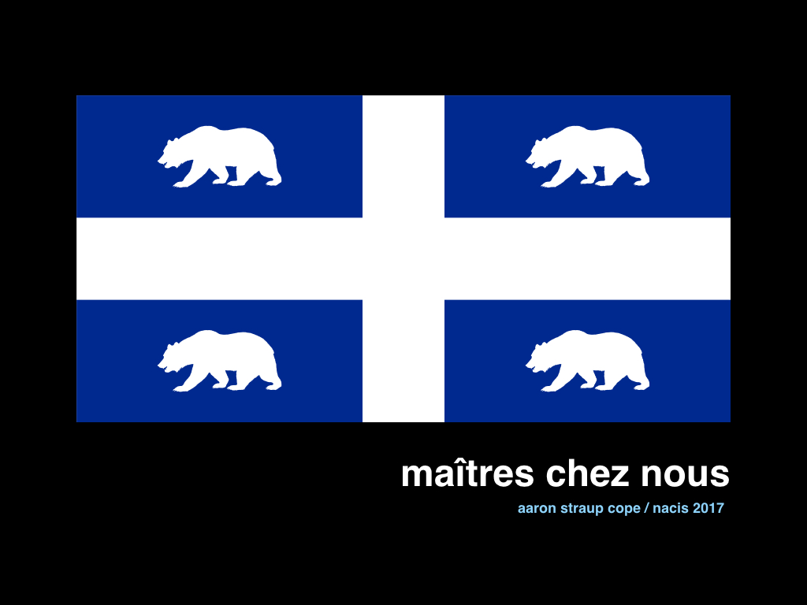](#intro)

_The following are the slides and notes for a talk about [Who's On First](https://whosonfirst.mapzen.com) that I delivered at the [2017 NACIS conference](http://nacis.org) in Montreal._ 
 
_From the beginning our goal with Who's On First has not been to create a canonical list of carefully selected, important or relevant places. It is not meant to act as the threshold by which places are measured but rather as a welcoming vessel for all the places and the raw material by which any number of thresholds might be crafted. This was not a talk about how we do that work but rather why it is important to do it, at all._

Hello.

It is a pleasure to be back with you at [NACIS](http://nacis.org/). The last time I was here [was in 2011](http://www.aaronland.info/weblog/2011/10/14/pixelspace/#nacis). It is also a treat for me that the conference is being held in [Montreal](https://places.mapzen.com/id/101736545/) because this is where I grew up.

Thank you for inviting me to speak.

[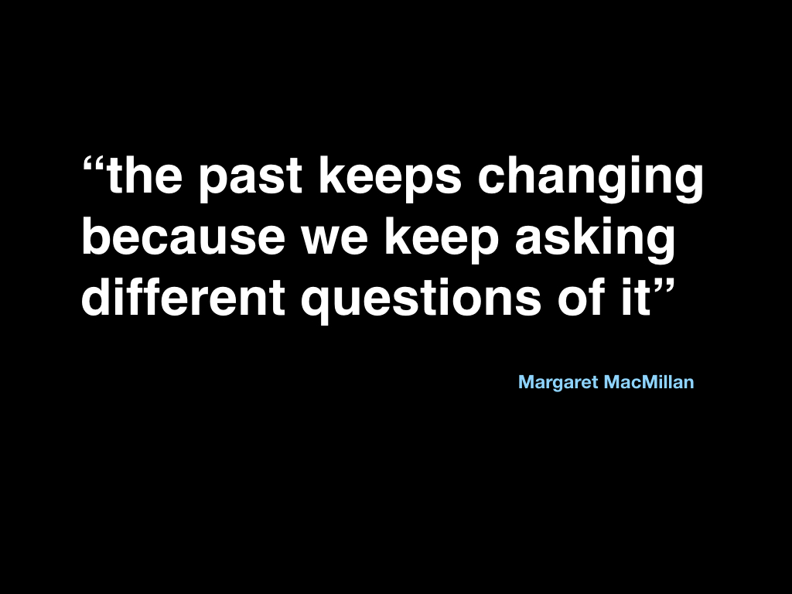](#past)

This is a talk about gazetteers and in particular the gazetteer that I work on, called [Who's On First](https://whosonfirst.mapzen.com). Who's On First has set itself the ambitious goal of global coverage from continents all the way down to venues.

For anyone not familiar with the term a "gazetteer" is basically just a great big phone book, but a phone book of places rather than people.

[Gazetteers have existed for as long as we've been able to conceptualize the idea of place.](http://www.iupress.indiana.edu/product_info.php?products_id=808056) A gazetteer is so deceptively simple as to seem mundane and beyond effort but so complex, the moment you scratch the surface, as to overwhelm even the best intentions.

This is not a talk about the mechanics of Who's On First. In the two and half years since the project began [something like forty to fifty thousand words have been written](https://whosonfirst.mapzen.com/blog) about the architectural theory and the engineering choices and all the challenges we've faced along the way.

This is not a talk about how we work on a gazetteer like Who's On First but rather why we work on it, at all.

[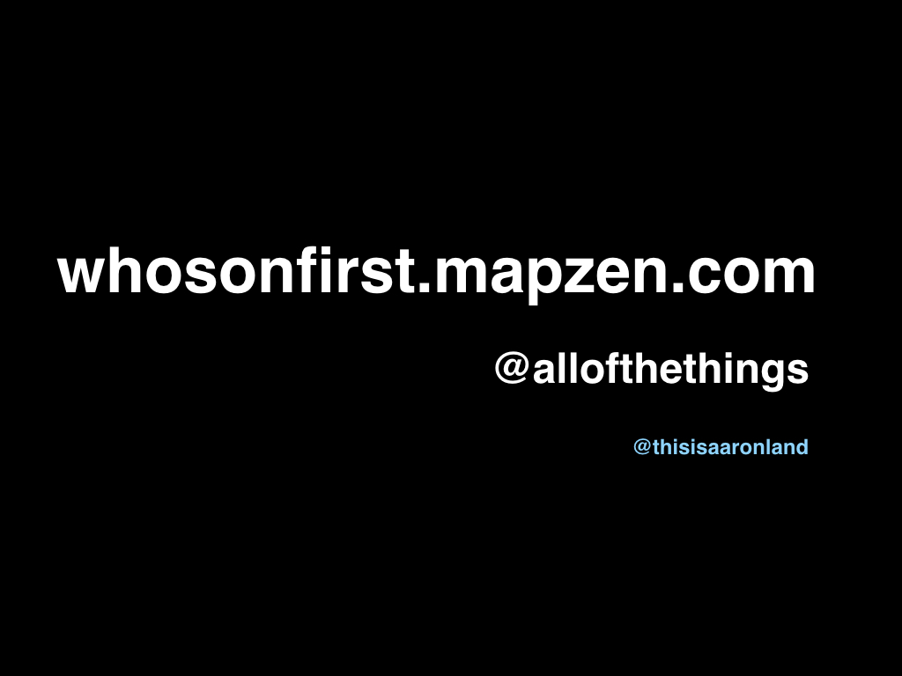](#what)

If not how but instead why, we still need to start with what. What is the shape of the Who's On First gazetteer?

* To begin, Who's On First is an [openly licensed](https://whosonfirst.mapzen.com/docs/licenses/) dataset. At its most restrictive, data is published under a Creative Commons By-Attribution license. Whenever possible, and this is true of our own day-to-day work, data is published under a Creative Commons Zero public domain license.

* Every record in Who's On First has [a stable permanent and unique numeric identifier](https://whosonfirst.mapzen.com/data/principles/). There are no semantics encoded in the IDs.

* At rest, each record is stored as a plain-text GeoJSON file. Our goal is to ensure that Who's On First embodies the principals of portability, durability and longevity. This led us to adopt plain-vanilla text files as the base unit of delivery.

* Files are stored in a nested hierarchy of directories derived from their IDs.

* There are [a common set of properties](https://whosonfirst.mapzen.com/docs/properties/) applied to all records which may be supplemented by an arbitrary number of additional properties specific to that place.

* There are [a finite number of place types](https://github.com/whosonfirst/whosonfirst-placetypes#here-is-a-pretty-picture) in Who's On First and all records share a common set of ancestors. As with properties, any given record may have [as complex a hierarchy as the circumstances demand](https://whosonfirst.mapzen.com/docs/hierarchies/) but there is a shared baseline hierarchy across the entire dataset.

* Individual records may have multiple geometries or multiple hierarchies and sometimes both.

* Records may be updated or superseded, cessated or even deprecated. Once a record is created though it can never be removed or replaced.

* Lastly and most importantly Who's On First is meant, by design, to accommodate all of the places.

**Who's On First is not a carefully selected list of important or relevant places. It is not meant to act as the threshold by which places are measured.**

**Who's On First, instead, is meant to provide the raw material with which a multiplicity of thresholds might be created.**

From Who's On First's perspective [the point is not that one place is more important or relevant than any other](https://mapzen.com/blog/who-s-on-first/). The point is not that a place may or may not exist anymore or that its legitimacy as a place is disputed. The point is, critically, that people _believe_ them to exist or to have existed.

This is why I often refer to Who's On First as ["a gazetteer of consensual hallucinations"](https://mapzen.com/blog/mapping-with-bias/).

<a name="leonard-cohen">

[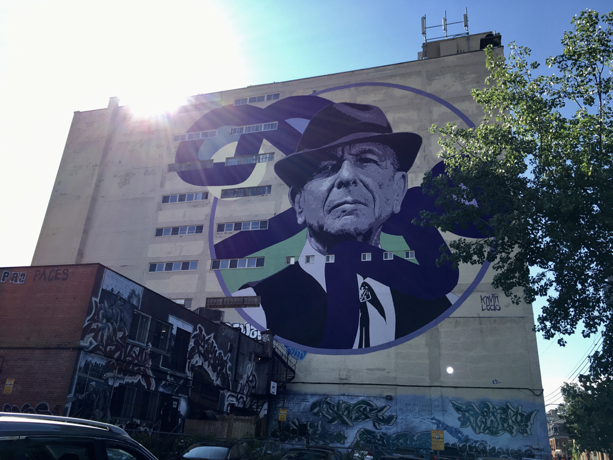](#leonard-cohen)

To explain why I'm going to start with this guy.

This is [Leonard Cohen](http://www.pbs.org/video/montreal-ladies-and-gentlemen-mr-leonard-cohen/), the poet and musician, who [died in November](https://www.youtube.com/watch?v=jP7pN_3_JQI) of last year. Cohen was born and raised in Montreal and [this mural](http://montrealgazette.com/news/local-news/leonard-cohen-looms-large-at-montreals-mural-international-public-art-festival) was [painted](http://www.kevinledo.com/) on St. Laurent Boulevard, just [down the street](https://www.nytimes.com/2017/02/10/travel/leonard-cohen-musician-montreal-canada.html) from where he kept a house in the city.

St. Laurent Boulevard is often referred to by locals simply as "The Main".

[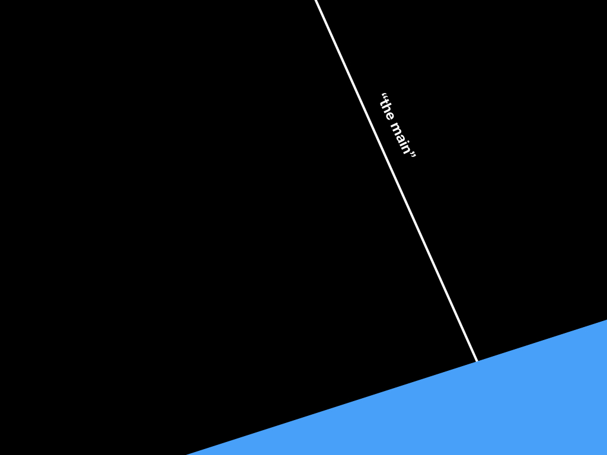](#the-main)

The Main is so-called because it is one the city’s oldest streets running along a North-South axis, starting in Old Montreal at the bank of the [St. Lawrence River](https://places.mapzen.com/id/404529181/).

[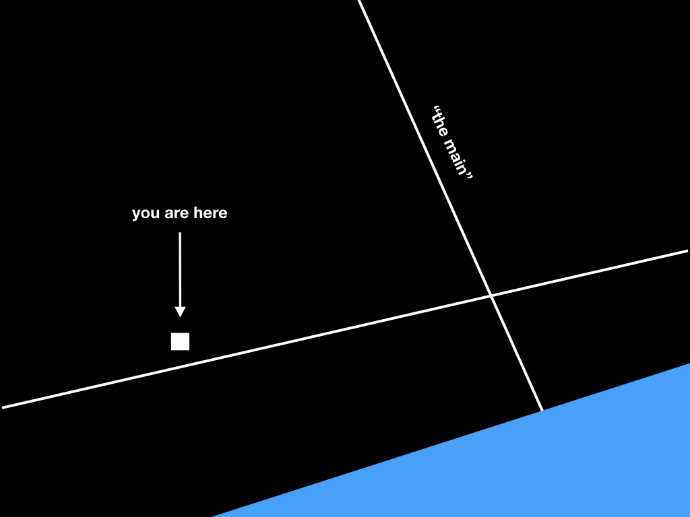](#north-south)

Like a lot of cities in the world, Montreal's North-South axis has no bearing in reality.

If you're being precise St. Laurent Boulevard runs along a North-North-West to South-South-East axis.

What's important about The Main is less its directionality than the fact that it acts as the border between the Eastern and Western halves of the city.

[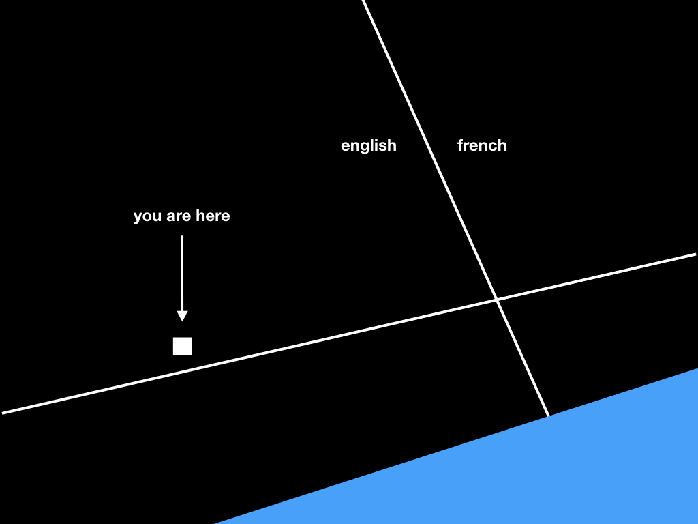](#english-french)

It is only in recent years that The Main has not served as the dividing line between the city's English and French speaking populations.

This was famously described by the author [Hugh MacLennan](http://www.hipmuseum.com/hugh.html) in the larger Canadian context as "two solitudes" living side by side [with little or no common ground between them](http://archive.gg.ca/media/doc.asp?lang=e&DocID=4574).

[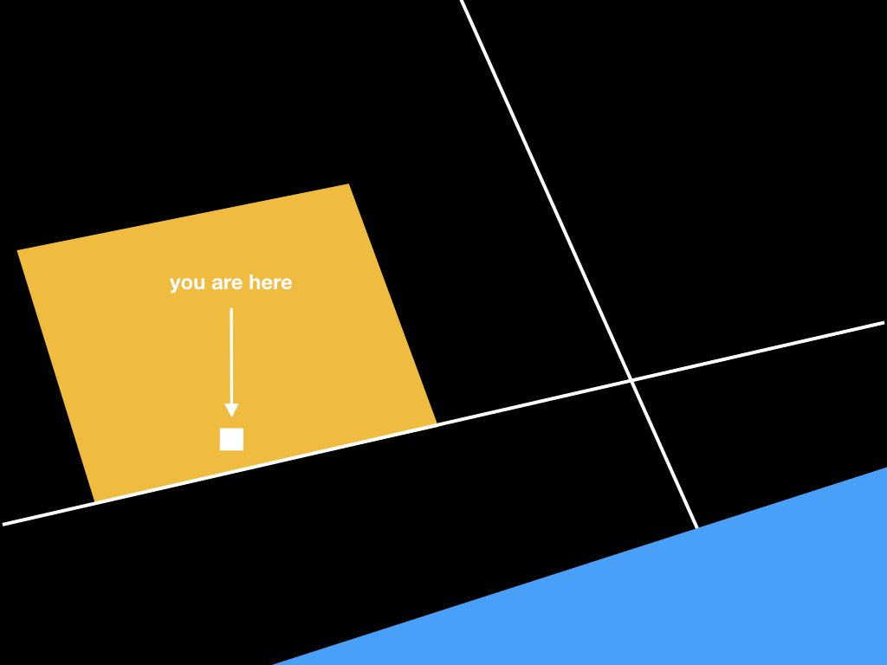](#golden-square-mile)

It is also not really possible to talk about that divide without talking about it as the border between the haves and the have-nots.

This conference is being held on the Southern edge of what was once called [The Golden Square Mile](https://places.mapzen.com/id/1108955947/). This part of town is where what we now call "the 1%" lived.

For a time this was the seat of all the wealth and power in Canada. It was very very English at a time when the contempt and disdain between the English and the French was barely contained and rarely disguised.

This created a power dynamic that rippled down through every aspect of society, in a province that has always been 90% Francophone. It was a power dynamic that was not only allowed to [fester](https://www.urbandictionary.com/define.php?term=T%C3%AAte%20carr%C3%A9e) but actively promoted.

This continued to varying degrees until the 1950s and what is known as [the Quiet Revolution](http://archives.radio-canada.ca/politique/provincial_territorial/dossiers/1732/) when the French Canadian population demanded, not for the first time, to be ["maîtres chez nous"](https://en.wikipedia.org/wiki/Quiet_Revolution) or "masters in our own home."

[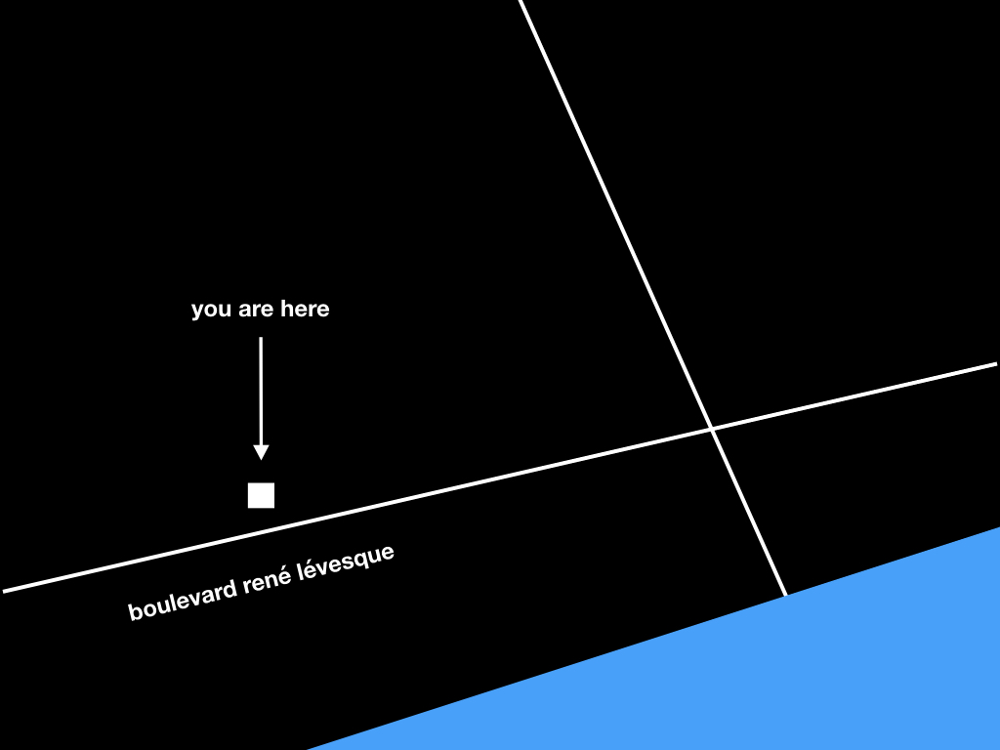](#blvd-rene-levesque)

You may have noticed that the conference hotel sits on a street named after a guy called [René Lévesque](https://en.wikipedia.org/wiki/Ren%C3%A9_L%C3%A9vesque).

It is difficult to overstate Lévesque's role during [the Quiet Revolution](http://www.banq.qc.ca/collections/collections_patrimoniales/bibliographies/revolution_tranquille.html) and in shaping contemporary life and the social contract in Québec.

He would be elected Premier in 1976 as the head of the separatist Parti Québécois (PQ) and would lead [an unsuccessful bid to secede from Canada in 1980](https://www.youtube.com/watch?v=lru4grpq3Rc).

_Note: During the talk I incorrectedly stated that "Among other things he gave Québec a Charter of Human Rights and Freedoms almost a decade before Canada [enacted its own](http://laws-lois.justice.gc.ca/eng/Const/page-15.html) and language laws which are still being debated, to this day."_

_In fact, The [Québec Charter of Human Rights and Freedoms](https://en.wikipedia.org/wiki/Quebec_Charter_of_Human_Rights_and_Freedoms) was passed by the provincial National Assembly the year before the PQ were elected. That is my bad so I will point out, instead, that Lévesque both championed and oversaw the final [nationalization of hydroelectric power in Québec](http://larevolutiontranquille.ca/en/the-nationalization-of-electricity.php). While not necessarily as inspiring as a Charter of Human Rights and Freedoms it would have an equal (probably greater) impact on the province._

By the time he died in 1987 few would deny Lévesque, whatever they thought of his politics, his place as [the father of modern Québec](https://www.youtube.com/watch?v=BhbSp4cJZVY).

So you would be forgiven for wondering why we have chosen to honour such a celebrated figure with such an unremarkable boulevard. The next time you go outside take a moment to marvel at its mediocrity.

The answer lies in what Boulevard René Lévesque used to be called.

[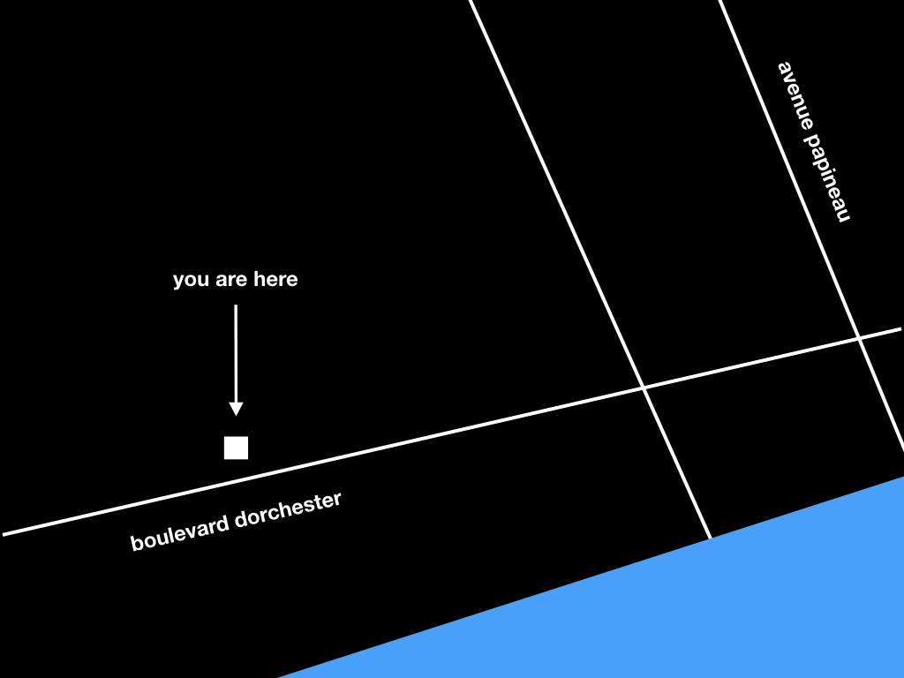](#blvd-dorchester)

Boulevard René Lévesque used to be called Dorchester Boulevard after the English Lord Dorchester, who was formerly known as Lord Durham.

Lord Durham was sent over to Canada in 1838 to report on [the Patriot Rebellions](https://fr.wikipedia.org/wiki/R%C3%A9bellion_des_Patriotes) of the previous year and more generally to determine why the Crown's French Canadian subjects were getting restless.

Fun fact: The rebellions were led by [Louis-Joseph Papineau](https://web.archive.org/web/20170612175735/https://www.pc.gc.ca/en/lhn-nhs/qc/louisjosephpapineau) who was also honoured with an equally drab and uninspiring avenue about 40 minutes walk from here.

[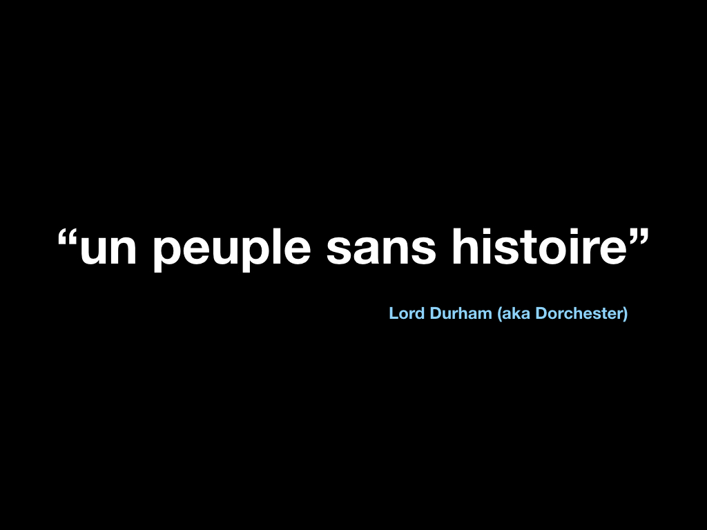](#sans-histoire)

[Lord Durham’s report](https://en.wikipedia.org/wiki/Report_on_the_Affairs_of_British_North_America) might have faded into historical obscurity had its author not offered the opinion that the French Canadians, who predated the first English settlers by a hundred years or more, were "un peuple sans histoire" or "a people without history."

[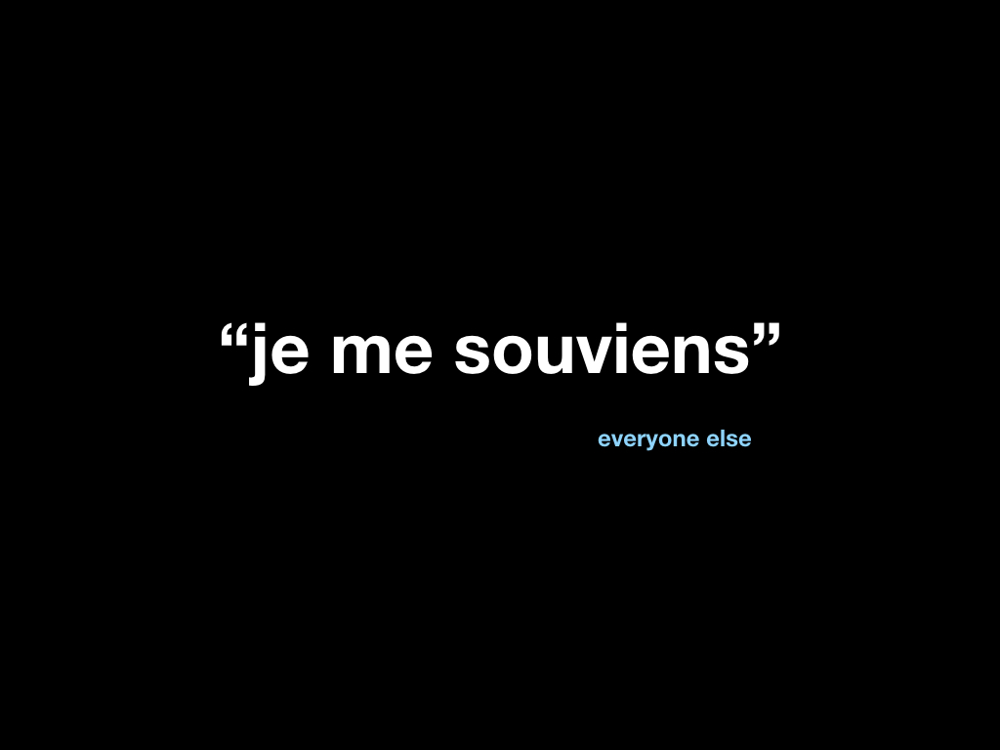](#je-me-souviens)

It is not for nothing that all the license plates in this province now read ["je me souviens"](https://www.youtube.com/watch?v=2FZXQZJxZRk) or "I remember".

Nor is it surprising that Dorchester Boulevard was purposely renamed to honour René Lévesque.

[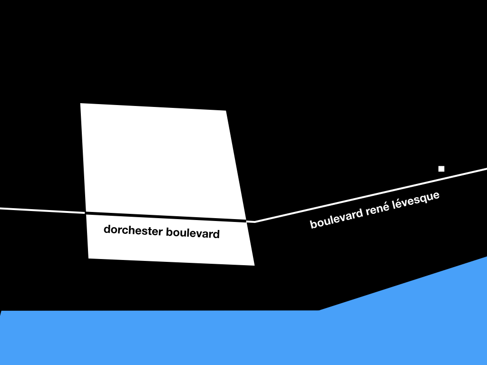](#westmount)

You know who else remembers, though? The city of [Westmount](https://places.mapzen.com/id/101736451/) remembers.

Westmount is [an autonomous municipality](https://westmount.org/en/the-city/history/) on the island of Montreal and home to the remaining money and power that didn't immediately decamp to [Toronto](https://places.mapzen.com/id/101735835) following the [election of René Lévesque](http://collections.musee-mccord.qc.ca/en/collection/artifacts/P090-A_50-1004/).

Westmount is a sort of leftover bronze square mile of wealth and privilege and in 1987 it [refused to rename Dorchester Boulevard](https://www.westmount.org/wp-content/publications/A_View_Of_Their_Own_the_Story_of_Westmount/files/assets/basic-html/page151.html) as the rest of the city had, and so it remains today.

[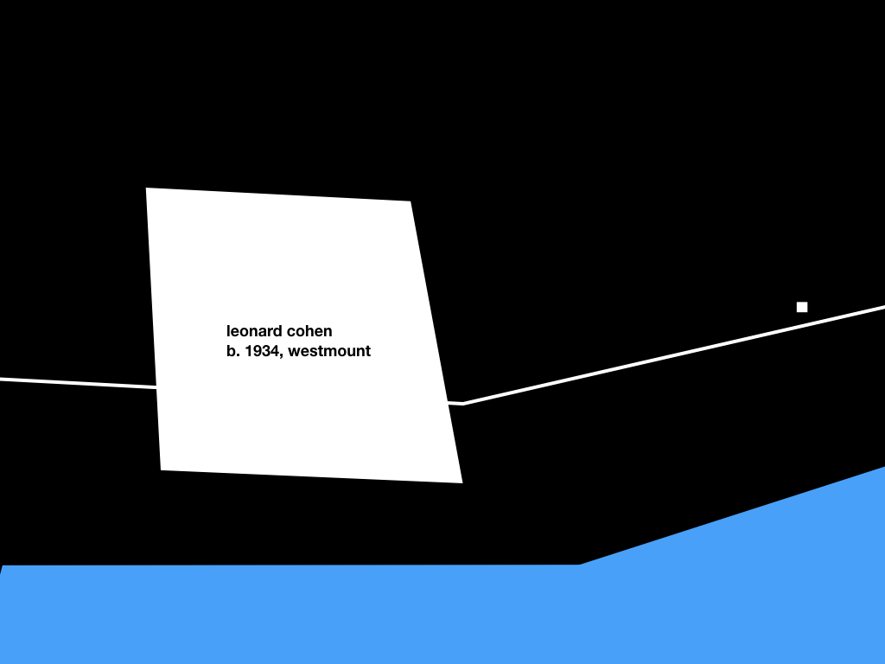](#cohen-westmount)

Fun fact: [Leonard Cohen was born in Westmount](http://www.leonardcohenfiles.com/montreal.html), in 1934.

So, we're back to this guy.

By the time Leonard Cohen died last year in Los Angeles [he had lived there for decades](http://www.cbc.ca/news/entertainment/leonard-cohen-la-home-1.3848347). This pesky fact has never prevented anyone in Montreal, English or French, from claiming him [as one of their own](https://www.newyorker.com/culture/culture-desk/leonard-cohens-montreal).

In the minds of many people in this city Leonard Cohen is before all things [a Montrealer](https://www.youtube.com/watch?v=ibUKEwds4Ng).

[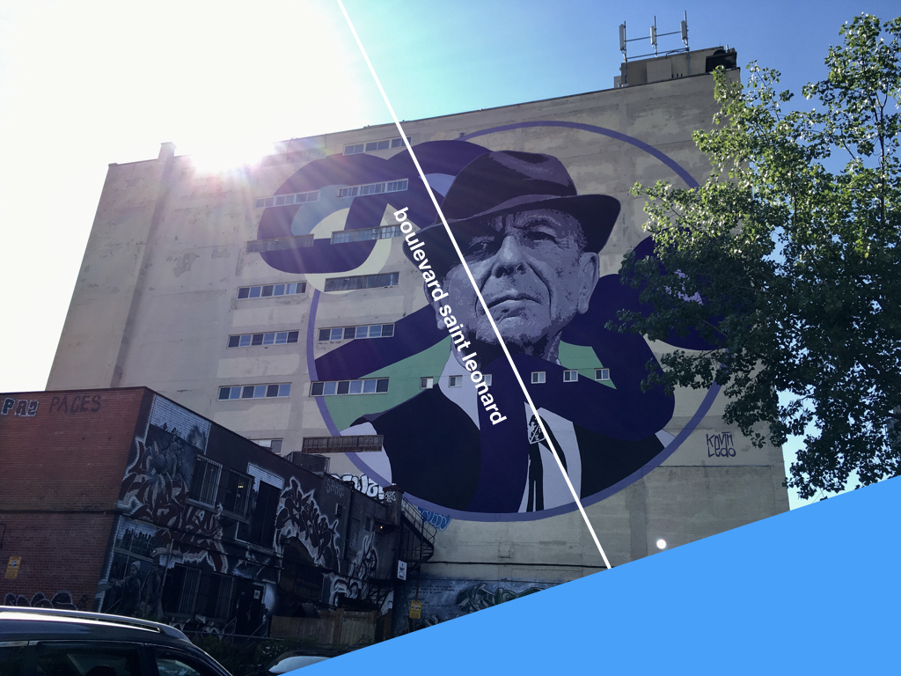](#blvd-leonard-cohen)

It is in all seriousness then that I would like to propose that the city of Montreal rename St. Laurent Boulevard after Leonard Cohen.

The simple fact is that Montreal suffers from a surplus of streets and plazas and landmarks devoted to the religious and linguistic power struggles and score-settling of the past.

We are overdue something that reflects the present. [We are overdue a celebration](https://www.youtube.com/watch?v=2FpwjQLZTTs).

I have told you these stories for two reasons:

The first is that all of these things really happened and they are the stories that inform the city you'll be visiting during this conference.

The second is to use the telling – and in particular the telling of a duality, of ”two solitudes" and "two founding nations" – to highlight an uncomfortable fact about Canadian history, French and English both.

Simply put, we have been blind to the fact that there has always been another story. We have been blind to the fact that the First Nations were already here living on these lands long before the European settlers arrived.

It is important to recognize that we have not been passive in our blindness but brutally deliberate. First out of malice and then later out of negligence and more recently out of shame.

We have closed our eyes to the fact that almost from the beginning we have systematically worked to erase the First Nations, hoping only to open them when the deed is done and there is nothing left to remember but the two solitudes.

[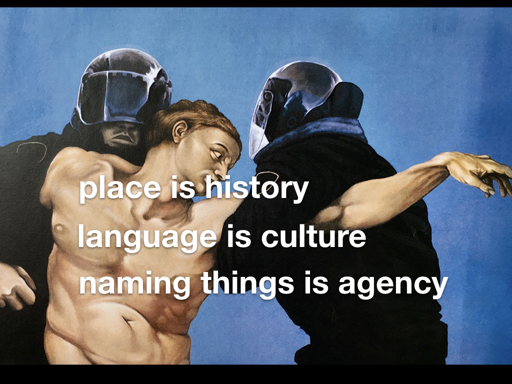](#place-is-history)

In 2017 there is at least a nascent awareness, something approaching acknowledgement, among Canadians that [these things happened and that we did them](https://gadebate.un.org/en/72/canada).

We are a long way from making amends and [there is not time enough to catalog all the ways we have done wrong](http://www.trc.ca/websites/trcinstitution/index.php?p=3) by the First Nations but I want to touch on one story in particular.

As late as the 1950s and the 1960s it was, as part of official government policy to assimilate the First Nations, our practice [to forcibly remove First Nations children from their families](https://www.nytimes.com/2017/10/06/world/canada/indigenous-forced-adoption-sixties-scoop.html).

These children were placed in [foster homes or residential schools](http://www.aadnc-aandc.gc.ca/eng/1100100015576/1100100015577) where in addition to widespread physical and sexual abuse they were actively prevented from learning or practicing or remembering their language, their culture, their histories and in many cases their own birth names.

If you believe that place is history or that language is culture or that naming things is an important form of agency – _all things which are the very stuff that maps are made of_ – it is difficult not to see those policies as anything but a sanctioned and pre-meditated erasure.

[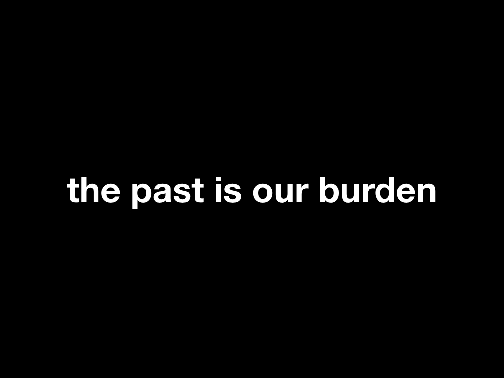](#burden)

I take the view that the sins of a mother or a father are not those of their sons or their daughters. We have enough evidence to suggest that things never end well when we assume they are. I do not believe however that this allows those same sons and daughters to abdicate their past.

The past I am sorry to say is our burden.

It is our burden because while the stories I've told you today have taken place in a comparatively modest slice of geography to a comparatively minuscule population _they are the same story everywhere you go_.  

The details may change but the story is always the same.

If there is one common thread that binds us all it is that we argue about what to call a place and the meaning of those names.

If there is another common thread it has been to assume the argument is a zero-sum game.

[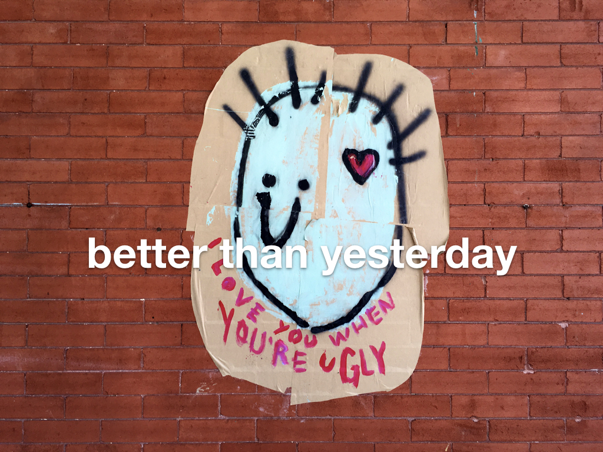](#better-than-yesterday)

What if we stopped doing that?

I have described to you a series of overlapping grievances and past injustices that _in no way_ will a gazetteer remedy alone. A gazetteer is only a tool but perhaps we can stop teaching our tools the bad habits of the past.

A gazetteer is fundamentally about the relationships between one place and all the others. In the past we have been limited by economics and by physics and by no shortage of myopia in the kinds of relationships a gazetteer might allow.

The hope and the goal for [Who's On First](https://whosonfirst.mapzen.com) is that the present has afforded us the opportunity to leap-frog many of those limitations. We live in a time when much of the technology around us has taken on a foul-smelling odor but I choose to believe that it is still possible to harness these tools in the service of a common good.

The hope and the goal of Who's On First is not that everyone should have to, or even want to, add their names and stories to our gazetteer but that they _may be able do so_ when they choose to.

The hope and the goal is in the chance to allow people the agency to name the places that define their own stories, and in doing so to give them a shared weight and mass in the Universe, without needing to erase someone else's telling in the process.

Thank you.
