
[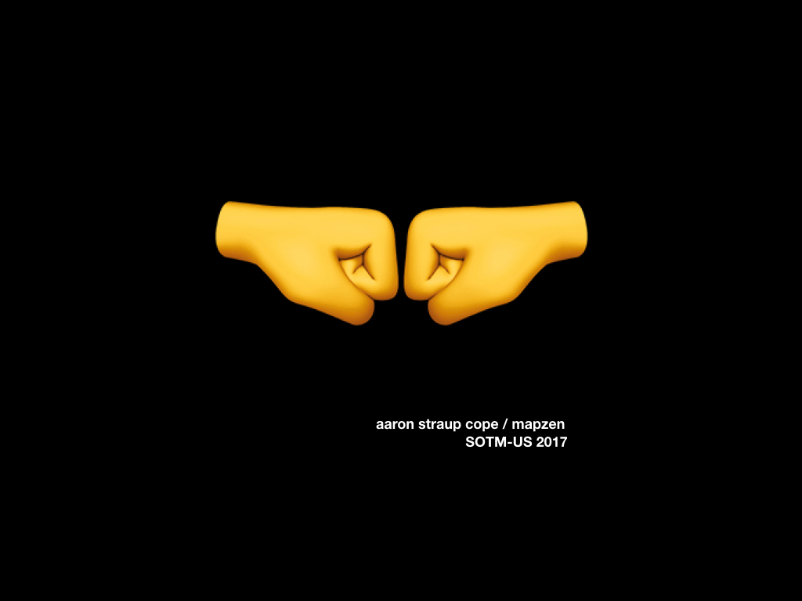](https://mapzen.com/blog/whosonfirst-sotmus-2017#intro)

Hello. I haven’t been able to attend [State of the Map](https://2017.stateofthemap.us) since [2014](https://2014.stateofthemap.us) so it’s good to be back. Thank you for inviting me to speak.

Before we get started I’d like to do a quick bit of house-keeping.

The full title of this talk is “Who’s On First colon fist-bump colon OpenStreetMap". The "colon fist-bump colon" part is meant to be a mock [emoji shortcode](http://www.webstock.org.nz/talks/emoji-fun-profit/).

There is not an emoji for ["fist-bump"](https://www.flickr.com/photos/secret_canadian/galleries/72157623155364950/) yet but I’m hoping there will be soon. Now that the [LEFT-FACING FIST](https://emojipedia.org/left-facing-fist/) and [RIGHT-FACING FIST](https://emojipedia.org/right-facing-fist/) characters have been added to Unicode 10 all that is necessary to [create a FIST-BUMP emoji](https://unicode.org/emoji/selection.html) is a combining character.

[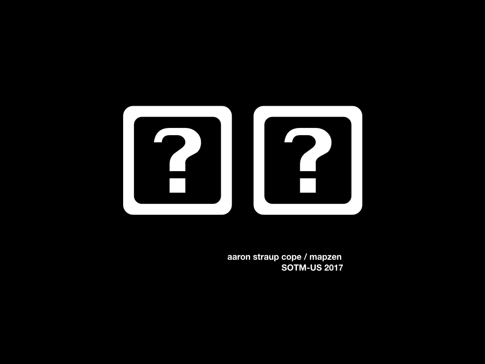](https://mapzen.com/blog/whosonfirst-sotmus-2017#unicode)

Not many operating systems have adopted [Unicode 10](https://www.unicode.org/versions/Unicode10.0.0/) yet, which is why I included a fake emoji shortcode.

For example, that last slide is actually an image. I prepared this talk on a different computer and the laptop I brought to the conference still [can’t display Unicode 10 characters](https://emojipedia.org/unicode-10.0/).

_Tangentially related the software used to publish this blog gets upset when you use the standard [COLON](https://thisisaaronland.github.io/unicode-table/#58) character in a title which is why we've used the less common [MODIFIER LETTER COLON](https://thisisaaronland.github.io/unicode-table/#42889) character in it's place..._

[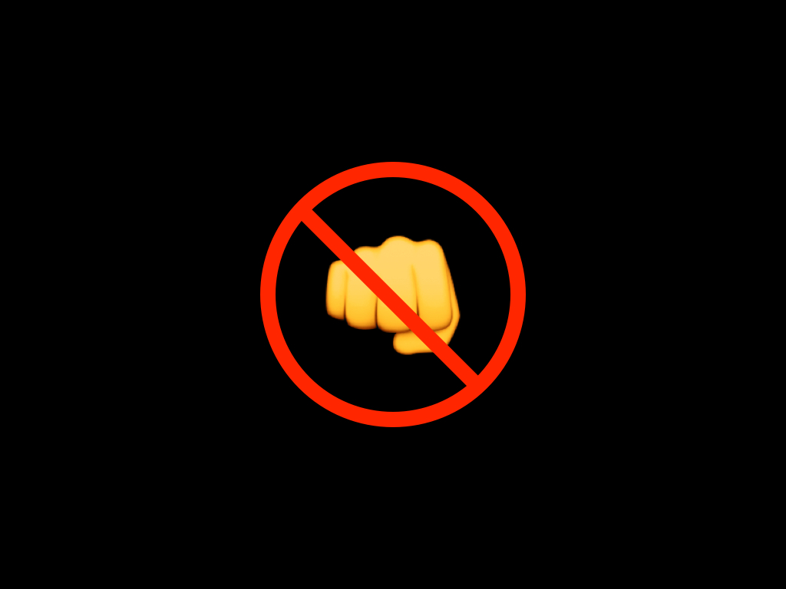](https://mapzen.com/blog/whosonfirst-sotmus-2017#punching)

Somewhere between submitting this talk for consideration and its inclusion in the conference program the title was lost in translation.

Instead of newly minted Unicode characters (which would almost certainly [not render](https://www.flickr.com/photos/bees/9458878023) on a majority of people’s screens, never mind the computers used by the printers who made the conference schedule) or my fake emoji shortcode the decision was made to use the more readily available [ONCOMING FIST](https://emojipedia.org/fisted-hand-sign/) character.

I am not really bothered by this except to point out that the title takes on a slightly more threatening and hostile tone than I ever intended.

For the record, punching [OpenSteetMap](https://openstreetmap.org) (OSM) is not what I had in mind.

[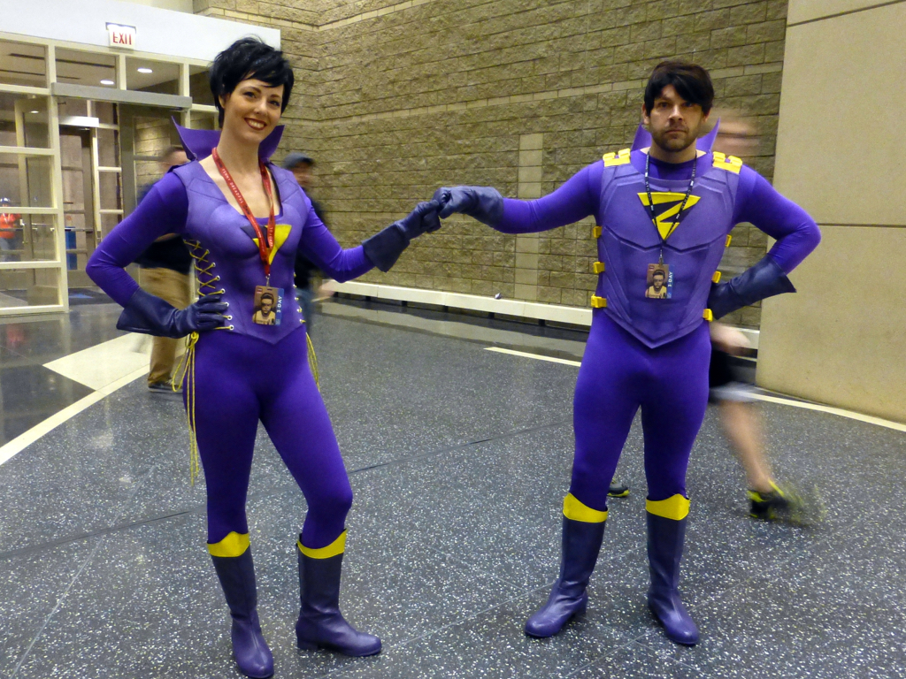](https://mapzen.com/blog/whosonfirst-sotmus-2017#wondertwins)

This is more what I had in mind.

For anyone who doesn't understand what's going on here, it’s two people dressed up as [the Wonder Twins](https://en.wikipedia.org/wiki/Wonder_Twins).

The Wonder Twins were Saturday morning cartoon characters, part of the Super Friends alongside more familiar characters like Batman and Wonder Woman.

The Wonder Twins would "activate" their super powers by fist-bumping upon which the siblings would transform in to a pair of complimentary objects. Perhaps [the most famous, and ridiculous, pairing](https://www.youtube.com/watch?v=FouDjI3GzEI) saw one of the twins become a giant eagle which carried the other who had transformed in to a bucket of water.

The 70s were weird like that in a way that we don’t have time to discuss today except to say that Who’s On First would like to be the bucket of water to OpenStreetMap’s giant eagle.

[Who’s On First](https://whosonfirst.mapzen.com) (WOF) is a gazetteer. If you’ve never heard the term "gazetteer" before it's basically just a big phone book, but a phone book of places rather than people. I am going to spend most of this talk discussing venues but I want to start with a high-level overview of what Who’s On First is. The shape of the elephant so to speak.

* It is an [openly licensed](https://whosonfirst.mapzen.com/docs/licenses/) dataset. At its most restrictive, data is published under a Creative Commons By-Attribution license. Whenever possible, and this is true of our own day-to-day work, data is published under a Creative Commons Zero public domain license.

* Every record in Who's On First has [a stable permanent and unique numeric identifier](https://whosonfirst.mapzen.com/data/principles/). There are no semantics encoded in the IDs.

* At rest, each record is stored as a plain-text [GeoJSON](https://tools.ietf.org/html/rfc7946) file. Our goal is to ensure that Who's On First embodies the principals of portability, durability and longevity. This led us to adopt plain-vanilla text files as the base unit of delivery.

* Files are stored in a nested hierarchy of directories derived from their IDs.

* There are [a common set of properties](https://whosonfirst.mapzen.com/docs/properties/) applied to all records which may be supplemented by an arbitrary number of additional properties specific to that place.

* There are [a finite number of place types](https://github.com/whosonfirst/whosonfirst-placetypes#here-is-a-pretty-picture) in Who's On First and all records share a common set of ancestors. As with properties, any given record may have [as complex a hierarchy as the circumstances demand](https://whosonfirst.mapzen.com/docs/hierarchies/) but there is a shared baseline hierarchy across the entire dataset.

* Individual records may have multiple geometries or multiple hierarchies and sometimes both.

* Records may be updated or superseded, cessated or even deprecated. Once a record is created though it can never be removed or replaced.

* Lastly and most importantly Who's On First is meant, by design, to accommodate all of the places.

Who's On First is not a carefully selected list of important or relevant places. It is not meant to act as the threshold by which places are measured. Who's On First, instead, is meant to provide the raw material with which a multiplicity of thresholds might be created.

From Who's On First's perspective [the point is not that one place is more important or relevant than any other](https://mapzen.com/blog/who-s-on-first/). The point is not that a place may or may not exist anymore or that its legitimacy as a place is disputed. The point is, critically, that people _believe_ them to exist or to have existed.

This is why I often refer to Who's On First as ["a gazetteer of consensual hallucinations"](https://mapzen.com/blog/mapping-with-bias/).

[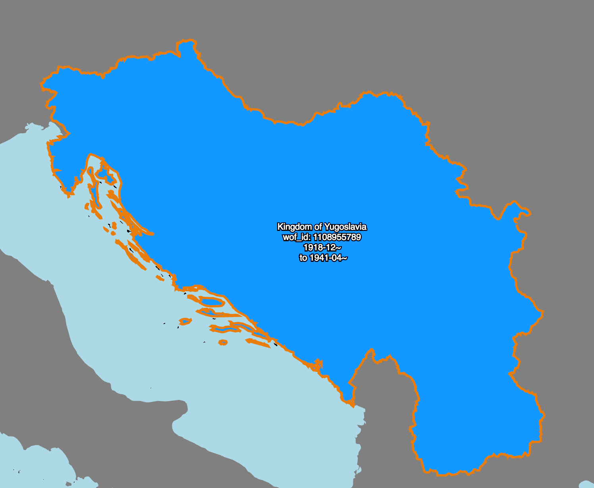](https://mapzen.com/blog/whosonfirst-sotmus-2017#yugoslavia)

Here’s an example.

This is an animation of [work that my colleague Stephen Epps did](https://mapzen.com/blog/tackling-space-and-time-in-whosonfirst/) earlier this year to create and link all the records representing the many ways that [the place we used to call "Yugoslavia"](https://whosonfirst.mapzen.com/spelunker/search/?q=yugoslavia) has changed between the start of the 20th century and now.

I’m going to let this run on a loop while I discuss a point some of you may have tweaked to in the last slide. Specifically that OpenStreetMap and Who's On First have sufficiently different licensing requirements that they prevent data exchange in both directions.

I just said "license" which means somewhere, someone just won ["OSM Bingo"](https://wiki.openstreetmap.org/wiki/Proposed_features/bingo_hall).

Seriously though I’d like to make one thing perfectly clear before I go any further: I am not here, either as an individual or an employee of Mapzen, to suggest _in any way_ that the OpenStreetMap community revisit [the decision to adopt the ODbL](https://wiki.openstreetmap.org/wiki/Open_Database_License).

My own personal feeling is that by virtue of having accomplished the impossible in creating OpenStreetMap, and having done so in thirteen short years, that the community has earned the right to do whatever it wants.

At the same time I still need and want an openly licensed location database that can be used and adapted in both commercial and "closed" projects without any restrictions beyond attribution.

This is the space that Who’s On First occupies and it is why we will not – can not – import data from OpenStreetMap.

[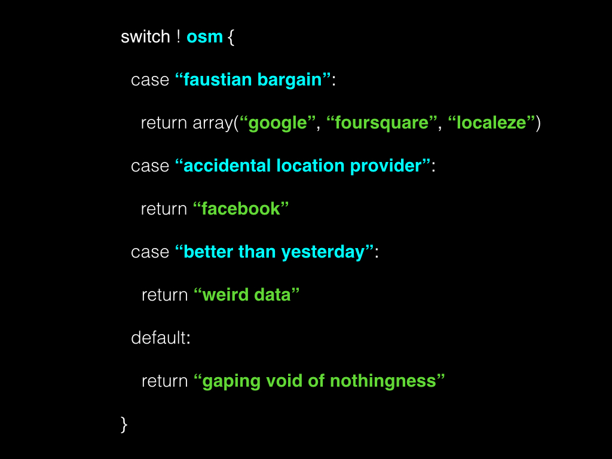](https://mapzen.com/blog/whosonfirst-sotmus-2017#ifnotosm)

About this time, two years ago, I had a little freak out at work.

We had been discussing the availability and viability of open venue datasets. The reason I freaked out is that when you take OpenStreetMap off the table, for the reasons I’ve just outlined, there are effectively _no openly licensed venue databases_ so I wasn’t sure what we were talking about.

Accurate and up-to-date venue data is a difficult and daunting challenge. There are a few companies that have built successful businesses collecting and reselling that data under terms which can only be described as a Faustian bargain.

Other companies like Facebook, we're told, have amassed similar and sometimes superior catalogs of data almost by accident as a by-product of their day-to-day work. So far, though, none of these companies has seen fit to share any of that data.

Which really only leaves two alternatives. The first is the gaping void of nothingness that we’ve all come to know and love. The second is to embrace the idea that _something is better than nothing_ and that something which can be improved upon over time is even better than that.

[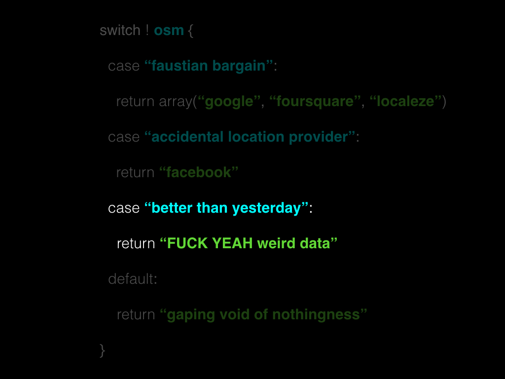](https://mapzen.com/blog/whosonfirst-sotmus-2017#absence)

To embrace, or at least accept, that our burden in the near-term will be one of managing absence.

That _in addition_ to all the hard work of collecting, vetting and improving data we will also need to think about ways to talk to people about the data we don’t have and to develop interfaces for buffering and tempering that absence.

This makes an already daunting project exhausting even to think about.

[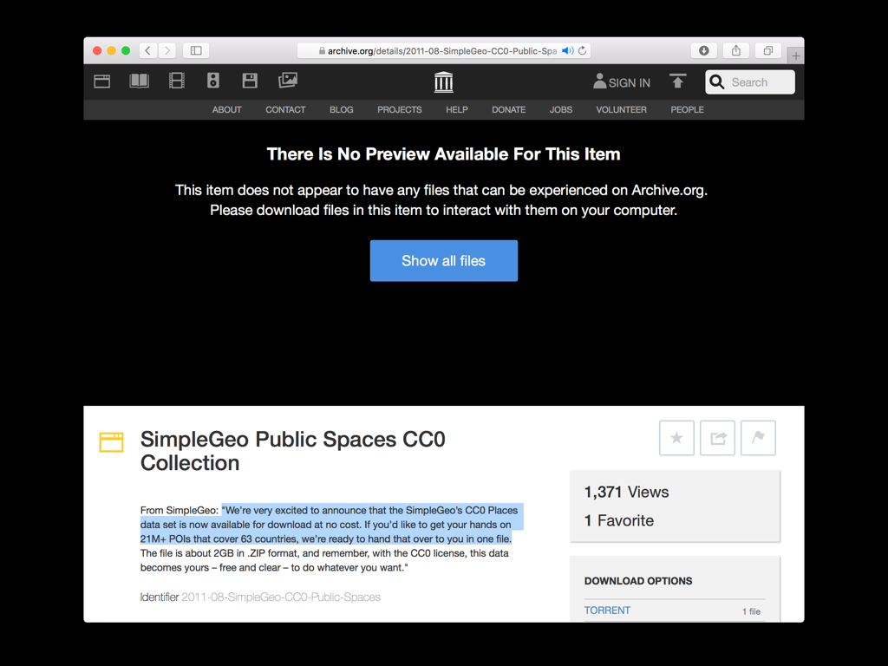](https://mapzen.com/blog/whosonfirst-sotmus-2017#simplegeo)

The good news is that there was in fact one open venue database, available for use, in 2015. In 2011 the geo-services company SimpleGeo [published their Places database](https://web.archive.org/web/20110514083813/http://blog.simplegeo.com/2011/04/20/open-places-data/), containing 21 million business listings, under a Creative Commons Zero public domain license.

The company went out of business shortly after that but not before [Jason Scott](https://t.co/1f0N0IPkEt) grabbed a copy of the data and [put it on the Internet Archive](https://archive.org/details/2011-08-SimpleGeo-CC0-Public-Spaces).

The first thing to know about the SimpleGeo data is that it is a flawed dataset.

[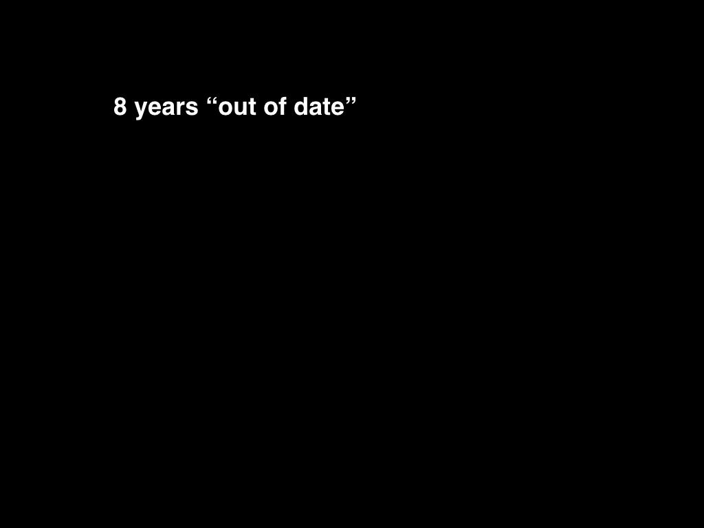](https://mapzen.com/blog/whosonfirst-sotmus-2017#outofdate)

For starters it is almost 8 years "out of date".

That’s what we say but when we say "out of date" what we are often really saying is there is no _new_ stuff.

And when we say "no new stuff" what we’re often really saying is that there is no new stuff for a _particular kind_ of business, typically those focused on snacking and grooming and nesting and aimed at a particular demographic: 18-35 year olds, with disposable income.

The funny thing is that lots of businesses survive longer than 17 years. Think of [the butcher that’s been in your town](http://places.mapzen.com/id/572151977) for 75 or 80 years now. If we're lucky, sooner or later we all get older and eventually need to call a plumber or an electrician or a notary.

That’s the stuff the SimpleGeo dataset is made of so to say that it’s out of date seems inaccurate and unfair.

[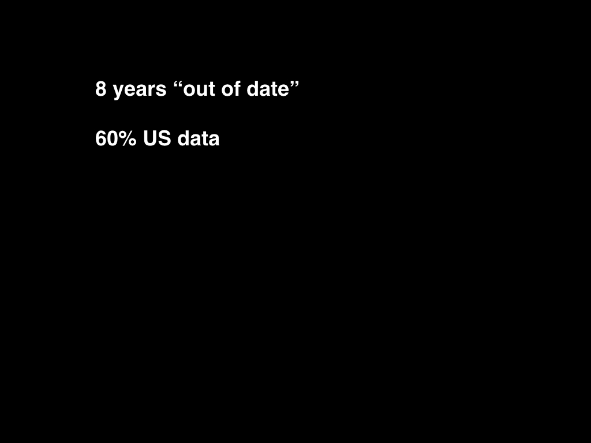](https://mapzen.com/blog/whosonfirst-sotmus-2017#usa)

The data is [heavily slanted towards the US](https://whosonfirst.mapzen.com/spelunker/placetypes/venue/). SimpleGeo claimed the data covered 60 countries but that is disingenuous when you consider all but about a dozen countries have fewer than a hundred venues.

[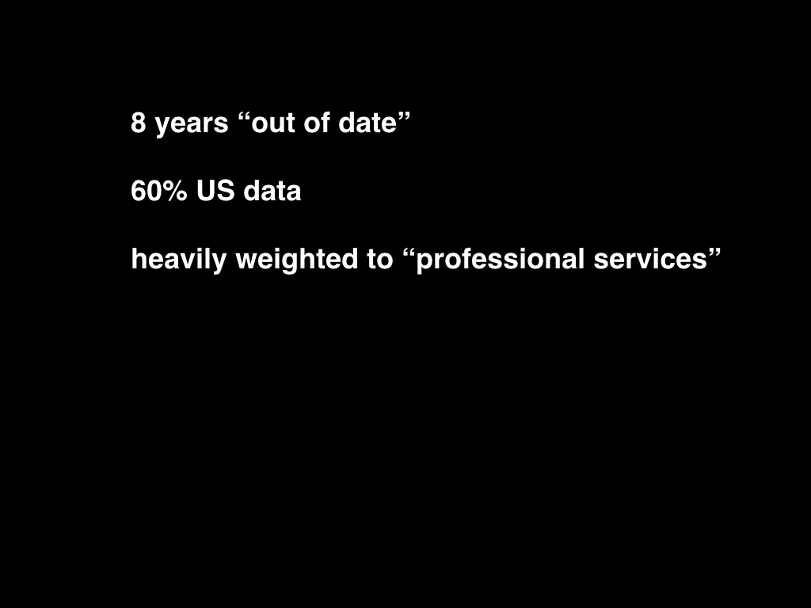](https://mapzen.com/blog/whosonfirst-sotmus-2017#service)

The data is also heavily weighted towards professional services. There are a lot of CPAs and lawyers and doctors and, to be honest, the sheer volume can make it difficult to see the trees for the forest.

[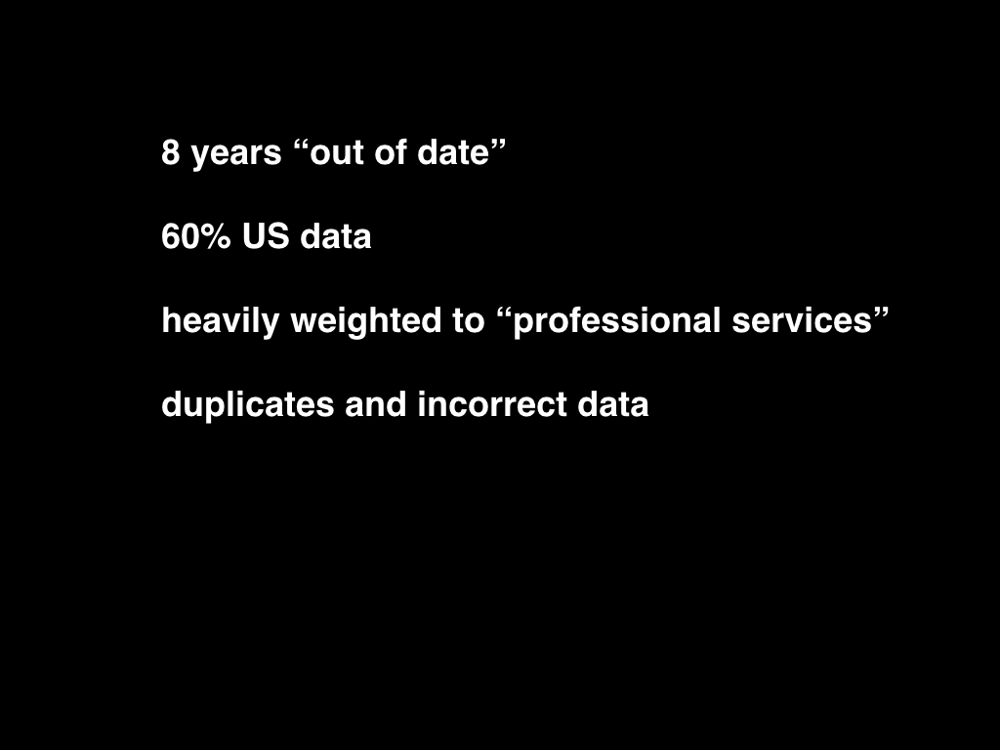](https://mapzen.com/blog/whosonfirst-sotmus-2017#data)

There is some genuinely bad data. No surprises there and I doubt anyone here is ready to cast the first stone when it comes to bad data.

[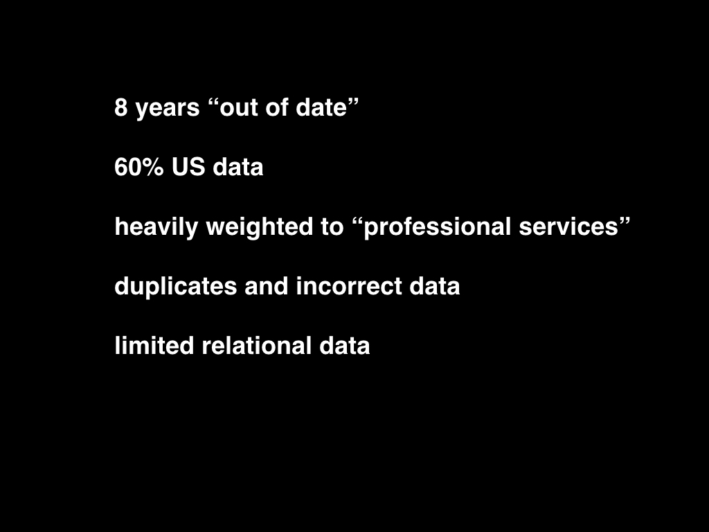](https://mapzen.com/blog/whosonfirst-sotmus-2017#relational)

There is minimal structured relational data. For example, the only way to find all the records in a given a locality or neighbourhood is to load everything in to a database and perform spatial queries.

[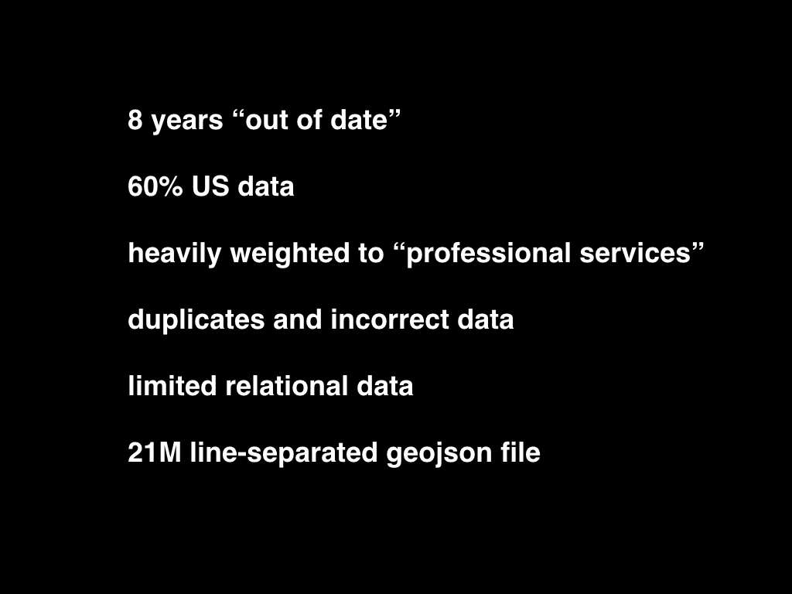](https://mapzen.com/blog/whosonfirst-sotmus-2017#geojson)

Everything was published as a single line-separated GeoJSON file. Had I been in SimpleGeo’s shoes at the time I might have made the same decision. As a consumer of that data, the decision has been nothing but 100% sad-making.

[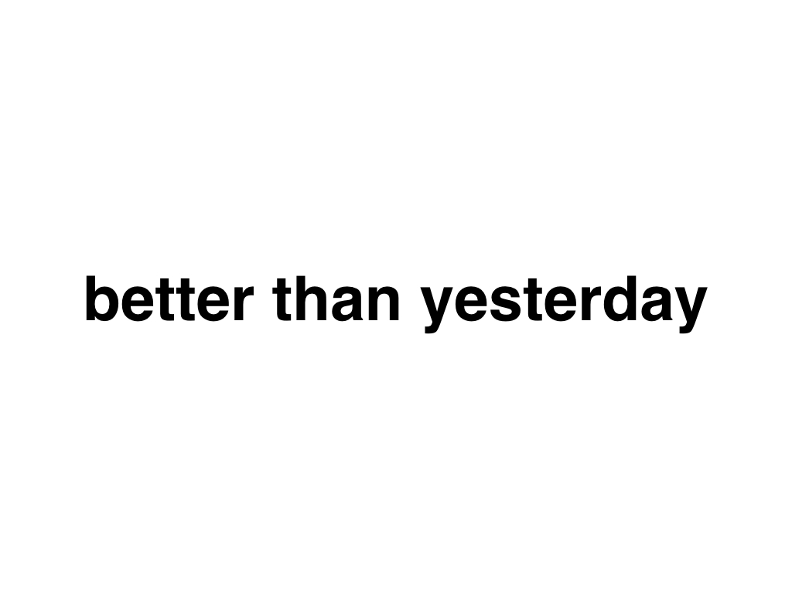](https://mapzen.com/blog/whosonfirst-sotmus-2017#better)

But it’s a good start and the first thing we did was to [explode that 21 million line text file in to 21 million discrete records](https://mapzen.com/blog/whosonfirst-venues), each with a new Who’s On First ID.

If nothing else the data has proven its value in forcing us to think about how, from a purely operational point of view, we manage editing, storing and distributing that much data.

Without getting in to all the details I’ll just say that [trying to put 21 million files in to a single Git repository](https://github.com/whosonfirst-data) remains challenging enough to the point of being impossible.

Simply having 21 million files on a single volume, in 2017, still causes people to [run out of inodes](https://www.ibm.com/developerworks/aix/library/au-speakingunix14/index.html) and try explaining that to someone who doesn’t understand, or care, how filesystems work.

But there are more than 21 million venues in the world and we’re going to have to figure these things out eventually so we might as well start now.

[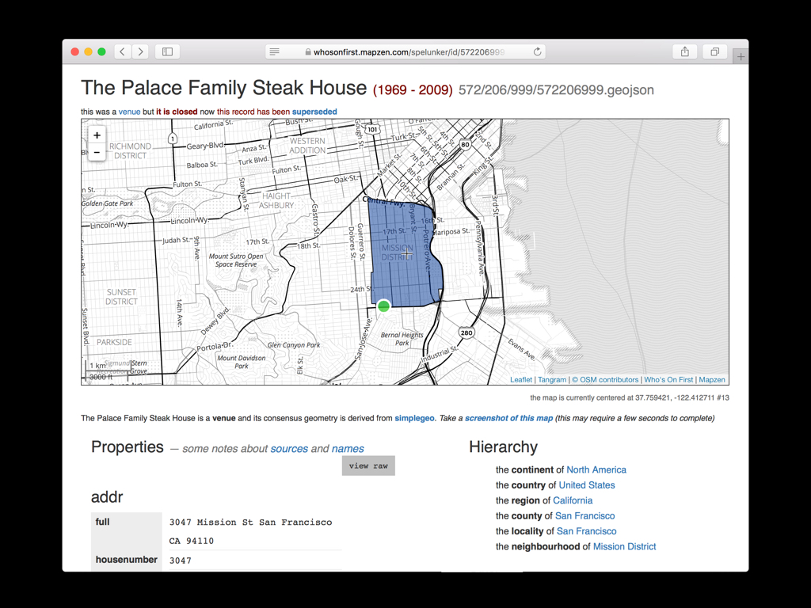](https://mapzen.com/blog/whosonfirst-sotmus-2017#palace)

This is what that looks like and if all the venues in the world weren’t enough, we also want to be able to track historical venues.

Let’s pretend that Who’s On First existed in 1985 and a writer has published a review of [The Palace Steak House](http://places.mapzen.com/id/572206999), associating its Who’s On First ID with their article.

It is important that both the author and the readers of that article can rely on that ID with the confidence that its meaning won’t change even though the Palace went out of business in 2009 and that space has been occupied by [three](https://places.mapzen.com/id/1108800487) [different](https://places.mapzen.com/id/1108800489) [restaurants](https://places.mapzen.com/id/1126130035) since then.

[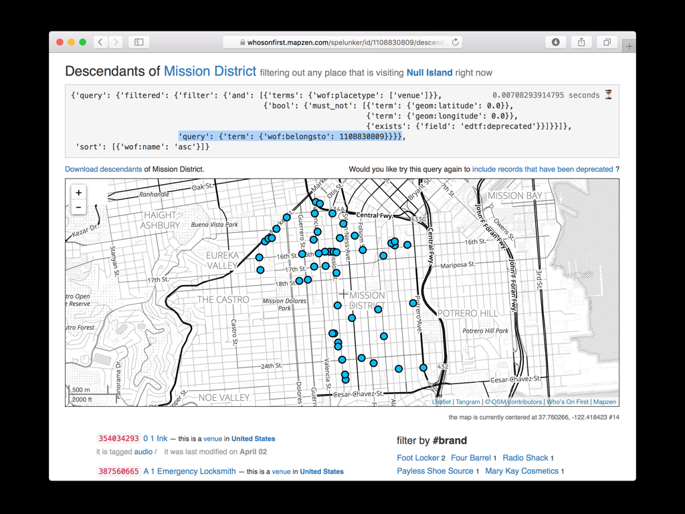](https://mapzen.com/blog/whosonfirst-sotmus-2017#mission)

The second thing we did was assign each venue a hierarchy with pointers to all the other places in Who’s On First that venue holds hands with.

If nothing else this reduces the problem of [finding all the venues in the Mission](https://whosonfirst.mapzen.com/spelunker/id/1108830809/descendants/?exclude=nullisland&placetype=venue) to a simple two-part key/value query.

[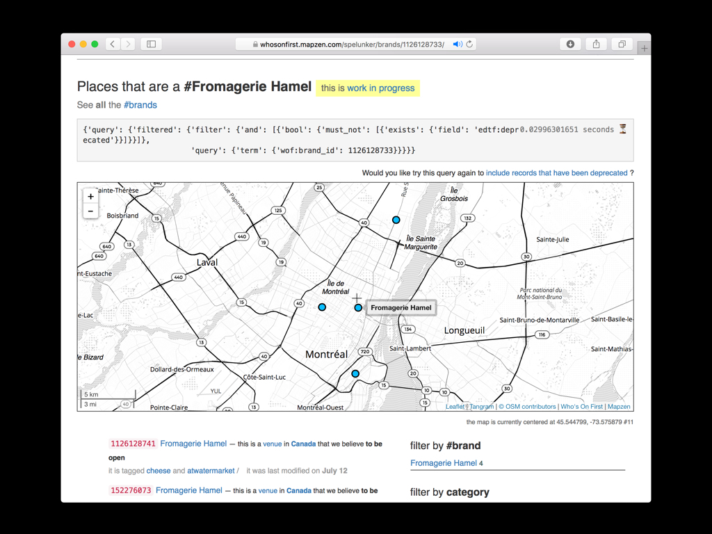](https://mapzen.com/blog/whosonfirst-sotmus-2017#brands)

It’s early days still but [we are also starting to do the work to track brands](https://github.com/whosonfirst-data/whosonfirst-brands/), assigning them each their own stable IDs and static records. It’s very primitive work right now and relies entirely on unsophisticated string-matching but it’s something to build on.

One of the medium-term goals we have is to work with actual brands and to have them contribute and take responsibility for maintaining their venues inside of Who’s On First.

[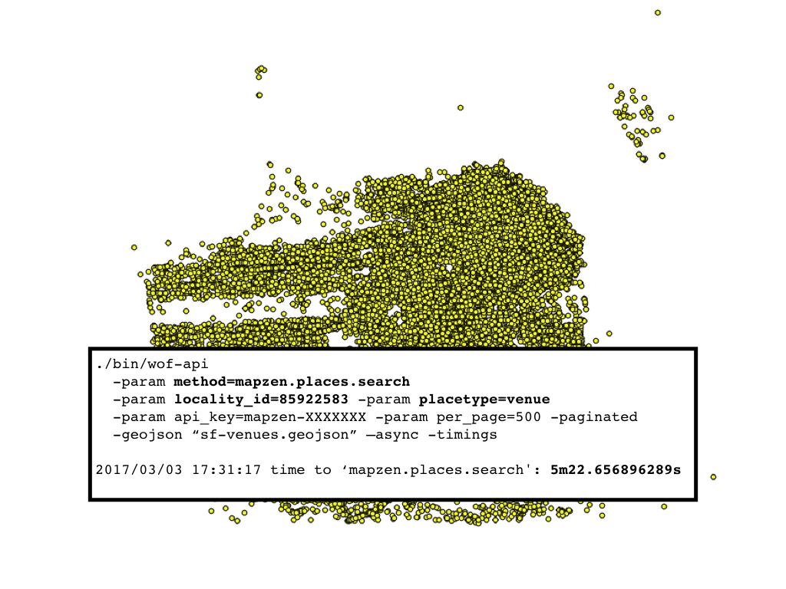](https://mapzen.com/blog/whosonfirst-sotmus-2017#api)

In addition to static downloads everything is available through the [Mapzen Places API](https://mapzen.com/documentation/places/).

It takes about 5 minutes to [grab all the venues in San Francisco](https://github.com/whosonfirst/go-whosonfirst-api) and dump them out as a GeoJSON FeatureCollection.

I could have easily spent the entire talk discussing [the UI and UX challenges](https://mapzen.com/blog/simple-is-hard) around editing the existing data and making it fast and easy to add new data. We are a small team so our biggest challenge is simply the short number of hours in the day.

This is work by another colleague, [Dan Phiffer](https://phiffer.org/), to think about how we might [use geotagged photos to add new venues](https://mapzen.com/blog/geotagging-wof-venues/).

Dan spent the summer in [South Korea](https://places.mapzen.com/id/85632231) and [Taiwan](https://places.mapzen.com/id/85632403), places where we have (had) no venue data and where all the Mapzen services like tiles and web-based APIs grind to a halt and become unusable when you’re traveling on a throttled data plan.

Dan’s tool allowed him to roam freely during the day quickly taking pictures of venues and points of interest and uploading them after the fact to create new records in Who’s On First.

[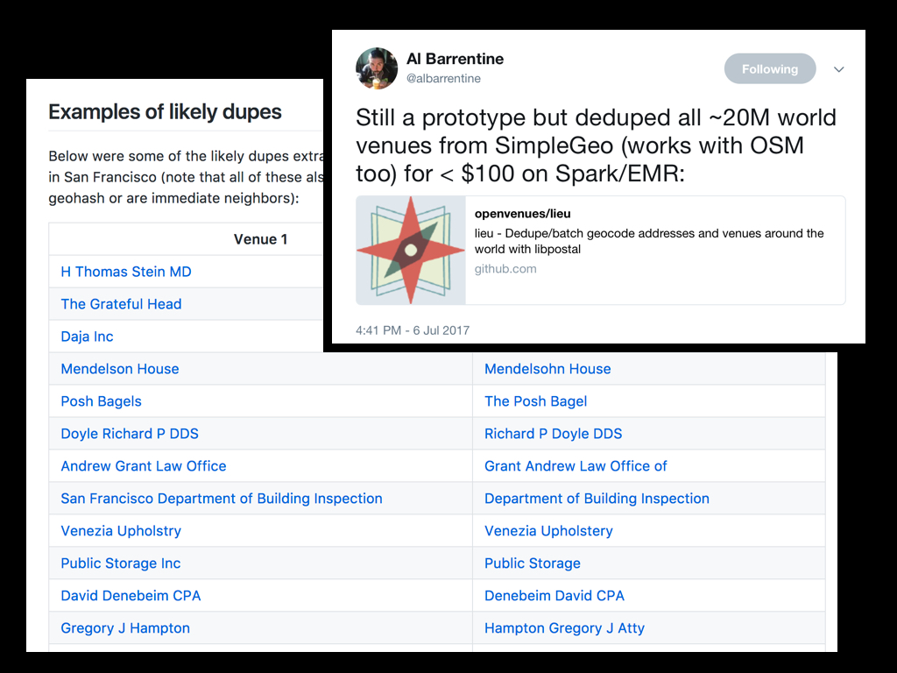](https://mapzen.com/blog/whosonfirst-sotmus-2017#lieu)

Finally we’ve been working with [Al Barrentine](https://twitter.com/albarrentine), who wrote the [libpostal address parser](https://mapzen.com/blog/inside-libpostal/). Building on that work we’ve asked Al to take a first pass at address de-duplication.

If address parsing is where you go to cry then address de-duplication is where you go to give up.

As we go forward and start to import newer datasets it is clear that the first challenge will be reconciling what we already have in Who’s On First with whatever new offering is on the table.

We don’t have the choice of giving up on this problem.

Al’s remit was not to solve all the things but to build a viable "1.0" tool that demonstrated tangible results and can be improved upon going forward.

[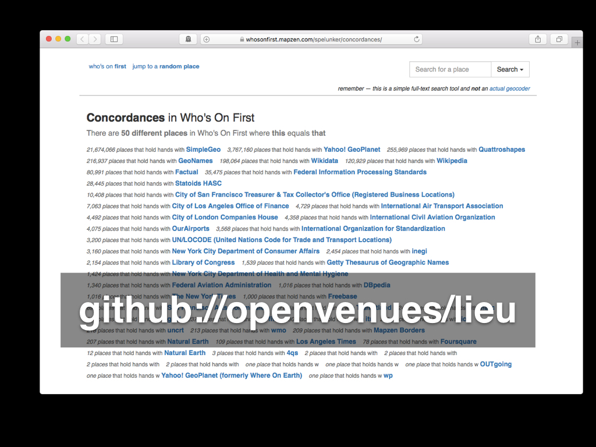](https://mapzen.com/blog/whosonfirst-sotmus-2017#business)

The tool is called `lieu` and, as with libpostal [it is available as open source software](https://github.com/openvenues/lieu).

As Al has been working on things I’ve been testing address de-duplication against Who’s On First and publicly available business listings from the usual suspects: [New York](https://whosonfirst.mapzen.com/spelunker/concordances/nycgov_dca/), [San Francisco](https://whosonfirst.mapzen.com/spelunker/concordances/sfgov_rbl/), [Los Angeles](https://whosonfirst.mapzen.com/spelunker/concordances/lacity_oof/) and [London](https://whosonfirst.mapzen.com/spelunker/concordances/companieshouse/).

One of the benefits of Al’s software is that when we establish a match between of our venues and an official listing we can flag that venue as ["current"](https://whosonfirst.mapzen.com/spelunker/placetypes/venue/?is_current=1) and remove some of the ambiguity that might surround it. We can add [concordances from Who’s On First](https://whosonfirst.mapzen.com/spelunker/concordances) back to the city and their venue records.

The next step as we get ready to finish up this phase of work and push it out the nest is to de-duplicate Who’s On First against itself.

[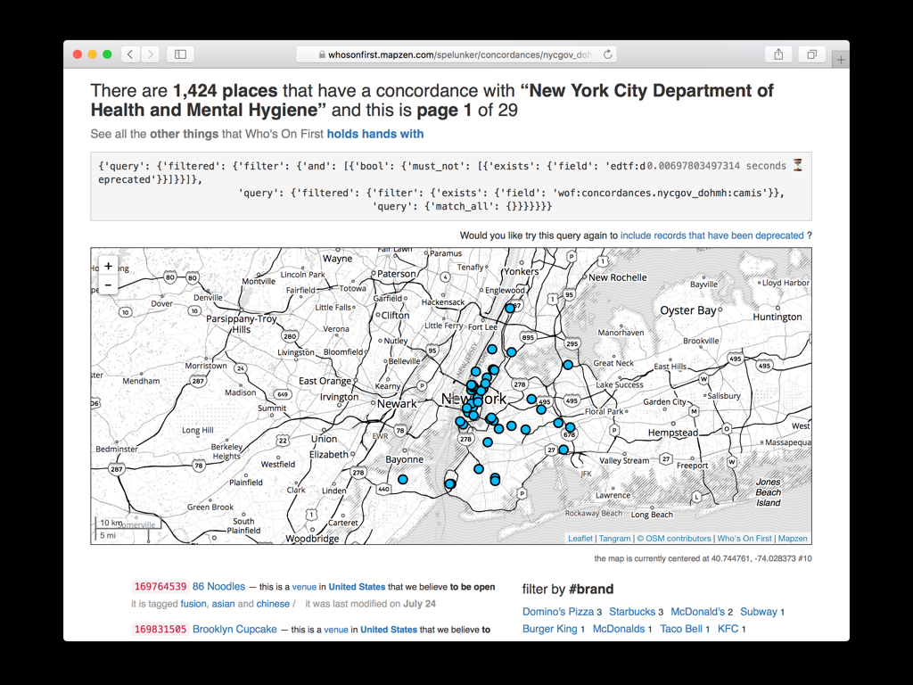](https://mapzen.com/blog/whosonfirst-sotmus-2017#fuzzy)

The software is also able to work with fuzzy and approximate location data for venues.

For example, it’s possible to use the latitude and longitude for the postal code associated with an address, in the absence of coordinate data for the address itself, and lieu will still find successful matches.

This means that basically [every health and safety inspection record ever published in the US](https://whosonfirst.mapzen.com/spelunker/concordances/nycgov_dohmh/) is fair-game for de-duping.

We can validate records that we already have and import new ones with a high, if not perfect, degree of confidence and start chipping away at the "no new stuff" problem.

[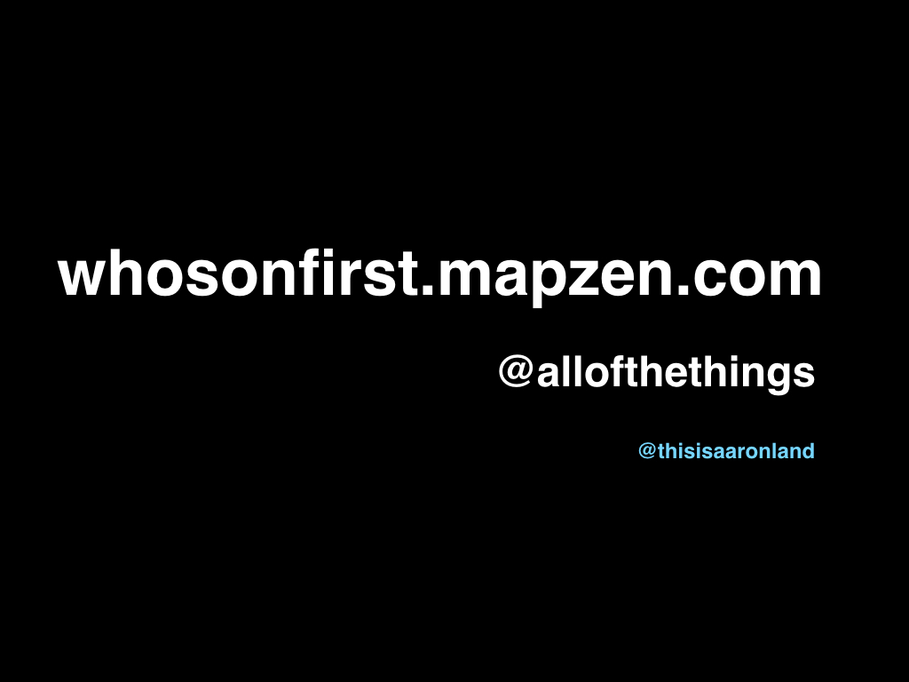](https://mapzen.com/blog/whosonfirst-sotmus-2017#outro)

By now some of you may be wondering what this has to do with [OpenStreetMap](https://www.openstreetmap.org/)? The answer is: I don’t know but something, I hope.

If Who’s On First can’t use OpenStreetMap data then we would like to make sure that it’s easy for the OpenStreetMap community, if you choose, to use our data. Maybe that means all we do is establish and maintain concordances between the two projects and [maybe it means more](https://stevecoast.com/2015/09/30/license-ascent/).

My hope, at the end of this talk, is that I will have raised enough interest and enough questions that we might find out together.

Thank you.

_Aaron's talk is [now on YouTube](https://www.youtube.com/watch?v=GUizIw0LNjc?rel=0)!_

<iframe src="https://www.youtube.com/embed/GUizIw0LNjc" frameborder="0" "height=100%" width="100%" allowfullscreen></iframe>

Photo credits:

<ul style="margin-top:1em;">
<li><a href="https://commons.wikimedia.org/wiki/File:C2E2_2015_-_Wonder_Twins_(17118576890).jpg">https://commons.wikimedia.org/wiki/File:C2E2_2015_-_Wonder_Twins_(17118576890).jpg</a></li>
</ul>

