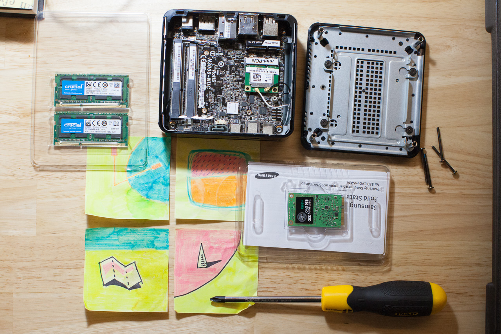
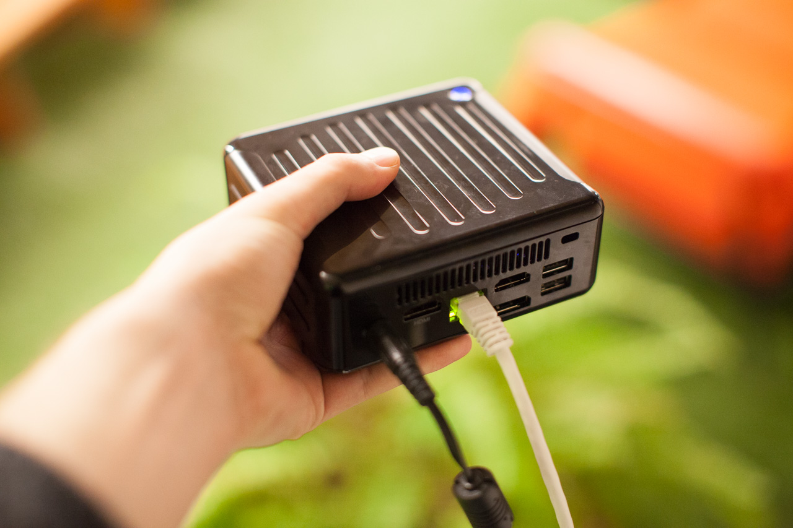
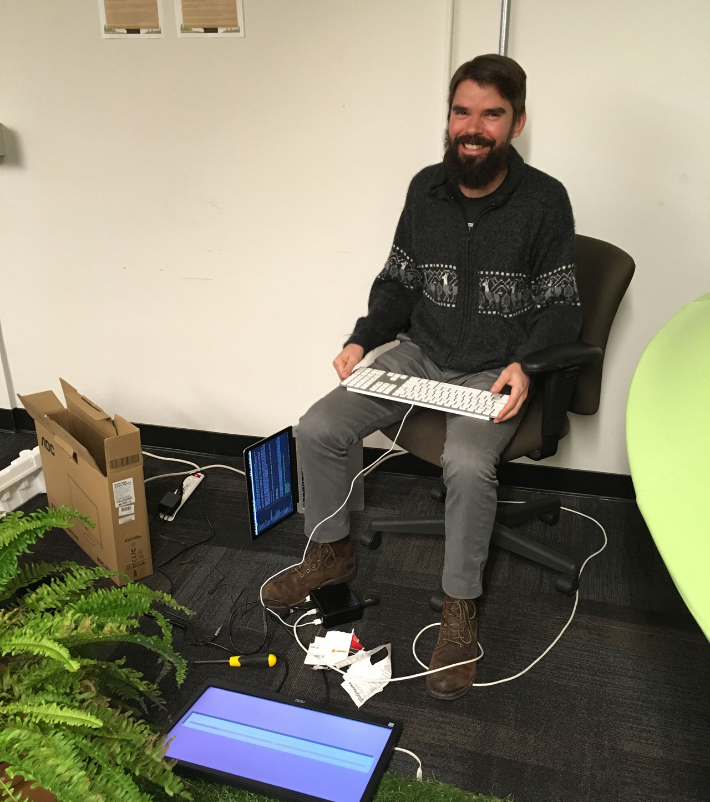
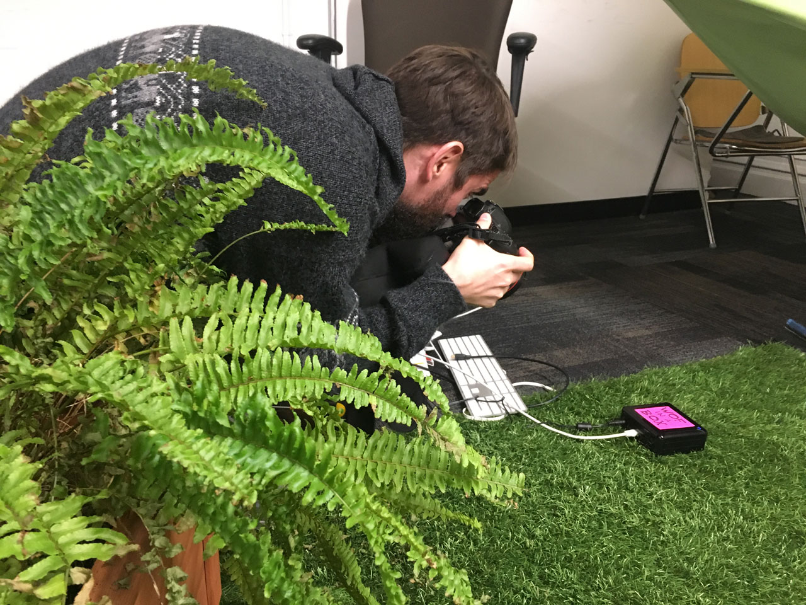
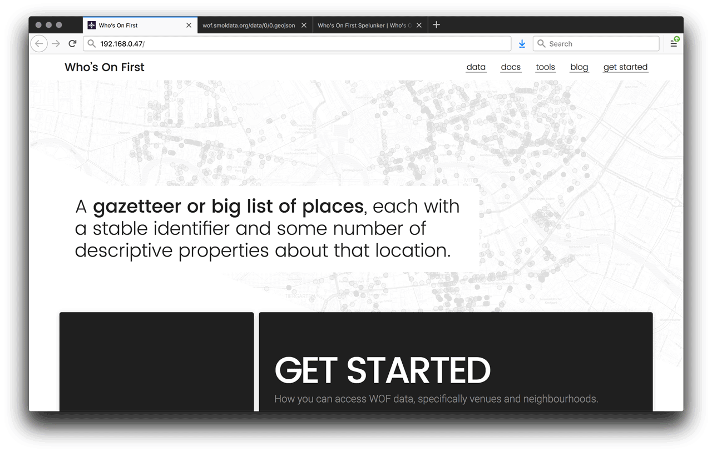

One of central design constraints of Who’s On First is that we don’t pick your database for you. We publish our gazetteer in [GeoJSON](https://whosonfirst.mapzen.com/data), CSV, and [SQLite](https://whosonfirst.mapzen.com/sqlite) and you can decide how you want to import into your software stack of choice. We aspire to support all programming languages, on whatever platform you happen to be using.

We have written our own editorial tools and utility scripts in a variety of languages including [PHP](https://github.com/whosonfirst?utf8=%E2%9C%93&q=&type=&language=php), [Python](https://github.com/whosonfirst?utf8=%E2%9C%93&q=&type=&language=python), and [Go](https://github.com/whosonfirst?utf8=%E2%9C%93&q=&type=&language=go). Some of these are general purpose libraries, like [py-mapzen-whosonfirst](https://github.com/whosonfirst/py-mapzen-whosonfirst), and some are narrowly scoped utilities like [go-whosonfirst-pip-v2](https://github.com/whosonfirst/go-whosonfirst-pip-v2).

Describing the *full range* of the tools and services that compose Who’s On First, in its entirety, is beyond the scope of this guide, but it's a good start. So far we've relied on a mix of shell scripts, Makefiles, and the AWS-hosted Chef deployment system known as OpsWorks. This exercise in documenting the installation of the WOF stack onto "bare metal" is a way to ensure the stack can exist outside the AWS ecosystem.

This guide is the first in a two part series describing how to set up tools for managing Who's On First records on a single Ubuntu Linux server:

* [WOF Spelunker](https://github.com/whosonfirst/whosonfirst-www-spelunker/) for exploring WOF records through a [web interface](https://whosonfirst.mapzen.com/spelunker)
* [Who’s On First API](https://github.com/whosonfirst/whosonfirst-www-api/) (aka [Mapzen Places](https://places.mapzen.com/)) to query the data via a [REST API](https://mapzen.com/documentation/places)
* [Boundary Issues](https://github.com/whosonfirst/whosonfirst-www-boundaryissues/) for editing records using a bespoke web-based CMS

Part two will cover the last pair of web applications, this first part focuses on the Spelunker and the various dependencies required to get it up and running.

We’ll begin by setting up a fresh server from scratch, installing all the dependencies required to host [administrative data](https://github.com/whosonfirst-data/whosonfirst-data) and each of the tools. Some of the underlying technologies we'll be using include:

* Python
* Elasticsearch
* nginx
* Apache
* PHP
* MySQL

The Apache/PHP/MySQL parts will come in the second part of the guide.

One thing that *isn’t* part of the install process yet is Docker. We have started to Dockerize the setup process, but we have a long way to go before the whole stack is covered. If anyone out there is inclined to help us translate our current setup process into Docker, we would definitely appreciate the help.

These docs are a work in progress. If you have thoughts or concerns, or if you get stuck, we would appreciate your feedback! Another caveat is that we are in the midst of migrating our servers from Ubuntu 14.04 to 16.04 (and PHP from version 5 to 7), so there may be some hiccups along the way.

## The server itself

This guide assumes you have, in your possession, an actual physical computer to install all of this onto. It could be the computer you’re reading this on, or a brand new one. The steps are not tied to a particular kind of hosting, and you can certainly set everything up in a cloud-hosted server if you prefer.

We will be using [Ubuntu 16.04 LTS](http://releases.ubuntu.com/16.04/). Things should work on other versions and flavors of Linux, but you may need to adjust some of the setup commands. You can cherry pick various parts of this guide that are interesting to you if you don't feel like setting up the full stack. Each service is designed to work independently of the others and they plug into each other by editing configurable URLs. There are also feature flags to enable/disable functionality, so if you see anything missing it may just be turned off.

I recommend running your WOF in a Box on an [Intel NUC](https://www.intel.com/content/www/us/en/products/boards-kits/nuc.html)-based server. It’s more powerful than a Raspberry Pi, but is affordable and easy to source. Unlike rack-mounted hardware, it will sit quietly on your desk and you can transport it easily in a backpack. The base systems run in the $100-200 range, and you decide how much RAM and disk to install on it. The total system should cost $300-700 depending on your chosen specs. I recommend maxing out the RAM, if you can afford it, but disk space is easy to expand later with external storage.

Hardware checklist:

* Intel NUC
* RAM, the more the better (usually two sticks of equal size)
* mSATA SSD hard drive
* A USB wired keyboard
* An HDMI-capable monitor
* Screwdrivers (to install RAM, SSD disk)
* An Ethernet cable & a network you can plug it into
* A USB memory stick to install Ubuntu

I am not going to describe the hardware setup process in detail here, but if you have all the right parts on hand it should be pretty clear what plugs in where when you open up the case.



## Operating System

Start by installing Ubuntu on the machine. If you’re going with a cloud-hosted server option, like AWS or DigitalOcean, you can skip this part.

1. [Download the installer from Ubuntu](https://www.ubuntu.com/download/server)
2. [Write the installer to a USB stick](https://tutorials.ubuntu.com/tutorial/tutorial-create-a-usb-stick-on-macos#0)
3. Plug the USB stick into the computer and boot to the installer (I have had a weird experience with NUC hardware where only some USB ports can boot from a USB drive, in case you find your machine doesn't boot up at first)

The install process starts from a menu where you can choose "Install Ubuntu Server" and presents you with a sequence of system configurations. I mostly stick with whatever the defaults are, but make sure that you configure the server to automatically install security upgrades. When you get to the "Software Selection" stage you should probably enable "OpenSSH Server" (press the space bar to toggle it), which will make it easier to manage the server remotely.

One key moment in the install process comes when the software is about to partition the disk and erase the contents: "Write the changes to disks and configure LVM?" You will have to select “yes” (which is not the default) and be sure you have the SSD selected, not the USB thumb drive. It will ask you a second time "Write the changes to disks?" Assuming the disk doesn’t have anything on it already, you can make these choices with confidence, with the understanding that you can always start over if something goes wrong.

You will be asked if you want to install the Grub boot loader (choose yes) and then which disk to install it onto (the SSD device). Finally the installer will ask you to remove the USB drive and then it will reboot your newly installed system.

## Basic Ubuntu setup

Once the install has completed, you should get a login prompt at the console. Login with the account you set up before and then use the console session to figure out what the IP address is for the server. That will let you SSH in, which I find to be an easier way to work with the server, compared to directly typing into the keyboard console.

Use the `ifconfig` command to get the current network configuration. There should be a line like `inet addr:192.168.0.47` and that shows your current IP address. Yours will be different, depending on your particular network setup, but we'll just assume in this guide that the IP is `192.168.0.47` as a placeholder.

The first thing we'll do is upgrade to the latest versions of everything.

```
sudo apt-get update
sudo apt-get upgrade -y
```

Next we’ll add some basic utilities and secure the server with a `ufw` firewall. We’ll keep things simple here, but for a more comprehensive security baseline setup you may want to read [Bryan Kennedy’s “first five minutes” guide](https://plusbryan.com/my-first-5-minutes-on-a-server-or-essential-security-for-linux-servers).

```
sudo apt-get install -y git ufw fail2ban unattended-upgrades unzip make jq
sudo ufw allow 22
sudo ufw allow 80
sudo ufw allow 443
sudo ufw enable
```

Your firewall is now configured to listen on ports for SSH, HTTP, HTTPS, and will block network requests for anything else.



## Where files go

We use the following convention for Who’s On First:

* Code goes in `/usr/local/mapzen`
* Data goes in `/usr/local/data`

Here’s how to prepare those base directories:

```
sudo mkdir -p /usr/local/mapzen
sudo mkdir -p /usr/local/data
sudo chown $USER /usr/local/mapzen
sudo chown $USER /usr/local/data
```

You can choose to install stuff elsewhere if you prefer, but the default configurations will expect things to exist in those base directories.

<a name="download"></a>
## Download some data

Now we are getting to the good part: downloading WOF data! The Who's On First data repos are split up [by placetype](https://github.com/whosonfirst-data/). The data repository we'll be working with is `whosonfirst-data`, which only includes administrative placetypes. That includes records for cities, countries, neighbourhoods, etc. We've split other placetypes like venues, constituencies and postalcodes into their own separate repositories, but everything contained in this guide should work the same with them.

Each Who's On First repository contains two top level folders, `data` and `meta`. The `meta` folder has CSV summaries of all the GeoJSON files contained in the `data` directory. Those CSV meta files tend to get large, so we are currently storing them using [git lfs](https://git-lfs.github.com/). It's a service provided by GitHub that accommodates files over 100MB that get stored in the repo as stub files. Once we have git lfs installed, it will take care of pulling down those big CSV files from GitHub as a separate stage at the end of a `git pull`.

So before we can clone the data repositories, we’ll need to [set up git lfs](https://github.com/git-lfs/git-lfs/wiki/Installation).

_We are also [in the process of phasing out git lfs-stored meta files](https://github.com/whosonfirst-data/whosonfirst-data/blob/master/meta/README.md#meta-files), in favour of having them generated on demand, but for now the `git lfs` dance is still an unfortunate dependency._

```
curl -s https://packagecloud.io/install/repositories/github/git-lfs/script.deb.sh | sudo bash
sudo apt-get install git-lfs
git lfs install
```

After you install git lfs, you may notice that your home directory has a new configuration in `~/.gitconfig`:

```
[filter "lfs"]
	process = git-lfs filter-process
	required = true
	clean = git-lfs clean -- %f
	smudge = git-lfs smudge -- %f
```

These filters are how the LFS system plugs into `git` commands.

This next part is going to take some time, so you may want to use a `screen` session (`tmux` is another popular alternative). I’m including a brief introduction to how `screen` works here.

```
screen -S download
```

This creates a new session called “download” that will keep your commands running in the background. It’s especially helpful for when you can’t stay logged in via SSH until a long task completes.

To “detach” from your session and keep it running behind the scenes, type `ctrl-A` followed by `D` (note to Mac users: this is the actual `ctrl` key, not `cmd`).

Then, to check up on its progress later, you can reattach by typing `screen -x download`. You can also use `screen -ls` to see what sessions you already have running.

You may want to read this [`screen` keyboard command cheat sheet](https://gist.github.com/fredrick/1216878), courtesy of [Fredrick Galoso](https://gist.github.com/fredrick).

Okay, now we can download some data!

```
cd /usr/local/data
git clone https://github.com/whosonfirst-data/whosonfirst-data.git
```

This should download about 37GB worth of Who’s On First records, a little over 700,000 of worldwide administrative GeoJSON records.



## Setting up Python

We are going to need some Python tools. It’s important to mention that our Python libraries are a reference implementation and poorly documented. Recently we have been porting much of the functionality to Go, and we also intend to support Python 3 (and finally document things), but for now Python 2 is what works. Python has a lot of twisty dependency issues, so it can be weird and frustrating to set up, but with some patience we will get it all working.

```
sudo apt-get install -y python-pip python-pyparsing python-setuptools libpython-dev libssl-dev libffi-dev
sudo python -m pip install --upgrade --force pip
sudo pip install --upgrade setuptools
sudo pip install --upgrade pyopenssl ndg-httpsclient pyasn1 'requests[security]'
```

Now we can install the [WOF Python libraries](https://github.com/whosonfirst/py-mapzen-whosonfirst).

```
cd /usr/local/mapzen
git clone https://github.com/whosonfirst/py-mapzen-whosonfirst.git
cd py-mapzen-whosonfirst
sudo pip install --upgrade -r requirements.txt --process-dependency-links .
```

Now that we have WOF python tools we can start working with the records. Here is an example of a very basic crawl script you could use to iterate over every WOF record in a directory tree:

```
#!/usr/bin/env python

import mapzen.whosonfirst.utils

def cb(feature):
    print feature.keys()

source = "/usr/local/data/whosonfirst-data/data"
crawl = mapzen.whosonfirst.utils.crawl_with_callback(source, cb, inflate=True, multiprocessing=True)
```

Note that you won't see any records in `/usr/local/data/whosonfirst-data` until the `git clone` command finishes in your `screen` session.

## Setting up Elasticsearch

As we said at the top of this guide, we don’t intend to choose your database, but [Elasticsearch](https://www.elastic.co/products/elasticsearch) is what we use to run all of the tools in this guide.

We first need to install Java to run Elasticsearch. The first step will require an extra `[enter]` to confirm you're okay with adding an [apt Personal Package Archives source](https://askubuntu.com/questions/4983/what-are-ppas-and-how-do-i-use-them) for Java.

```
sudo add-apt-repository ppa:webupd8team/java
sudo apt-get update
sudo apt-get install -y oracle-java8-installer
```

The third step will prompt you to accept the Java legal terms.

Now we can install Elasticsearch itself.

```
wget https://download.elastic.co/elasticsearch/release/org/elasticsearch/distribution/deb/elasticsearch/2.4.6/elasticsearch-2.4.6.deb
sudo dpkg -i elasticsearch-2.4.6.deb
sudo systemctl enable elasticsearch.service
```

Next we will edit some configurations:

```
sudo nano /etc/elasticsearch/elasticsearch.yml
```

Add the following to the config:

```
cluster.name: whosonfirst
node.name: "Who's On First"
index.number_of_shards: 1
index.number_of_replicas: 0
```

Now we can start the Elasticsearch service:

```
sudo systemctl start elasticsearch
```

Give it 30 seconds or so to finish starting up, and then you should be able to `curl http://localhost:9200/` and get back a response (“you know, for search”).

There’s a more detailed discussion of setting up Elasticsearch in Ubuntu 16.04 in the excellent [DigitalOcean documentation](https://www.digitalocean.com/community/tutorials/how-to-install-and-configure-elasticsearch-on-ubuntu-16-04).

## Elasticsearch schemas

Elasticsearch is great at a lot of things, but it is really fussy about how you maintain its index schemas. By default it uses “magic” to infer datatypes of JSON properties when you index them, but when it guesses wrong the result can be very frustrating. As a result we need to be careful with managing our index schemas.

We keep the WOF Elasticsearch schemas in [a dedicated repo](https://github.com/whosonfirst/es-whosonfirst-schema).

```
cd /usr/local/mapzen
git clone https://github.com/whosonfirst/es-whosonfirst-schema.git
```

We have some synonyms that help out decipher incoming search queries, we need to copy those to the Elasticsearch config folder.

```
sudo mkdir -p /etc/elasticsearch/synonyms
cd /usr/local/mapzen/es-whosonfirst-schema/synonyms
sudo cp *.txt /etc/elasticsearch/synonyms/
```

Now we can set up the schema for the Spelunker.

```
cd /usr/local/mapzen/es-whosonfirst-schema
cat schema/2.4/mappings.spelunker.json | curl -X PUT http://localhost:9200/spelunker_20171221 -d @-
curl -X POST http://localhost:9200/_aliases -d '{ "actions": [ { "add": { "alias": "spelunker", "index": "spelunker_20171221" } } ] }'
```

We have actually done two things:

1. Created an index called `spelunker_20171221`
2. Aliased it to respond to `spelunker`

Using an alias makes upgrading the schema easier in the future.

Let’s check to make sure the index and alias are set up properly:

```
curl -s http://localhost:9200/_aliases | jq
```

You should see a response like:

```
{
  "spelunker_20171221": {
    "aliases": {
      "spelunker": {}
    }
  }
}
```

<a name="index"></a>
## Index the data

The next logical step is to index the data into Elasticsearch, but there is a chance you may still be waiting on the `git clone` command to finish. This might be a good time to check on the download we had running in a `screen` session from earlier: `screen -x download`. Remember, to detach from the session press `ctrl-A` then `D`.


If it hasn't finished, continue on with the next steps and circle back to this later.

Once `git` has finished cloning, we can index the records into Elasticsearch. This will also take a while to complete, so you may want to just keep the `screen` session going.

```
cd /usr/local/data/whosonfirst-data
wof-es-index -s . --index=spelunker -b
```

Once this completes, you’ll be able to make requests to Elasticsearch to inspect individual records like this:

```
curl -s http://localhost:9200/spelunker/locality/102027181 | jq
```

That should give you the GeoJSON for [Shanghai](https://whosonfirst.mapzen.com/spelunker/id/102027181/).


## Installing the Spelunker

Before we spin up the Spelunker itself, there are _more_ Python dependencies we need to install first.

```
sudo apt-get update
sudo apt-get install -y gunicorn python-gevent gdal-bin
sudo pip install flask flask-cors pycountry
```

Now we can download and set up the Spelunker web app.

```
cd /usr/local/mapzen
git clone https://github.com/whosonfirst/whosonfirst-www-spelunker.git
cd whosonfirst-www-spelunker
./ubuntu/setup-spelunker.sh
./ubuntu/setup-gunicorn.sh
```

The Spelunker itself is a simple [Flask application](http://flask.pocoo.org/). Flask applications implement the [Web Server Gateway Interface](https://www.python.org/dev/peps/pep-0333/) which allow requests to be handled a more robust web server application, like [gunicorn](http://gunicorn.org/). Finally, for our purposes we route requests to the `gunicorn` web server through the `nginx` proxy server, discussed below.

Basically gunicorn is the long underwear and nginx is the down parka that your Flask application (the Spelunker) wears when it goes outside in to the cold winter of the Internet. An unfortunate side-effect of this otherwise fruitful relationship is that there a few too many settings and different config files that need to be managed in order for everything to work smoothly. Which is to say:

There are a handful of config files in the `config` folder you may want to look at, but we will leave them with their default settings.

There is one JavaScript config file we need to set up.

```
cd /usr/local/mapzen/whosonfirst-www-spelunker/www/static/javascript
cp mapzen.whosonfirst.config.js.example mapzen.whosonfirst.config.js
nano mapzen.whosonfirst.config.js
```

Look for `var api_key = 'mapzen-xxxxxx';` and replace the key with your own Mapzen API key. You can register one from the [Mapzen dashboard](https://mapzen.com/dashboard).

Next we will set up a log file for the Spelunker.

```
sudo touch /var/log/spelunker
sudo chown www-data:www-data /var/log/spelunker
```

Let’s try starting up the Spelunker in debug mode. (Note that we intend to update this `init.d` script to use something more modern.)

```
sudo /etc/init.d/whosonfirst-www-spelunker.sh debug
```

You will very likely get an error at this point: `Error: class uri 'egg:gunicorn#gevent' invalid or not found`

We are still figuring out why `gevent` isn't working on platforms like the NUC, so the interim solution is to just comment it out. If you happen to know *why* gevent isn't working for us, we'd be very interested to know why.

```
cd /usr/local/mapzen/whosonfirst-www-spelunker/config
nano whosonfirst-www-spelunker-gunicorn.cfg
```

Look for this line and add a `#` comment to disable it:

```
# worker_class = "egg:gunicorn#gevent"
```

Then try again running in debug mode.

```
sudo /etc/init.d/whosonfirst-www-spelunker.sh debug
```

If that works, we can start the service to run in the background.

So, yes, `init.d` scripts have been deprecated in Ubuntu 16.04. We are still finding our way to the right [Systemd equivalents](https://www.digitalocean.com/community/tutorials/systemd-essentials-working-with-services-units-and-the-journal), so for now we will kind of hold our nose and pretend this is just fine. The first `killall` command is for shutting down any previously-running instances of the Spelunker.

```
sudo killall gunicorn
sudo /etc/init.d/whosonfirst-www-spelunker.sh start
```

You should now be able to see the service running locally.

```
curl http://localhost:7777/
```



## Setting up nginx

Now that we have the Spelunker working we need a web proxy to send requests for `/spelunker` to `localhost:7777`. We’ll be using [nginx](https://www.nginx.com/resources/wiki/) to handle this.

But while we are here configuring nginx, we'll set it up for the rest of the WOF stack too.

* `/` - served statically from `/usr/local/data/whosonfirst-www/www`
* `/data` - raw data served statically from `/usr/local/data/whosonfirst-data/data`
* `/spelunker` - proxied to `localhost:7777`
* `/api` - proxied to `localhost:8888`
* `/boundaryissues` - proxied to `localhost:9999`

And that first path doesn't exist yet, so let's clone the Who's On First website repo.

```
cd /usr/local/mapzen
git clone https://github.com/whosonfirst/whosonfirst-www.git
```

This gives us a basic website with lots of Who's On First documentation, available from the server's homepage.

Okay, now let’s install nginx.

```
sudo apt-get update
sudo apt-get install -y nginx
cd /etc/nginx/sites-available
```

Now create a new config file `whosonfirst`.

```
sudo nano whosonfirst
```

Add the following configurations to it:

```
server {
	listen 80;
	server_name _;
	index index.html;

	root /usr/local/mapzen/whosonfirst-www/www;

	location / {
		try_files $uri $uri/ =404;
	}

	location /data {
		root /usr/local/data/whosonfirst-data/data;
	}

	location /spelunker {
		proxy_pass http://localhost:7777;
		proxy_set_header Host $http_host;
		proxy_set_header X-Forwarded-For $proxy_add_x_forwarded_for;
		proxy_set_header X-Scheme $scheme;
		proxy_set_header X-Proxy-Path /spelunker; # this bit is important (tomorrow)
		proxy_set_header X-Script-Name /spelunker; # this bit is important (today)
		# https://github.com/whosonfirst/whosonfirst-www-spelunker/blob/master/www/server.py#L45
	}

	location /api {
		proxy_pass http://localhost:8888;
		proxy_set_header Host $http_host;
		proxy_set_header X-Forwarded-For $proxy_add_x_forwarded_for;
		proxy_set_header X-Scheme $scheme;
		proxy_set_header X-Proxy-Path /api;
	}

	location /boundaryissues {
		proxy_pass http://localhost:9999;
		proxy_set_header Host $http_host;
		proxy_set_header X-Forwarded-For $proxy_add_x_forwarded_for;
		proxy_set_header X-Scheme $scheme;
		proxy_set_header X-Proxy-Path /boundaryissues;
	}
}
```

Next we will enable the `whosonfirst` configuration.

```
cd /etc/nginx/sites-enabled
sudo rm default
sudo ln -s ../sites-available/whosonfirst whosonfirst
```

Now we can restart nginx for our new configurations to kick in.

```
sudo service nginx restart
```

Here’s a quick test that should indicate whether things are working:

```
curl -I http://localhost/
curl -I http://localhost/data/0/0.geojson
curl -I http://localhost/spelunker/
```

If each of those report back with `HTTP/1.1 200 OK` then you are in good shape. If the second request for `0.geojson` comes back with a 404 error, that may be because you're still not done cloning data with `git`. If you want to test it out from a web browser, just go to http://192.168.0.47/spelunker/ (substituting whatever your actual IP address is).



## Stay tuned for part two

That concludes the first part of the WOF in a Box guide. We have some WOF data and a Spelunker tool to explore it with. The second installment will add a [REST API](https://github.com/whosonfirst/whosonfirst-www-api/) and a [web-based CMS](https://github.com/whosonfirst/whosonfirst-www-boundaryissues/) to edit records with.
