Way back in 2012 I started working on a project called [Privatesquare](https://straup.github.io/privatesquare/). At the time I was doing a lot of work around the idea of [personal archiving](https://www.aaronland.info/weblog/2012/02/14/incentivize/#pda2012) and
Privatesquare was originally conceived as a simple backup of my Foursquare check-ins. 

At one point I started thinking: I don't care if Foursquare knows I went
to the bar around the corner, but maybe I'm not so keen on them knowing I
went to the drug store. At the same time maybe I am interested in having a
record of that. So what began as a simple unidirectional archiving project
morphed in to a tool where I would check-in to Privatesquare _first_ and then
optionally tell Foursquare.

_Fun fact: Without Privatesquare the IDs in Who's On First might have been
completely different but that is [an entirely other
story](https://www.aaronland.info/weblog/2012/12/01/coffee-and-wifi/#timepixels),
for another day._

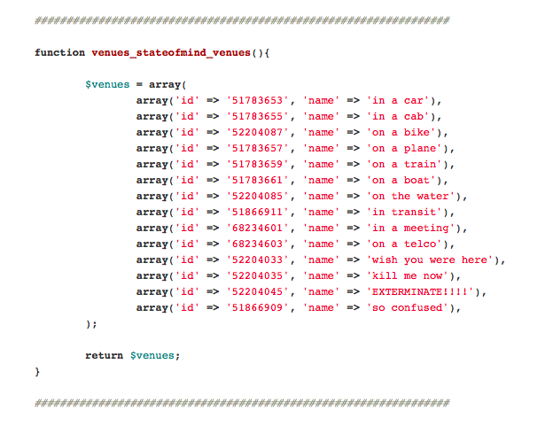

Privatesquare eventually grew more sophisicated allowing you to "check-in" to
places not defined in Foursquare. For example, old buildings in New York City courtesy the
[New York Public Library](https://github.com/NYPL/gazetteer/wiki/ApiDocs) and so-called "states of mind". It also added the ability to record travel
and to record things you liked or didn't like in the [Atlas of Desire](http://nearfuturelaboratory.com/2012/09/04/the-atlas-of-desire/).

Privatesquare was always a mornings-and-weekends project and used a variety of
external services to get thing done: [Foursquare](https://developer.foursquare.com/) for venues and search; [Stamen](http://maps.stamen.com/) for map
tiles; The [Flickr API](https://www.flickr.com/services/api) for geocoding cities.

The first week I started at [Mapzen](https://en.wikipedia.org/wiki/Mapzen), in 2015, I remembering thinking: I wonder if I can
swap out each one of third-party services used by Privatesquare with an equivalent
Mapzen service? The answer, at the time, was "No".

It was a useful reminder of [the work we had set out for ourselves](https://archive.org/search.php?query=mapzen%20weblog).

Fast forward to the spring of 2017 and I had begun to experiment with small
bespoke [Electron-based applications](https://electronjs.org/), specifically a tool that a person could use
to explore and test the [Who's On First API](/blog/2017/04/04/whosonfirst-api/). Electron applications are written in
HTML and CSS and Javascript and then bundled up and compiled in to a binary
application.

I continue to be interested in Electron apps because they
afford the ability to more easily craft something that looks and feels like a native
application, across different platforms, without a lot of the boring grunt-work that
comes with writing native applications.

After I finished the [Who's On First API Explorer](/blog/2017/04/28/whosonfirst-api-explorer/) application I remember thinking
back to 2015 and wondering if I could finally swap out all of the
third-party services in Privatesqure with an equivalent Mapzen service.

The answer this time was "Yeah, probably..."

---

Instead of updating [the Privatesquare web application](https://github.com/straup/privatesquare/) I decided to build a
dedicated Electron application from scratch. I did this for a few
reasons:

* I didn't want the extra hassle of running another server with user accounts.

* I also didn't want to store any user data on a remote server.

* I wanted to see whether [the model that Firefox team had developed for their
  Sync product](https://blog.mozilla.org/warner/2014/05/23/the-new-sync-protocol/) could be applied to check-ins and personal location tracking.

* I wanted to think about building an application that could be developed and
  deployed across a number of platforms and devices, each of which might have a
  purpose-built UI but all of which shared the same underlying data model, in
  this case a simple SQLite database. 

Everything in Privatesquare is private to an individual. There is no way
to "share" a place or a list or really anything you do in the application. That
is by design but even though you could run your own copy of Privatesquare (and
a few people did) if you used my instance then your data was stored alonside
everyone's else data in a shared database that someone else (me) controlled. So
it is "private" in as much as you trust me.

That's a truism bordering on a platitude but in 2018 [trust in systems, if not
individuals](https://www.aaronland.info/weblog/2012/10/08/signs/#stories),
increasingly seems
like it is in short supply. Every day bring news of some previously unknown [existential flaw in the fundamental
principles of computers](https://www.raspberrypi.org/blog/why-raspberry-pi-isnt-vulnerable-to-spectre-or-meltdown/) and computer networks – aka "the cloud" – so that even if you
implicitly trust an operator or a service the guarantee of that trust feels like
it is called in to question.

---

So what does it mean to _not_ store sensitive data (whether it _is_ sensitive or
just _feels_ sensitive amounts to the same thing) on a remote server? The
problem of course is that people now have multiple computers, big and small, and have come to
expect that all those "devices" can and will can in sync with one another. 

One approach to mitigating this problem is simply encrypting the data in
transit, and at rest, between devices. [This is how Firefox synchronizes things](https://github.com/mozilla/fxa-auth-server/wiki/onepw-protocol)
like browser preferences and bookmarks between a user's desktop computer and
their mobile phone.

[](https://github.com/mozilla/fxa-auth-server/wiki/onepw-protocol)

Ultimately there is still a server brokering the communication between devices
and there is a lot of math and cryptography and there are still user accounts
and a bunch of ways you can shoot yourself in the foot and never be able to
decrypt your data (that's what's going on in the scary screenshot above) but the
thing you get in return for all that hoop-jumping is that Mozilla, the parent
company of Firefox, doesn't know what you're bookmarking.

I don't belive what Firefox is doing is a perfect solution, by any means, but it
feels like forward motion and is at least "better than yesterday". In as much as
"check-ins" are just "bookmarks" by another name, maybe there's something to
learn from people already working on this problem. 

---

It's also worth a quick tangent to mention [differential
privacy](https://en.wikipedia.org/wiki/Differential_privacy) and Google's
[federated
learning](https://research.googleblog.com/2017/04/federated-learning-collaborative.html)
here.

When user data is encrypted at the service provider level it is problematic for
companies that rely on aggregating that data (and hence be unencrypted) in to
something they can resell, whether its advertising or genuinely useful secondary
services. Nevermind the former but I choose to believe there's an argument to be made
in favour of the latter.

What I think is valuable about projects like differential privacy and federated learning is
the idea there might be a way to say to people: We care intensively about
whatever it is you're "doing" but we don't actually care about you, personally
or individually. This is interesting to me for projects like Who's On First and
Privatesquare/zen when it comes to things like validating data but more generally I
think there is a need and real value for people to have a way to participate in
collaborative efforts with some measure of ambiguity, if not anonimity.

Simson Garfinkel's presentation on [Modernizing the Disclosure Avoidance System
for the 2020 Census](https://youtu.be/G3voy0MuoN0?t=1h54m20) for the Census
Scientific Advisory Committee (CSAC), last year, is a good discussion of
some of the benefits and trade-offs in this approach.

---

Lots of people have written about and demonstrated the value of [SQLite](https://sqlite.org/) databases, none
more eloquantly than [Paul
Ford](https://newrepublic.com/article/124425/dreamed-perfect-database). Similarly
Simon's Willison's [Datasette](https://simonwillison.net/2017/Nov/13/datasette/)
project is a good example of how SQLite databases can make "simple things and hard
things possible".

Even before that, though, SQLite has been used under the hood for years by a
wide array of applications and services. SQLite databases and small and portable
and self-contained (a single file on disk that you could send to someone as an
email attachment) and while they still require a user to
install dedicated software to work with the data those tools are readily available in 2018.

And lots of different tools can read and write SQLite databases. Aside from
the mechanical considerations for using SQLite (only one file to encrypt and
decrypt and send across the wire) I like the fact that the _raw data_ that makes
the application unique and useful to an individual is something which is also
accessible to browse, manipulate or do whatever someone wants with _outside_ of
that application.

It provides a useful check and a separation of concerns that forces an application to
succeed on its own merits and not because it has the key to all your data.

---

One day, after showing some work-in-progress of my new Mapzen-enabled
Privatesquare – aka "Privatezen" – at the office a colleague asked if
this was an official Mapzen project. It was not and never was. I would have
enjoyed making it one but we already had million other things on the go so it
was a thing that I would poke at in 45-minute increments over coffee in the
morning before going to do the "real work" of Who's On First. 

It was and has remained, for now, a tool uniquely tailored to me because I
assume I am the only one who can see past all the short-cuts and gotchas to
bother using the thing.

It (bookmarking places or "check-ins" or whatever you want to call it) is a
thing I've always missed since I stopped running a hosted version of
Privatesquare. At the same time, I've always felt that there was no point in
doing Who's On First unless you could actually _do_ something with the data so
this project was a good way to kick the tires.

"Privatezen", the application, is organized around six categories: Visits, Neighbourhoods,
Cities, Lists, #feelings and Trips. All of these categories hold hands with each other meaning you
should be able to look for all the visits in a particular neighbourhood or all
of the lists that have visits in a particular city or #feelings associated with
trips and so on.

_"#feelings" used to be "desires" (as in Privatesquare's [Atlas of Desire](http://nearfuturelaboratory.com/2012/09/04/the-atlas-of-desire/))
but a hashtag felt more in keeping with the times..._

Here's what a "visit" looks like:

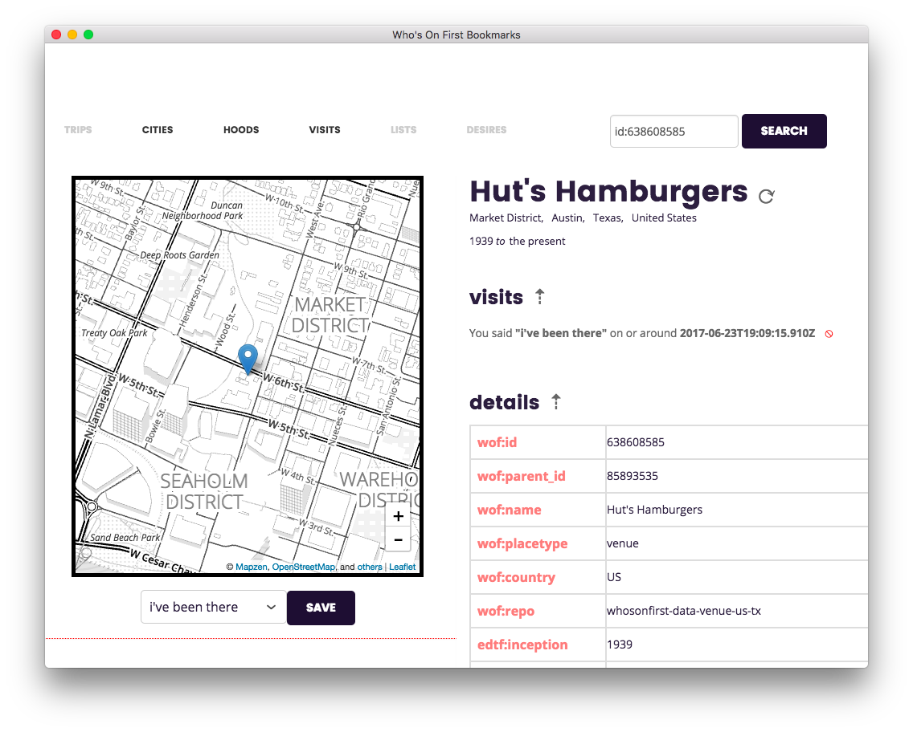

Chief among the long list of short-cuts and gotchas is the fact that search has never worked very well, for three
reasons.

First lots of venues (in Who's On First) hadn't been indexed in Mapzen
Search yet. Second, we were using the [mapzen.js](https://github.com/nextzen/mapzen.js) library for map display and the
[Pelias API](https://github.com/pelias/pelias-doc/blob/master/search.md) for search. Although the Who's On First API implemented a
[Pelias-API compliant endpoint](https://github.com/whosonfirst/whosonfirst-www-api/blob/master/www/include/lib_api_whosonfirst_pelias.php) it was always buggy and those fixes just never made it
to the top of the stack. Third, I just never got
around to implementing a good generic list view interface for things like search
results.

Instead, because I was the only person ever using this tool, I suffered the
hassle of looking up a venue ID (usually from the [Spelunker](/spelunker/)) and
then, using the special syntax `id:{WHOSONFIRST_ID}`, would paste it to the search
box on the top right.
 
From there the application would look up the venue details and display them with
a handy map at which point you could save your "visit" by saying nothing more specific
than "I've been there" and the UI would update itself accordingly. 

There are couple things to note: There was nothing venue specific about
this interface. You could have saved any place in Who's On First. There was also
nothing specific about signaling _when_ a visit took place.

```
	const feelings = {
		0: "i've been there",
		1: "i was there",
		2: "i want to go there",
		3: "again again",
		4: "again",
		5: "again maybe",
		6: "again never",
		7: "meh",
		8: "i would try this",
	};
```

Although there is a timestamp indicating when a visit was _added_ to the database the
application doesn't assume that you are recording things in the moment. In fact
you can use the application to signal places that you _want_ to visit.

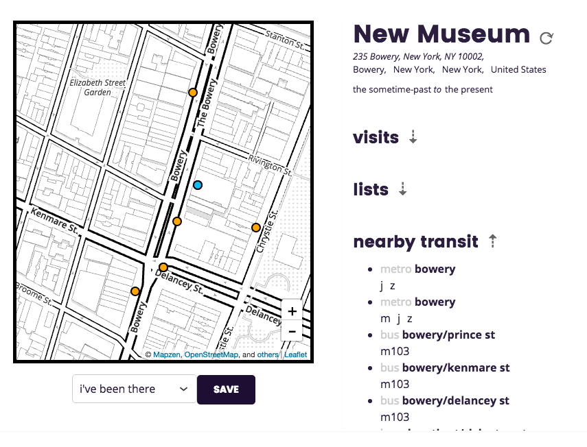

I was also trying to integrate as many of the various Mapzen services, not
so much for the sake of it but because they were all useful and to understand
how they fit together and where the stress points remained.

Once a Who's On First place was loaded on to the map we would call the
[Transitland API](https://transit.land/) for nearby transit stops. Like a lot of
features this never moved beyond the basic prove-it-works-with-a-list-view stage on
to a more refined and useful user interface.

Routing, and something like Dan's [All of the
Places](/blog/2016/08/24/all-of-the-places/) experiments from 2016, were also on
the list but there was never enough time for all of the things...

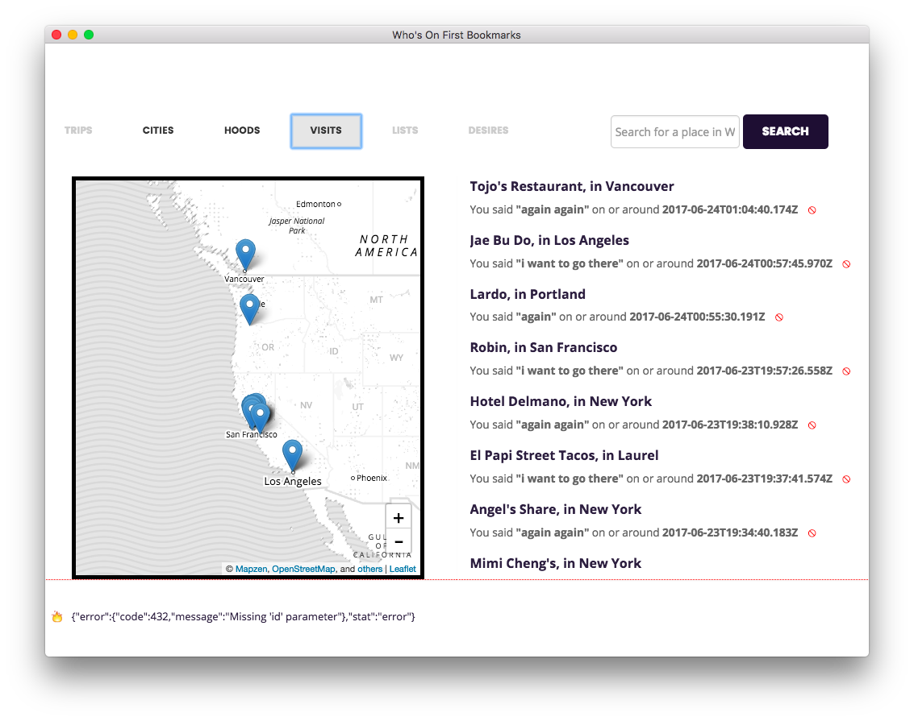

The default view when you launch the application is to show your most recent
visits in reverse chronological order with a handy map. Generally the rule of
thumb was to add "a handy map" whenever possible.

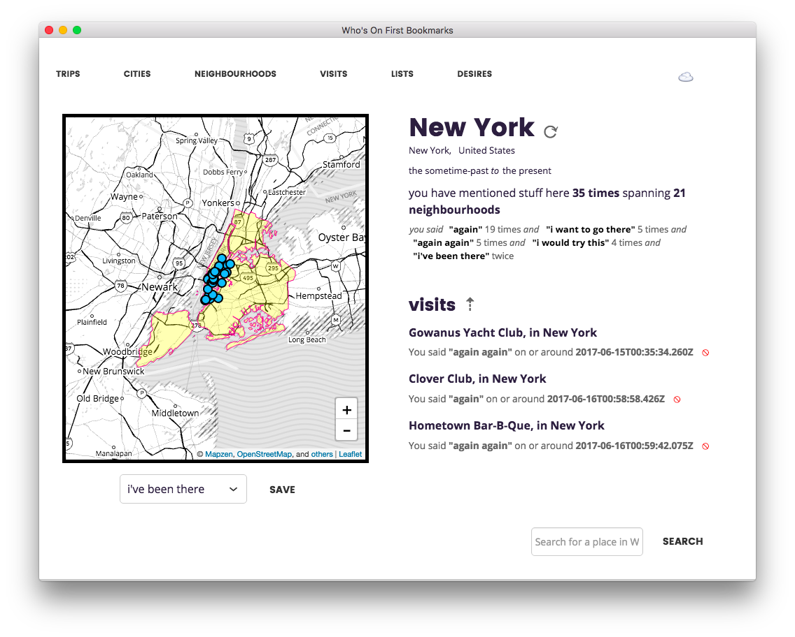

The other rule was to make every "first class object" in every view
clickable. Here's what I would see when I clicked [New York
City](https://places.whosonfirst.org/id/ 85977539/).

As you can
see from the many dots on the map and only three visible "visits", on the right, another of the
many neglected UI details included how best to fit everything in to a finite
amount of space and signaling when a given element overflowed the viewport.

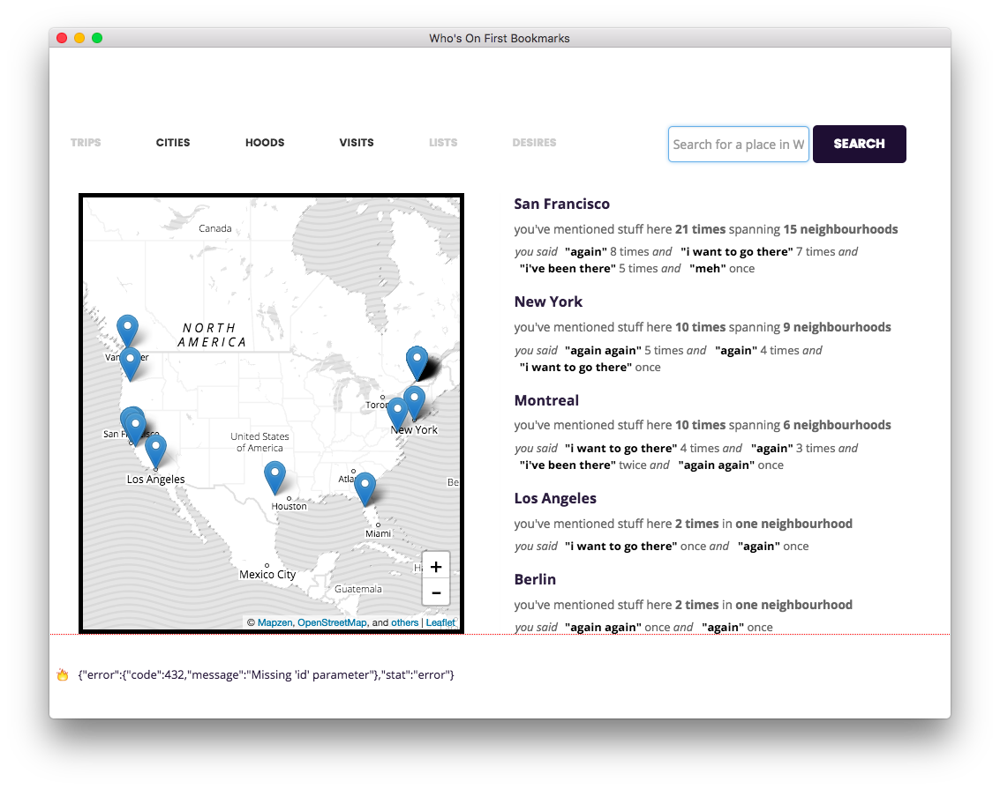

Here are the top cities that I had recorded visits for. These were grouped again
by #feelings about the places that I had visited in that city. There are
likewise views for neighbourhoods which was often very useful when trying to figure out
where to meet someone for dinner and then immediately drawing a complete blank
when asked to pick a spot.

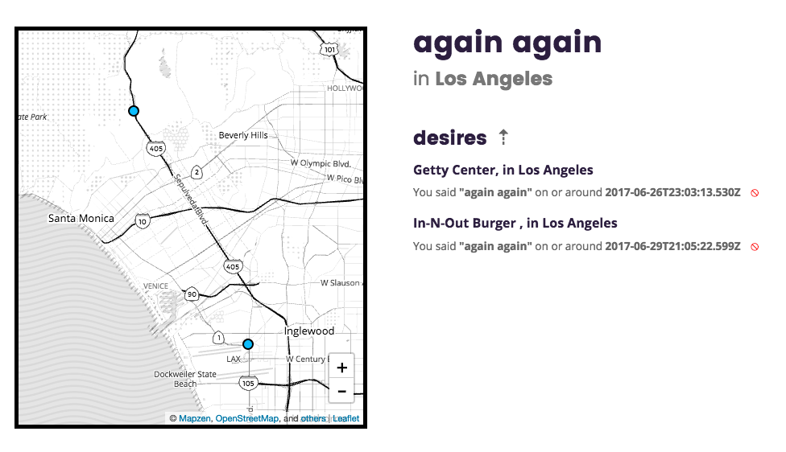

Credit for the basic model of grouping things in to buckets labeled "again",
"again again", "again maybe" and "again never" goes to [Chris Heathcote](https://mobile.twitter.com/antimega).

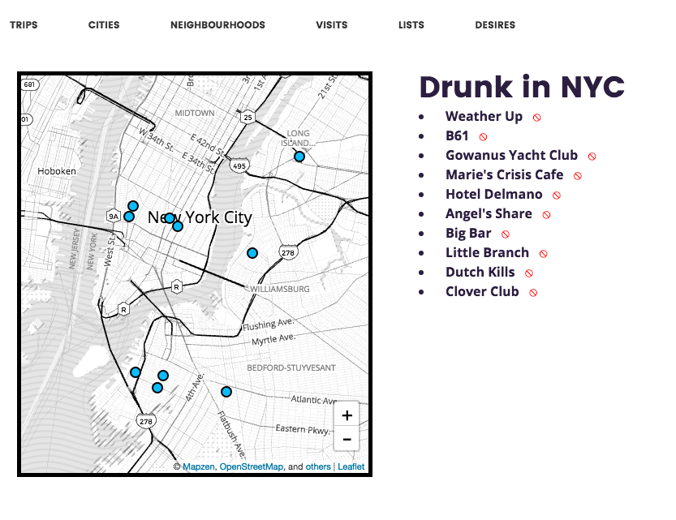

It is possible to create lists and like the transit work, above, they
never matured much beyond the "prove it's possible with a list of items" stage.

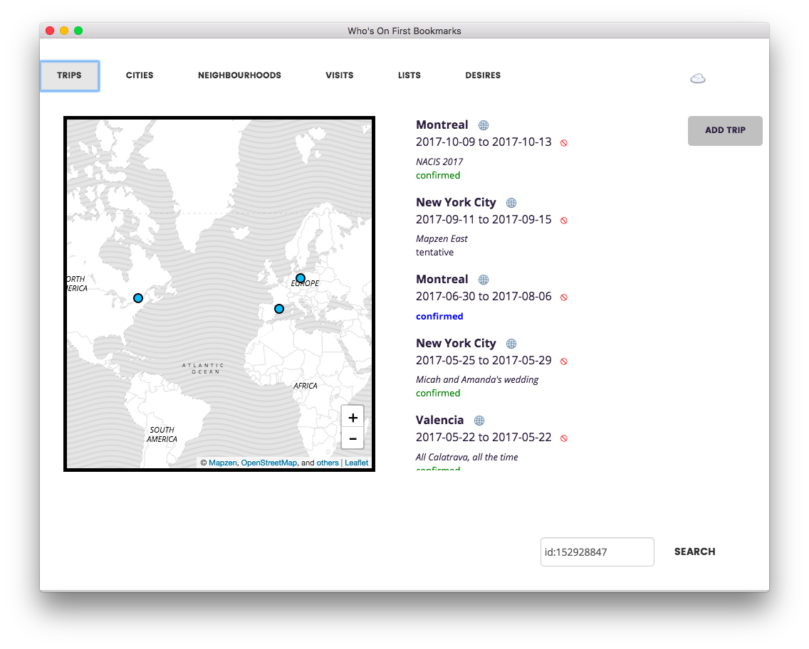

You can add trips to places which is useful when combined with the "I want to
go there" #feeling.

This is a straight clone of [the trips functionality in
Privatesquare](https://www.aaronland.info/weblog/2014/04/21/mirrors/#trips) which cloned the idea from the old social-travel website called
[Dopplr](https://en.wikipedia.org/wiki/Dopplr).

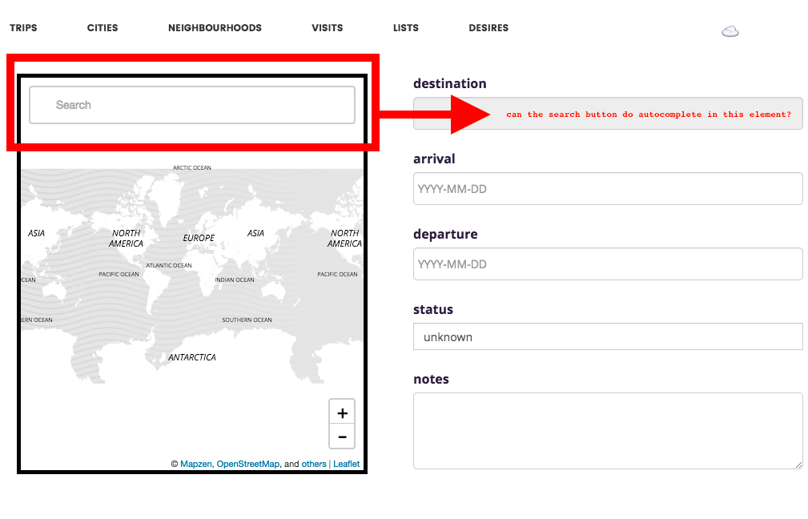

I never did figure out how to assign the `mapzen.js` search and geocoding widget
to another element outside of the map...

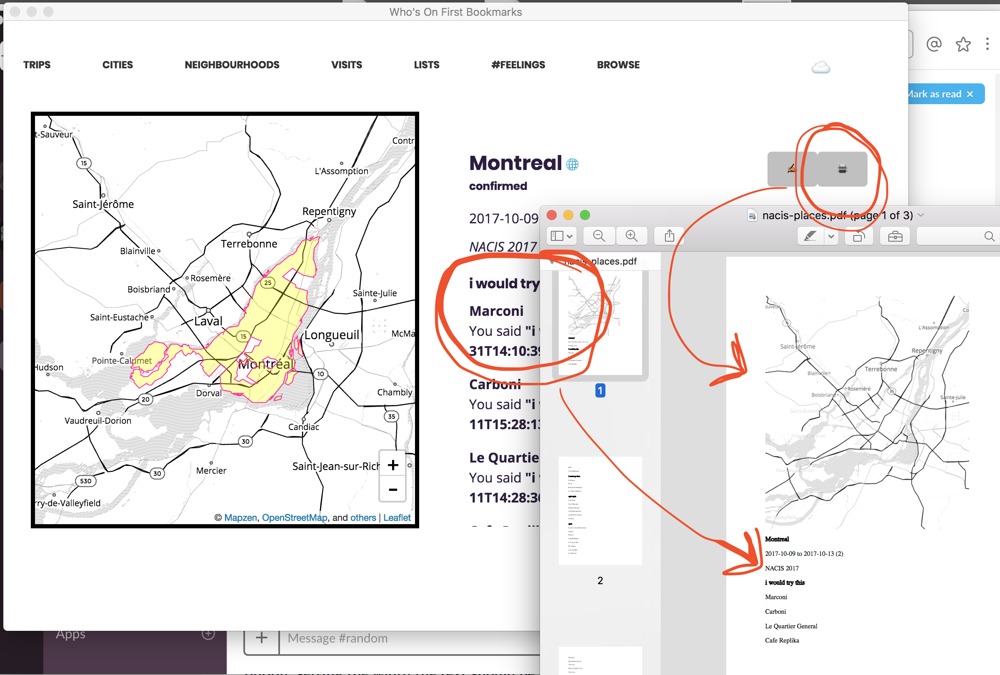

Before going to
[NACIS](http://localhost:8080/blog/2017/10/17/whosonfirst-nacis-2017/) last year
I spent a little bit of time writing the code to generate a PDF file of all the
places associated with a trip, with an eye towards extending the functionality
to any list view.

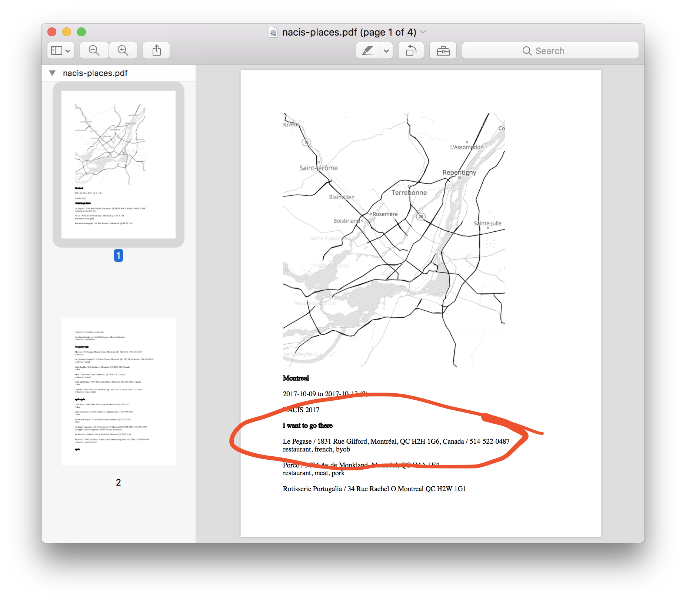

This work got stuck between the part where we use the Leaflet [GeoJSON plugin](http://leafletjs.com/reference-1.3.0.html#geojson) to
draw features on the map and the built-in ability of [tangram.js](https://github.com/tangrams/tangram) to screenshot
an image of the current map to include in the PDF file.

The problem being that because the features displayed on the map are being drawn
by a completely different map "layer" managed by
[Leaflet](http://leafletjs.com/) that the `tangram.js` code doesn't even know
about, from `tangram.js` 's perspective there are no features to draw in screenshot-mode.

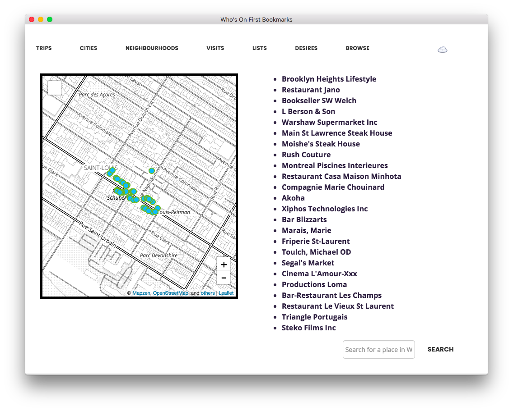

I mentioned earlier that there's never been a proper interface for list
views. Browsing all the nearby venues surrounding a point is a good example of that.

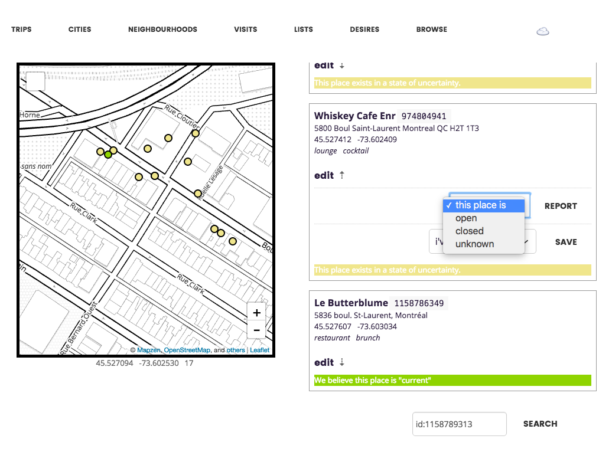

Here's a screenshot of some work that I started to to do to develop a generic
view (or "card") for any given place. This included
developing a range of colour-codings to apply to things like dots on the map,
to signal properties about a venue like whether it was open or closed.

I always imagined that these views, or cards, could do double-duty as a place where
people could [help improve](/blog/2016/04/08/yesnofix/) the underlying Who's On First data.

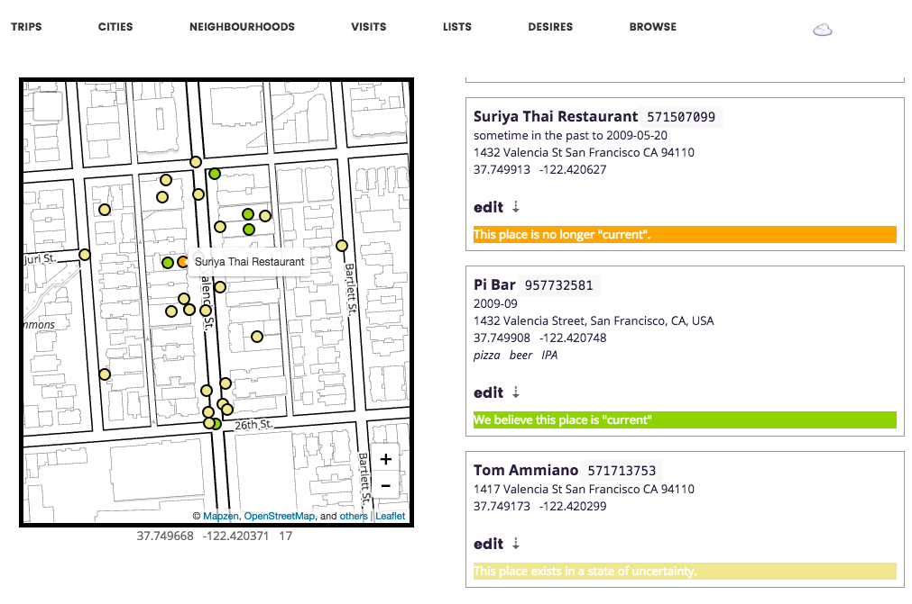

Here's a tangible illustration of the the Who's On First `supersedes`
and `superseded_by` properties in action. These two restaurants "occupy" the same
building: First [Suriya Thai](https://places.whosonfirst.org/id/571507099) until early-2009 and then [Pi Bar](https://places.whosonfirst.org/id/957732581) following that.

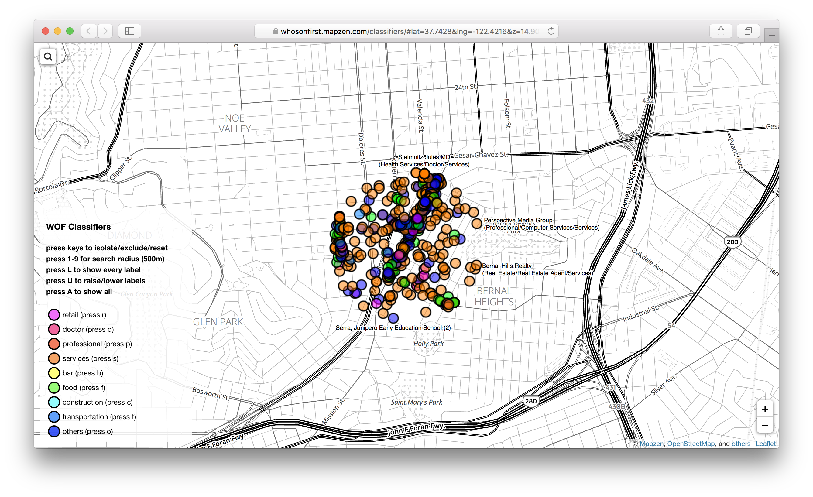

Speaking of colour coding dots on a map here's a screenshot of some lovely work
that [John Oram](https://burritojustice.com/) did to display and filter venues by category.

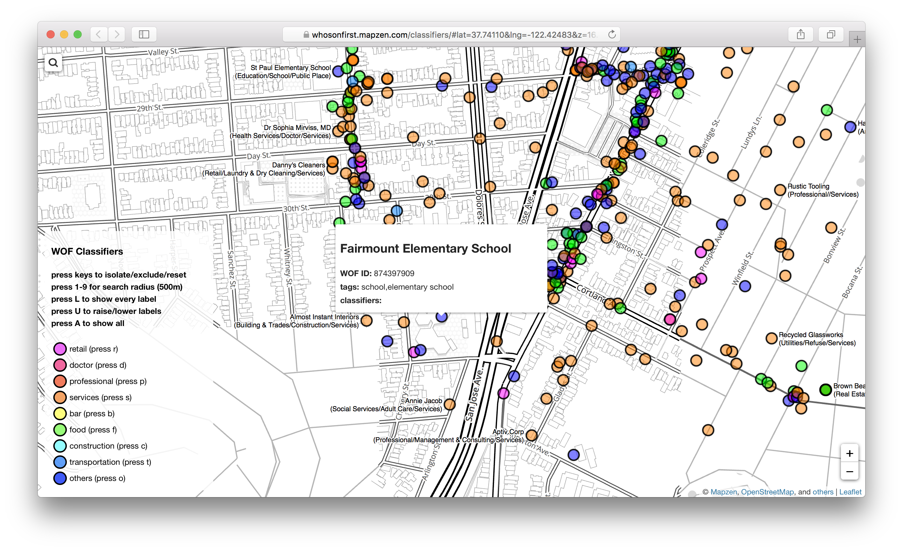

This isn't work that's part of "Privatezen" today but there a bunch of useful
tricks that could be applied from John's work.

If nothing else John is drawing all
those dots in `tangram.js` rather than using the Leaflet GeoJSON plugin which
means if we did the same in "Privatezen" then we wouldn't have the
dotless-screenshots-for-use-in-PDF-files problems described above.

We'll badger John in to writing a blog post about his work soon.

---

The application does a few other things that aren't as easy to screenshot, or
even if they were make for _really boring_ screenshots. For example,
"Privatezen" is designed to work offline.

It works offline in the sense that because the SQLite database is sitting on
your computer you don't need to fetch everything from a remote server so pretty
much everything except search and maps (discussed below) will work as expected,
regardless of your internet connection.

It _sort of_ works offline in that the application will keep a local cache of
Mapzen tiles that it's used to display maps and once a map has loaded for a
specific place (a neighbourhood, a venue, etc.) then it will ask `tangram.js` to
[take a screenshot](https://github.com/tangrams/tangram/blob/ca798f7972ddfaa20997b261f07cbfd515caf165/src/scene.js#L1212-L1218) of the map and [store it on disk](https://github.com/whosonfirst/electron-whosonfirst-bookmarks/blob/master/javascript/mapzen.whosonfirst.bookmarks.screenshots.js).

The next time you visit that place in the application the first that will happen
is the the screenshot will be loaded _underneath_ the map. If you're online or
if you have cached map tiles the screenshot will be covered up but if not you
still have a visual representation of the place you're "looking" at.

It _doesn't_ work  offline when it comes to adding new things. As mentioned
search doesn't work but even if you happen to know the Who's On First ID of the
place you're trying to add the application needs to fetch the details for that
place over the wire.

Now that we've started building [bundled SQLite databases
of Who's On First data](/download/#sqlite) I can imagine a scenario where
you download one or more "bundles" specific to your interests, say just the
venues in one or two cities, and those are used for lookups if the API isn't available.

---

The other notable place where "Privatezen" doesn't work is adding new venues
that don't already exist in Who's On First.

I 100% agree with everyone who thinks it would be really useful for people to have a mechanism that
allows them to create new places in the application, even if they're only stored
locally.

You might even think that should have been the first thing I worked and maybe I
should have. This is the part where I look at my shoes and mutter something
about "mornings and weekends"...

I think I punted on it because it starts to get complicated pretty quickly
between having to generate and store local IDs and then to reconcile them with
Who's On First IDs, not to mention the lack of an API or even a simple way to
submit a pull request against [the data stored in
GitHub](https://www.github.com/whosonfirst-data).

These are all things that _need_ to be done but here's me looking at my shoes
and muttering something about "mornings and weekends"...

---

Nor are there any "clients" beyond the desktop application. All the fancy talk
about encrypting and decrypting SQLite databases over the network is just fancy
talk at the moment. There are the beginnings of [a
Cordova-based
application](https://github.com/whosonfirst/cordova-whosonfirst-bookmarks) to do just that but so far it's mostly just been a reminder of why
programming native/non-web applications is... challenging.

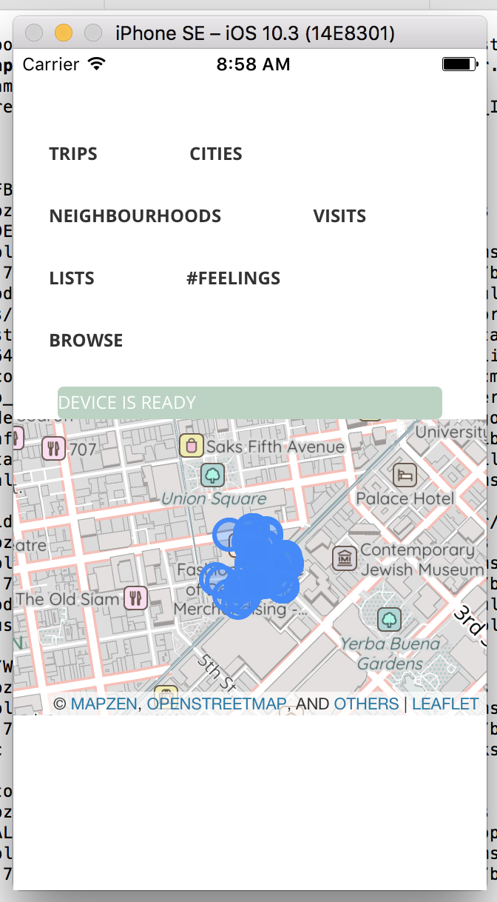

---

As mentioned the desktop application is an Electron application so it's all written in
JavaScript and CSS and a tiny amount of HTML. It's mostly a lot of boilerplate
JavaScript.

I think you're supposed to use something fancy like [React](https://github.com/facebook/react) to build applications
like this, these days, and if I had to do this sort of thing 40-hours a week I probably
would have invented something like React too. Instead it's just a lot of
JavaScript libraries that load and call one another and, aside from the part
where "Privatezen" works, I am willing to accept that I'm "doing it wrong".

At one point, building "Privatezen" became an exercise in trying to refactor or write all
of the [Who's On First Javascript libraries](https://github.com/whosonfirst/js-mapzen-whosonfirst) to work in both a browser context and
a [nodejs](https://nodejs.org/) context. They don't yet, or at least not all of
them, and I doubt any of them do it well. But that is the goal.

I've been referring to the project as "Privatezen" in this blog post but the actual code is
stored in a repository with the very dull name of:

<span style="display:block;text-align:center;">https://github.com/whosonfirst/electron-whosonfirst-bookmarks</span>

There are build instructions for the applications (eventually there will
OS-specific binary versions) but that's about it as far as documentation goes
right now. Honestly, this blog post will probably serve as the best piece of
documentation about the project for the time being.

There is also the awkward reality of [Mapzen itself shutting down](https://whosonfirst.org/blog/2018/01/02/chapter-two/) along with all of the
services the application uses, including the Who's On First API. That was never
part of the plan. 

I actually don't think it will be a big deal between the [Nextzen tile
release](https://mapzen.com/blog/long-term-support-mapzen-maps/) and Mapzen Search blossoming into [geocode.earth](https://mapzen.com/blog/v1-searching-for-the-road-ahead/) and the Who's On
First API [eventually re-surfacing](http://localhost:8080/blog/2018/01/02/chapter-two/) (and I promise it will if only because I need it).

It might be nothing more complicated than swapping out endpoints and API keys
for the different services and wouldn't that be a nice way to dull the pain of
Mapzen shutting down?

---

A few final words about #feelings.

At State of the Map US, last year, I [told the
story](http://localhost:8080/blog/2017/10/24/whosonfirst-sotmus-2017/) of the
minor freak out I had during a meeting, early on at Mapzen, and asking people to
accept that there were _no open venue datasets_ for us to piggy back off of. The
consequence of that fact is that a lot of our work would be trying to find 
_new ways_ to have people contribute data, a lot of it data that many people had
already gone to the trouble of adding to services like Foursquare.

The gem that fell out of that meeting, for me, was an idea for a brain-dead simple mobile
application that allowed people to talk about _what kind_ of place you were in and
_what sort_ of thing you were doing, rather than a hyper-specific narrative.

What if instead of saying you were at a specific place with a specific address,
which we didn't know about and which you didn't want to waste time pecking in to
a mobile UI, you could just record that you were "at a bar" ? And what if the
way to add meaning and nuance to that fact was to add a
"feeling" to the signal.

For example, what if you could say "I'm at a bar, crying" or "I'm in a telco,
hulking out". The list goes on. Those two statements (category plus emotion) combined with a latitude
and longitude, multiplied by a lot of people, start to fill in a lot of gaps.

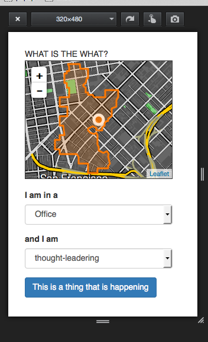

It was meant to be something you could do in the moment, ideally with nothing
more than your thumb and without making your friends feel like you were more
interested in your phone than you were in them. It was meant to be something
that could convey just enough information in the moment, with enough wiggle room
for people to play with.

Ideally we would have wanted for people to go back and fill in the names and
addresses for all the ["bars" and "restaurants"](https://github.com/whosonfirst/maplibs-meta/blob/master/data/buckets.json) where they were ["drinking" and
"crying"](https://github.com/whosonfirst/maplibs-meta/blob/master/data/feels.json) but even if they didn't it would be enough signal for us to start
working with and using to prioritize future-work.

```
{
	"feels": [
		{
			"label": "being the decider",
			"label_clean": "being-the-decider",
			"id": 135726611
		},
		{
			"label": "crying",
			"label_clean": "crying",
			"id": 102681251
		},
		{
			"label": "drinking",
			"label_clean": "drinking",
			"id": 102681341
		},
		{
			"label": "eating",
			"label_clean": "eating",
			"id": 135877017
		},
		{
			"label":
			"incentivizing",
			"label_clean": "incentivizing",
			"id": 135726609
		},
		... and so on...
```

Sadly, it's not a project that ever went anywhere. The database schema that I
scribbled out on the whiteboard that afternoon sat there untouched for 18 months
(maybe more) but point of telling this story is not to bemoan our inability to ship the
simplest and dumbest of user-facing applications. Instead it is to celebrate the silliness,
and the usefulness in the silliness, of the framing devices we imagined for what
was little more than a "check-in" application. 

On the surface recording a lot of people "crying, in bars" or "monetizing like
crazy, in offices" doesn't seem like it would be useful but I don't buy that argument.

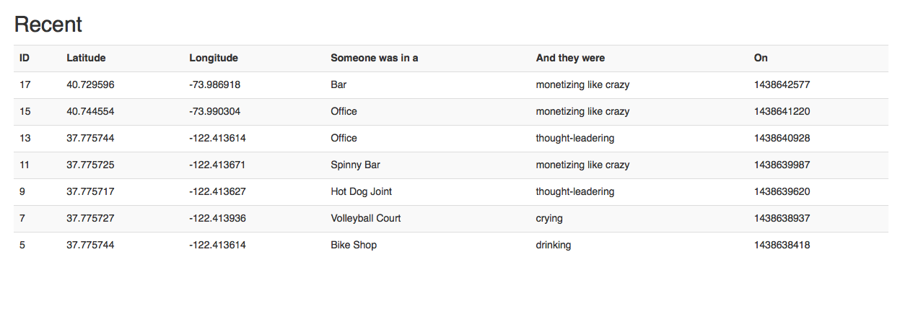

I remain convinced that if we'd be been able to devote a little more time than
we had to polishing the rough edges off of this idea we could have not only made
short work of the "no open data venues" problem but also had _fun_ doing it at
the same time. Fun, it turns out is... well, fun.

It's something I try to remember while building "Privatezen" and why the
application has #feelings.
